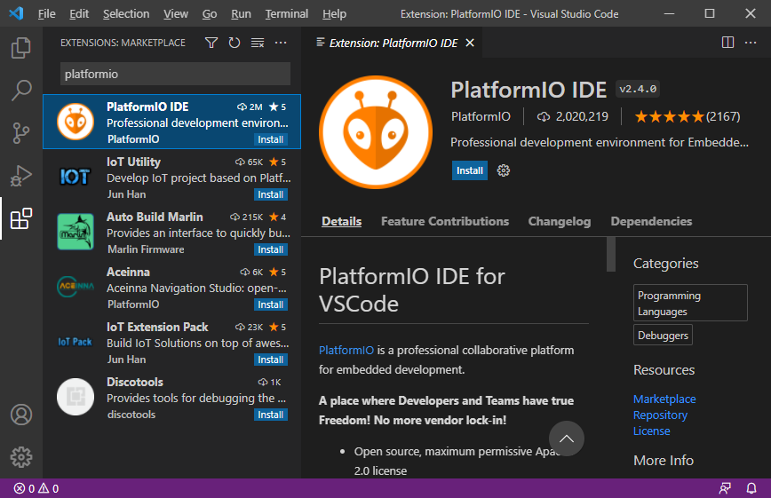

# How to use AVR template with PlatformIO

*PlatformIO is a cross-platform build system that can be used to develop software platforms for Arduino, ESP32, PIC32, and AVR. PlatformIO can be used with VS Code to provide a powerful set of tools to assist you in development [[1](https://maker.pro/arduino/tutorial/how-to-use-platformio-in-visual-studio-code-to-program-arduino)].*

1. Download and install [Visual Studio Code](https://code.visualstudio.com/) source code editor.

2. Download and install [Git](https://git-scm.com/downloads). During installation choose the default editor used by Git as **Use Visual Studio Code as Git's default editor**.

3. Run Visual Studio Code, open up the extensions viewer in menu **View > Extensions Ctrl+shift+X**, and then typing `PlatformIO` into the search bar. Press **Install** button on the result `PlatformIO IDE`.

It may take a few minutes depending on your connection speed. Do not close any window and do not open other folders until the installing process is completed. After that, restart the Visual Studio Code.

4. Install Arduino framework. Click on the PlatformIO icon in the left-hand margin, then in menu **PIO Home > Platforms > Embedded**. Type `AVR` as a platform's filter and select **Atmel AVR**. Click on the **Install** button.

5. Create a new project. Click on the PlatformIO icon in the left-hand margin, then in menu **PIO Home > Open > New Project**. Type `blink` as project name, select `Arduino Uno` board, keep `Arduino` framework, and select location to your working folder. Click on the **Finish** button.

6. Code the application. Copy/paste [blink example code](https://github.com/tomas-fryza/Digital-electronics-2/blob/master/Examples/blink/main.c) from this repository to your `BLINK > src > main.cpp` file.

7. Compile and upload the code. The handy shortcuts for building and uploading the code is available on the blue footer taskbar. Hover over the icon to get its functionality. Firts, compile (build) the project and then upload it to Arduino Uno board. You can clean up generated files as well.

#### Tested on operating systems

| **Version**                | **Date (YYYY-MM-DD)** | **Note**    |
| :------------------------- | :-------------------: | :---------- |
| Windows 10                 | 2021-11-25            | Office      |
