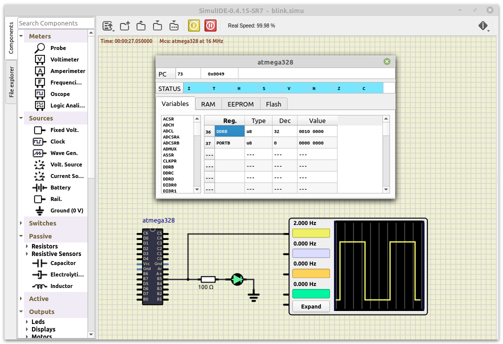
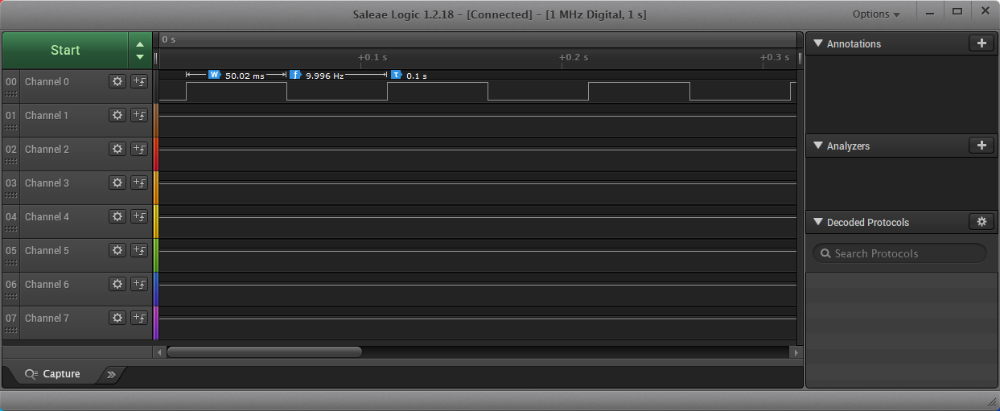

# Lab 1: Git version-control system, AVR tools

### Learning objectives

The purpose of this laboratory exercise is to learn how to use the git versioning system, write the markdown readme file, learn the basic structure of C code, and learn how to use development tools to program a microcontroller on the Arduino Uno.


## Preparation tasks (done before the lab at home)

Create an account on [GitHub](https://github.com/).

According to your preferences, choose one of the variants below prepare the development chain on your own computer.


### Windows and Atmel Studio 7

Download and install:
* [Atmel Studio 7](https://www.microchip.com/mplab/avr-support/atmel-studio-7),
* [git](https://git-scm.com/), and
* [SimulIDE](https://www.simulide.com/p/home.html).

If you have the option to use Arduino Uno board and logic analyzer, also download and install:
* [Arduino IDE](https://www.arduino.cc/en/Main/Software), which contains all USB drivers and
* [Saleae logic](https://www.saleae.com/downloads/).

Yo make it easier to work with git, you can install a graphical client:
* [GitKraken](https://www.gitkraken.com/) or
* [GitHub Desktop](https://desktop.github.com/).


### Windows and command-lin toolchain

Follow the [instructions for Windows](https://github.com/tomas-fryza/Digital-electronics-2/blob/master/Docs/HOWTO_windows.md) and create an entire comand-line toolchain instead of using Atmel Studio.

Yo make it easier to work with git, you can install a graphical client:
* [GitKraken](https://www.gitkraken.com/) or
* [GitHub Desktop](https://desktop.github.com/).


### Ubuntu-based Linux distributions

Follow the [instructions for Linux](https://github.com/tomas-fryza/Digital-electronics-2/blob/master/Docs/HOWTO_linux.md) and create an entire comand-line toolchain.

Download and install [SimulIDE](https://www.simulide.com/p/home.html).

Yo make it easier to work with git, you can install a graphical client [GitKraken](https://www.gitkraken.com/).


## Part 1: GitHub

GitHub is a code hosting platform for collaboration and version control. GitHub lets you (and others) work together on projects.

In GitHub, create a new public repository titled **Digital-electronics-2**. Initialize a README, .gitignore, and [MIT license](https://choosealicense.com/licenses/mit/).

Use manuals [How to make the perfect Readme.md on GitHub](https://medium.com/swlh/how-to-make-the-perfect-readme-md-on-github-92ed5771c061), [Basic writing and formatting syntax](https://help.github.com/en/articles/basic-writing-and-formatting-syntax) or [Mastering Markdown](https://guides.github.com/features/mastering-markdown/) and add the following parts in your README file.

   * Headers
   * Emphasis (italics, bold)
   * Lists (ordered, unordered)
   * Links
   * Table
   * Listing of C source code


## Part 2: Local repository

In the lab, make your own home folder within `Documents`, and with help of `git` command or any Git GUI client clone a local copy of your public repository:

```bash
## Linux:
$ cd
$ pwd
/home/lab661

$ cd Documents/
$ mkdir your-name
$ cd your-name/
$ pwd
/home/lab661/Documents/your-name

$ git clone https://github.com/your-github-account/Digital-electronics-2
$ cd Digital-electronics-2/
$ ls
LICENSE  README.md
```

Download `Docs` and `Examples` folders from [this repository](https://github.com/tomas-fryza/Digital-electronics-2) and copy them to your `Digital-electronics-2` local repository.

```bash
## Linux:
$ ls
Docs  Examples  LICENSE  README.md
```

Create a new working folder `Labs/01-tools` for this exercise.

```bash
## Linux:
$ mkdir Labs
$ cd Labs/
$ mkdir 01-tools
```


## Part 3: Test AVR tools

### Version: Windows and Atmel Studio 7

Follow any online tutorial, such as [this](https://unboxing-tomorrow.com/programming-atmel-microcontrollers-with-atmel-studio-7/), create a new project for ATmega328P within `01-tools` working folder and copy/paste [blink example code](../../Examples/blink/main.c) to your `main.c` source file. Examine all lines of source code. What is the meaning of individual commands?

Compile the project.

Simulate the project in Atmel Studio 7.

Run external programmer in menu **Tools > Send to Arduino UNO** and download the compiled code to Arduino Uno board. (Note that, this external tool is configured according to [How to Flash AVR from Atmel Studio](https://www.elecrom.com/program-flash-arduino-uno-atmel-studio/).)


### Version: Windows and command-lin toolchain

Copy `main.c` and `Makefile` files from blink example to `Labs/01-tools` folder.

Copy `Example/firmware.in` settings file to `Labs` folder. Note that, this file contains parameters and settings that are identical for all (future) projects located in this folder. Uncomment the Windows settings in this file.

```Makefile
## Linux
#PREFIX  = /opt/avr8-gnu-toolchain-linux_x86_64
#AVRDUDE = avrdude
#RM      = rm -f
## See "dmesg" command output
#USBPORT = /dev/ttyUSB0

## Windows
PREFIX  = C:\APPZ\Atmel\Studio\7.0\toolchain\avr8\avr8-gnu-toolchain
AVRDUDE = C:\APPZ\avrdude\avrdude.exe
RM      = del
# See USB-SERIAL CH340 port in Device Manager
USBPORT = COM3
```

Run Visual Studio Code source code editor, open your `Digital-electronics-2` working folder, run internal terminal in menu **Terminal > New Terminal**, change path to `Labs/01-tools`, and open `main.c` source file. Examine all lines of source code. What is the meaning of individual commands?

Use the following commands sequentially in the internal terminal. What is their meaning? Note: these commands are defined in the `Makefile` file.

```bash
$ mingw32-make.exe all
$ mingw32-make.exe clean
$ mingw32-make.exe size
$ mingw32-make.exe flash
```


### Version: Ubuntu-based Linux distributions

Copy `main.c` and `Makefile` files from blink example to `Labs/01-tools` folder.

Copy `Example/firmware.in` settings file to `Labs` folder. Note that, this file contains parameters and settings that are identical for all (future) projects located in this folder. Uncomment the Linux settings in this file.

```Makefile
## Linux
PREFIX  = /opt/avr8-gnu-toolchain-linux_x86_64
AVRDUDE = avrdude
RM      = rm -f
# See "dmesg" command output
USBPORT = /dev/ttyUSB0

## Windows
#PREFIX  = C:\APPZ\Atmel\Studio\7.0\toolchain\avr8\avr8-gnu-toolchain
#AVRDUDE = C:\APPZ\avrdude\avrdude.exe
#RM      = del
## See USB-SERIAL CH340 port in Device Manager
#USBPORT = COM3
```

Run Visual Studio Code source code editor, open your `Digital-electronics-2` working folder, run internal terminal in menu **Terminal > New Terminal**, change path to `Labs/01-tools`, and open `main.c` source file. Examine all lines of source code. What is the meaning of individual commands?

```bash
$ cd Labs/01-tools/
```

Use the following commands sequentially in the internal terminal. What is their meaning? Note: these commands are defined in the `Makefile` file.

```bash
$ make all
$ make clean
$ make size
$ make flash
```


## Part 4: SimulIDE

Run SimulIDE, use online [tutorials](https://www.simulide.com/p/blog-page.html), create circuit with ATmega328 AVR microcontroller, resistor/LED/GND connected to pin B5, load `.hex` firmware from `Labs/01-tools`, and simulate the project.




## Part 5: Logic analyzer

Run Saleae Logic software

```bash
## Linux:
$ Logic &
```

connect Channel 0 to Arduino board pin 13, and use logical analyzer to verify duration of `_delay_ms()` function.




## Synchronize git

Remove all binaries and object files from the working directory by command

```bash
## Linux:
$ make clean
```

Use [git commands](https://github.com/joshnh/Git-Commands) to add, commit, and push all local changes to your remote repository. Check the repository at GitHub web page for changes.


```bash
## Linux:
$ git status
$ git add <your-modified-files>
$ git status
$ git commit -m "[LAB] AVR toolchain tested"
$ git status
$ git push
$ git status
```


## Experiments on your own

1. Install AVR development tools on your computer.

2. Modify the blink example to repeatedly display the `DE2` string on the LED in Morse code.

3. Simulate the previous task in SimulIDE.


## Lab assignment

1. Link to your GitHub repository.

2. Blink example. Submit:
    * Answers to questions: What is the meaning of `|`, `&`, `^`, `~`, `<<` operations in C source file?

3. Morse code. Submit:
    * C code (`main.c`).

The deadline for submitting the task is the day before the next laboratory exercise. Use [BUT e-learning](https://moodle.vutbr.cz/) web page and submit a single PDF file.
