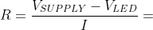

# Lab 2: Control of GPIO, LED, push button


### Learning objectives

The purpose of this laboratory exercise is to learn how to use basic input/output devices such as LEDs (Light Emitting Diodes) and push buttons, and how to control GPIO (General Purpose Input Output) pins with help of control registers.


## Preparation tasks (done before the lab at home)

Draw two basic ways to connect a LED to the output pin of the microcontroller: LED active-low, LED active-high. What is the name of the LED pin that is connected to the microcontroller in each case?

&nbsp;

&nbsp;

&nbsp;

&nbsp;

&nbsp;

&nbsp;

[Calculate LED resistor value](https://electronicsclub.info/leds.htm) for typical red and blue LEDs.

&nbsp;

&nbsp;

| **LED color** | **Supply voltage** | **LED current** | **LED voltage** | **Resistor value** |
| :-: | :-: | :-: | :-: | :-: |
| red | 5&nbsp;V | 20&nbsp;mA | | |
| blue | 5&nbsp;V | 20&nbsp;mA | | |

> Note that, equation was generated by [Online LaTeX Equation Editor](https://www.codecogs.com/latex/eqneditor.php) using the following code.
```LaTeX
R = \frac{V_{SUPPLY}-V_{LED}}{I} =
```
>

Draw the basic ways to connect a push button to the microcontroller input pin: button active-low, button active-high.

&nbsp;

&nbsp;

&nbsp;

&nbsp;

&nbsp;

&nbsp;


## Part 1: Synchronize Git and create a new folder

When you start working, always synchronize the contents of your working folder and local repository with remote version at GitHub. This way you are sure that you will not lose any of your changes.

Run Git Bash (Windows) of Terminal (Linux) and synchronize repositories.

```bash
## Windows Git Bash:
$ cd d:/Documents/
$ cd your-name/
$ cd Digital-electronics-2/
$ git pull

## Linux:
$ cd
$ cd Documents/
$ cd your-name/
$ cd Digital-electronics-2/
$ git pull
```

Create a new working folder `Labs/02-leds` for this exercise.

```bash
## Windows Git Bash or Linux:
$ cd Labs/
$ mkdir 02-leds
```


## Part 2: Active-low and active-high LEDs

AVR microcontroller associates pins into so-called ports, which are marked with the letters A, B, C, etc. Each of the pins is controlled separately and can function as an input (entry) or output (exit) point of the microcontroller. Control is possible exclusively by software via control registers.

There are exactly three control registers for each port: DDR, PORT and PIN, supplemented by the letter designation of the port. For port A these are registers DDRA, PORTA and PINA, for port B registers DDRB, PORTB, PINB, etc.

DDR (Data Direction Register) is used to set the input/output direction of port communication, PORT is the output data port and PIN works for reading input values from the port.

A detailed description of working with input/output ports can be found in [ATmega328P datasheet](https://www.microchip.com/wwwproducts/en/ATmega328p) in section I/O-Ports.

Use the datasheet to find out the meaning of the DDRB and PORTB control register values and their combinations.

| **DDRB** | **Description** |
| :-: | :-- |
| 0 | Input pin |
| 1 | |

| **PORTB** | **Description** |
| :-: | :-- |
| 0 | Output low value |
| 1 | |

| **DDRB** | **PORTB** | **Direction** | **Internal pull-up resistor** | **Description** |
| :-: | :-: | :-: | :-: | :-- |
| 0 | 0 | input | no | Tri-state, high-impedance |
| 0 | 1 | | | |
| 1 | 0 | | | |
| 1 | 1 | | | |

See [schematic of Arduino Uno board](../../Docs/arduino_shield.pdf) in docs folder of Digital-electronics-2 repository and find out which pins of ATmega328P can be used as input/output pins. To which pin is the LED L connected? Is it connected as active-low or active-high?

| **Port** | **Pin** | **Input/output usage?** |
| :-: | :-: | :-- |
| A | x | Microcontroller ATmega328P does not contain port A |
| B | 0 | Yes (Arduino pin 8) |
|   | 1 |  |
|   | 2 |  |
|   | 3 |  |
|   | 4 |  |
|   | 5 |  |
|   | 6 |  |
|   | 7 |  |
| C | 0 | Yes (Arduino pin A0) |
|   | 1 |  |
|   | 2 |  |
|   | 3 |  |
|   | 4 |  |
|   | 5 |  |
|   | 6 |  |
|   | 7 |  |
| D | 0 | Yes (Arduino pin RX<-0) |
|   | 1 |  |
|   | 2 |  |
|   | 3 |  |
|   | 4 |  |
|   | 5 |  |
|   | 6 |  |
|   | 7 |  |

Use breadboard (or SimulIDE real time electronic circuit simulator), connect resistor and second LED to Arduino output pin in active-low way. **Let the second LED is connected to port C.**


### Version: Atmel Studio 7

Create a new project for ATmega328P within `02-leds` working folder and copy/paste [template code](main.c) to your `main.c` source file.

Complete the control register settings according to the pin to which you have connected the second LED. Program an application that blinks alternately with a pair of LEDs. Use the delay library as in the previous exercise.

Compile the project. Simulate the project in Atmel Studio 7.

Run external programmer in menu **Tools > Send to Arduino UNO** and download the compiled code to Arduino Uno board or load `*.hex` firmware to SimulIDE circuit. Observe the correct function of the application using the flashing LEDs.


### Version: Command-line toolchain

Copy `main.c` and `Makefile` files from previous lab to `Labs/02-leds` folder. Check if `firmware.in` settings file exists in `Labs` folder.

Copy/paste [template code](main.c) to your `main.c` source file.

Complete the control register settings according to the pin to which you have connected the second LED. Program an application that blinks alternately with a pair of LEDs. Use the delay library as in the previous exercise.

Compile the project with the `mingw32-make.exe all` (Windows) or `make all` (Linux).

Download the compiled code to Arduino Uno board with `mingw32-make.exe flash` (Windows) or `make flash` (Linux) or load `*.hex` firmware to SimulIDE circuit. Observe the correct function of the application using the flashing LEDs.


## Part 3: Push button

Use breadboard (or SimulIDE real time electronic circuit simulator), connect resistor (if internal pull-up resistor is not used) and push button to Arduino input pin in active-low way. **Let the push button is connected to port D.**

Use code from previous part and program an application that toggles LEDs only if push button is pressed. Otherwise, the value of the LEDs does not change. 

Configure the pin to which the push button is connected as an input and enable the internal pull-up resistor.

Use Special function registers from [AVR Libc](https://onlinedocs.microchip.com/) to test bit values in control registers:

| **Function** | **Example** | **Description** |
| :-- | :-- | :-- |
| `bit_is_set(reg, pin)` | `if (bit_is_set(PINA, 3)) {...}` | Perform the code only if bit number 3 in register PINA is 1 (set) |
| `bit_is_clear(reg, pin)` | `if (bit_is_clear(PINB, 5)) {...}` | Perform the code only if bit number 5 in register PINB is 0 (clear) |
| `loop_until_bit_is_set(reg, pin)` | `loop_until_bit_is_set(PIND, 0);` | Stay here until bit number 0 in register PIND becomes 1 |
| `loop_until_bit_is_clear(reg, pin)` | `loop_until_bit_is_clear(PINA, 7);` | Stay here until bit number 7 in register PINA becomes 0 |

Complete the code, compile it and download to Arduino Uno board or load `*.hex` firmware to SimulIDE circuit. Observe the correct function of the application using the flashing LEDs and the push button.


## Part 4: Switch debouncing (hardware implementation only)

*[Bouncing](https://whatis.techtarget.com/definition/debouncing) is the tendency of any two metal contacts in an electronic device to generate multiple signals as the contacts close or open; debouncing is any kind of hardware device or software that ensures that only a single signal will be acted upon for a single opening or closing of a contact.*


Use AVR Libc and time delay library functions to debounce a push button. Create an application that samples the input signal and decides that the push button was pressed based on a series of the same values, eg. four zero bits consecutively present on the input pin.


## Synchronize git

Use [git commands](https://github.com/tomas-fryza/Digital-electronics-2/wiki/Git-useful-commands) to add, commit, and push all local changes to your remote repository. Check the repository at GitHub web page for changes.


## Experiments on your own

1. Connect five LEDs and a push button to the microcontroller, modify `02-leds` code, and program an application that will--after you press the button--ensure that only one of LED is switched on at a time in [Knight Rider style](https://www.youtube.com/watch?v=w-P-2LdS6zk).

2. Simulate the Knight Rider application in SimulIDE.

Extra. Program the [PWM generator](https://www.analogictips.com/pulse-width-modulation-pwm/) using the delay library. Let the duty cycle of the PWM signal be changed continuously and the signal is connected to one of the LEDs. How does a change of duty cycle affect the brightness of an LED?


## Lab assignment

1. LED example. Submit:
    * Tables for DDRB, PORTB, and their combination,
    * Table with input/output pins available on ATmega328P,
    * C code with two LEDs and a push button,
    * Screenshot of SimulIDE circuit.

2. Knight Rider application. Submit:
    * C code.

The deadline for submitting the task is the day before the next laboratory exercise. Use [BUT e-learning](https://moodle.vutbr.cz/) web page and submit a single PDF file.
