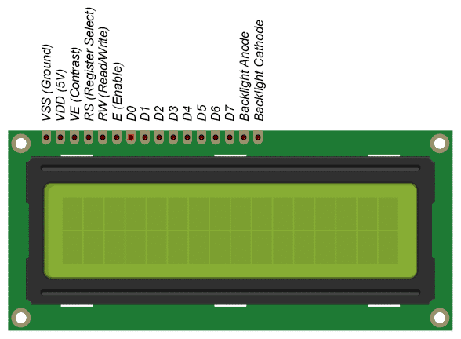
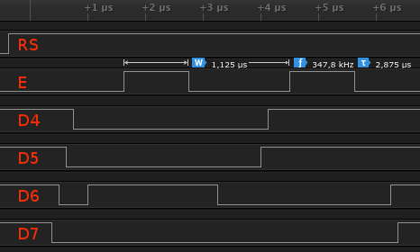
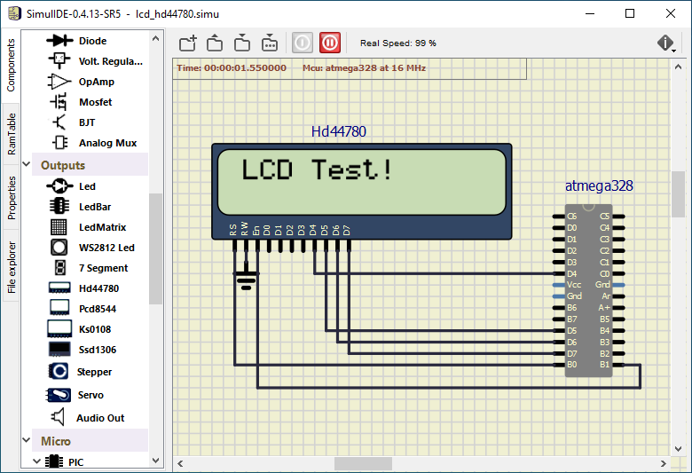

# Lab 6: Display devices, LCD display

### Learning objectives

The purpose of the laboratory exercise is to understand the serial control of Hitachi HD44780-based LCD character display and how to define custom characters. Another goal is to learn how to read documentation for library functions and use them in your own project.


## Preparation tasks (done before the lab at home)

Use schematic of the [LCD keypad shield](../../Docs/arduino_shield.pdf) and find out the connection of LCD display. What data and control signals are used? What is the meaning of these signals?

&nbsp;

&nbsp;

&nbsp;

&nbsp;

&nbsp;

&nbsp;

   | **LCD signal(s)** | **AVR pin(s)** | **Description** |
   | :-: | :-: | :-- |
   | RS | PB0 | Register selection signal. Selection between Instruction register (RS=0) and Data register (RS=1) |
   | R/W |  |  |
   | E |  |  |
   | D[3:0] |  |  |
   | D[7:4] |  |  |

What is the ASCII table? What are the values for uppercase letters `A` to `Z`, lowercase letters `a` to `z`, and numbers `0` to `9` in this table?

&nbsp;

&nbsp;

&nbsp;


## Part 1: Synchronize repositories and create a new folder

Run Git Bash (Windows) of Terminal (Linux), navigate to your working directory, and update local repository. Create a new working folder `Labs/06-lcd` for this exercise.


## Part 2: LCD display module

**LCD (Liquid Crystal Display)** is an electronic device which is used for display any ASCII text. There are many different screen sizes e.g. 16x1, 16x2, 16x4, 20x4, 40x4 characters and each character is made of 5x8 pixel dots. LCD displays have different LED backlight in yellow-green, white and blue color. LCD modules are mostly available in COB (Chip-On-Board) type. With this method, the controller IC chip or driver (here: HD44780) is directly mounted on the backside of the LCD module itself.

The control is based on the Hitachi HD44780 chipset (or a compatible), which is found on most text-based LCDs, and hence the driving software remains the same even for different screen sizes. The driver contains instruction set, character set, and in addition you can also generate your own characters.

The HD44780 is capable of operating in 8-bit mode i.e. faster, but that means 11 microcontroller pins are needed. Because the speed is not really that important as the amount of data needed to drive the display is low, the 4-bit mode is more appropriate for microcontrollers since only 6 (or 7) pins are needed.

In 8-bit mode we send the command/data to the LCD using eight data lines (D0-D7), while in 4-bit mode we use four data lines (D4-D7) to send commands and data. Inside the HD44780 there is still an 8-bit operation so for 4-bit mode, two writes to get 8-bit quantity inside the chip are made (first high four bits and then low four bits with an E clock pulse).

In the lab, the LCD1602 display module is used. The display consists of two rows of 16 characters each. It has an LED backlight and it communicates through a parallel interface with only 6 wires:
   * RS - register select. Selects the data or instruction register inside the HD44780,
   * E - enable. This loads the data into the HD44780 on the falling edge,
   * D7:4 - Upper nibble used in 4-bit mode.



When a command is given on the LCD, we select the command register (RS = 0) and when data is sent to the LCD for display, we select the data register (RS = 1). A command is an instruction entered on the LCD in order to perform the required function. In order to display textual information, data is send to LCD.

> Let the following image shows the communication between ATmega328P and LCD display in 4-bit mode. How does HD44780 chipset understand the sequence of these signals?
>
   &nbsp;
   

> The following signals are read on the first falling edge of the enable: `RS = 1` (data register) and high four data bits `D7:4 = 0100`. On the second falling edge of enable, the low four data bits are `D7:4 = 0011`. The whole byte transmitted to the LCD is therefore `0100_0011` (0x43) and according to the ASCII (American Standard Code for Information Interchange) table, it represents lettre `C`.
>

The Hitachi HD44780 has many commands, the most useful for initialization, xy location settings, and print [[1]](https://www.sparkfun.com/datasheets/LCD/HD44780.pdf).


If you are an advanced programmer and would like to create your own library for interfacing your microcontroller with an LCD module then you have to understand those instructions and commands which can be found its datasheet.


## Part 3: Library for HD44780 based LCDs

In the lab, we are using [LCD library for HD44780 based LCDs](http://www.peterfleury.epizy.com/avr-software.html) developed by Peter Fleury. Use online manual of LCD library and add the input parameters and description of the functions to the following table.

   | **Function name** | **Function parameters** | **Description** | **Example** |
   | :-- | :-- | :-- | :-- |
   | `lcd_init` | `LCD_DISP_OFF`<br>`LCD_DISP_ON`<br>`LCD_DISP_ON_CURSOR`<br>`LCD_DISP_ON_CURSOR_BLINK` | Display off&nbsp;&nbsp;&nbsp;&nbsp;&nbsp;&nbsp;&nbsp;&nbsp;&nbsp;&nbsp;&nbsp;&nbsp;&nbsp;&nbsp;&nbsp;&nbsp;&nbsp;&nbsp;&nbsp;&nbsp;&nbsp;&nbsp;&nbsp;&nbsp;&nbsp;&nbsp;&nbsp;&nbsp;&nbsp;&nbsp;&nbsp;&nbsp;&nbsp;&nbsp;&nbsp;&nbsp;&nbsp;&nbsp;&nbsp;&nbsp;&nbsp;&nbsp;&nbsp;&nbsp;&nbsp;<br>&nbsp;<br>&nbsp;<br>&nbsp; | `lcd_init(LCD_DISP_OFF);`<br>&nbsp;<br>&nbsp;<br>&nbsp; |
   | `lcd_clrscr` | | | `lcd_clrscr();` |
   | `lcd_gotoxy` | | | |
   | `lcd_putc` | | | |
   | `lcd_puts` | | | |
   | `lcd_command` | | | |
   | `lcd_data` | | | |


### Version: Atmel Studio 7

Create a new GCC C Executable Project for ATmega328P within `06-lcd` working folder and copy/paste [template code](main.c) to your `main.c` source file.

In **Solution Explorer** click on the project name, then in menu **Project**, select **Add Existing Item... Shift+Alt+A** and add LCD library files `lcd.h`, `lcd_definitions.h`, [`lcd.c`](../library/lcd.c) from `Labs/library/include` and `Labs/library` folders and timer library `timer.h` from the previous labs.


### Version: Command-line toolchain

Copy `main.c` and `Makefile` files from previous lab to `Labs/06-lcd` folder.

Copy/paste [template code](main.c) to your `06-lcd/main.c` source file.

Add the source file of LCD library between the compiled files in `06-lcd/Makefile`.

```Makefile
# Add or comment libraries you are using in the project
SRCS += $(LIBRARY_DIR)/lcd.c
#SRCS += $(LIBRARY_DIR)/uart.c
#SRCS += $(LIBRARY_DIR)/twi.c
#SRCS += $(LIBRARY_DIR)/gpio.c
#SRCS += $(LIBRARY_DIR)/segment.c
```


### Both versions

Compile the code and download to Arduino Uno board or load `*.hex` firmware to SimulIDE circuit (create an identical LCD connection to the LCD keypad shield).



Test the functions from the table and display strings/characters on the LCD as follows [[2]](http://avtanski.net/projects/lcd/). Explanation: You will later display the square of seconds in position "a", the process bar in position "b", and the rotating text in position "c".


## Part 4: Stopwatch

Because library functions only allow the display of strings (`lcd_puts`) or individual characters (`lcd_putc`), the current values of the variables need to be converted to these strings. To do this, use the `itoa(number, string, num_base)` function from the standard `stdlib.h` library. The `num_base` parameter allows you to display the `number` value in decimal, hexadecimal, or binary.

```C
#include <stdlib.h>         // C library. Needed for conversion function
...
    itoa(tens, lcd_string, 10);     // Convert decimal value to string
    lcd_puts(lcd_string);
    ...
```

Use Timer/Counter2 and update the stopwatch value approximately every 100&nbsp;ms. Update tenths of a second first, then add a condition to update the seconds and finally the minutes.

```C
/* Interrupt service routines ----------------------------------------*/
/**
 * ISR starts when Timer/Counter2 overflows. Update the stopwatch on
 * LCD display every sixth overflow, ie approximately every 100 ms
 * (6 x 16 ms = 100 ms).
 */
ISR(TIMER2_OVF_vect)
{
    static uint8_t number_of_overflows = 0;
    static uint8_t tens = 0;        // Tenths of a second
    static uint8_t secs = 0;        // Seconds
    static uint8_t mins = 0;        // Minutes
    char lcd_string[2] = "  ";      // String for converting numbers by itoa()

    number_of_overflows++;
    if (number_of_overflows >= 6)
    {
        // Do this every 6 x 16 ms = 100 ms
        number_of_overflows = 0;

        // WRITE YOUR CODE HERE

    }
}
```


## Part 5: User-defined symbols

All LCD displays based on the Hitachi HD44780 controller have two types of memory that store defined characters: CGROM and CGRAM (Character Generator ROM & RAM). The CGROM memory is non-volatile and cannot be modified, while the CGRAM memory is volatile and can be modified at any time [[3]](https://lastminuteengineers.com/arduino-1602-character-lcd-tutorial/).

CGROM memory is used to store all permanent fonts that can be displayed using their ASCII code. For example, if we write 0x43, then we get the character "C" on the display. It can generate 208 5x8 character patterns.


CGRAM is another memory that can be used for storing user defined characters. This RAM is limited to 64 bytes. Meaning, for 5x8 pixel based LCD, up to 8 user-defined characters can be stored in the CGRAM. It is useful if you want to use a character that is not part of the standard 127-character ASCII table.


A custom character is an array of 8 bytes. Each byte (only 5 bits are considered) in the array defines one row of the character in the 5x8 matrix. Whereas, the zeros and ones in the byte indicate which pixels in the row should be on and which ones should be off.

Design at least two custom characters, store them in CGRAM according to the following code and display them on the LCD screen.

```C
/* Variables ---------------------------------------------------------*/
// Custom character definition using https://omerk.github.io/lcdchargen/
uint8_t customChar[8] = {
    0b00111,
    0b01110,
    0b11100,
    0b11000,
    0b11100,
    0b01110,
    0b00111,
    0b00011
};
    ...
    // Set pointer to beginning of CGRAM memory
    lcd_command(1 << LCD_CGRAM);
    for (uint8_t i = 0; i < 8; i++)
    {
        // Store all new chars to memory line by line
        lcd_data(customChar[i]);
    }
    // Set pointer to beginning of DDRAM memory
    lcd_command(1 << LCD_DDRAM);
    ...
    // Display first custom character
    lcd_putc(0);
```


## Synchronize repositories

Use [git commands](https://github.com/tomas-fryza/Digital-electronics-2/wiki/Git-useful-commands) to add, commit, and push all local changes to your remote repository. Check the repository at GitHub web page for changes.


## Experiments on your own

1. Complete the `TIMER2_OVF_vect` interrupt routine with stopwatch code.

2. Display the square of the value "seconds" at LCD position "a".

3. Use new characters and create a progress bar at LCD position "b". Let the full bar state corresponds to stopwatch seconds. Hint: Use Timer/Counter0 with 16ms overflow and change the custom character at specific position.

```C
/* Variables ---------------------------------------------------------*/
// Custom character definition using https://omerk.github.io/lcdchargen/
uint8_t customChar[] = {
    // addr 0: .....
    0b00000, 0b00000, 0b00000, 0b00000, 0b00000, 0b00000, 0b00000, 0b00000,
    // addr 1: |....
    0b10000, 0b10000, 0b10000, 0b10000, 0b10000, 0b10000, 0b10000, 0b10000,
    ...
};
...
/*--------------------------------------------------------------------*/
/**
 * ISR starts when Timer/Counter0 overflows. Update the progress bar on
 * LCD display every 16 ms.
 */
ISR(TIMER0_OVF_vect)
{
    static uint8_t symbol = 0;
    static uint8_t position = 0;

    lcd_gotoxy(1 + position, 1);
    lcd_putc(symbol);

    // WRITE YOUR CODE HERE
}
```

Extra. From the LCD position "c", display the running text, ie text that moves one character to the left every second.


## Lab assignment

1. Preparation tasks (done before the lab at home). Submit:
   * Table with LCD signals,
   * ASCII values.

2. HD44780 communication. Submit:
   * Picture of time signals between ATmega328P and HD44780 when transmitting data `DE2`.
   
3. Stopwatch. Submit:
   * Listing of `TIMER2_OVF_vect` interrupt routine with complete stopwatch code (`minutes:seconds.tenths`) and square value computation,
   * Screenshot of SimulIDE circuit when "Power Circuit" is applied.

4. Progress bar. Submit:
   * Listing of `TIMER0_OVF_vect` interrupt routine with a progress bar,
   * Screenshot of SimulIDE circuit when "Power Circuit" is applied.

The deadline for submitting the task is the day before the next laboratory exercise. Use [BUT e-learning](https://moodle.vutbr.cz/) web page and submit a single PDF file.


## References

1. https://www.sparkfun.com/datasheets/LCD/HD44780.pdf
2. https://protostack.com.au/2010/03/character-lcd-displays-part-1/
3. https://www.circuitbasics.com/
4. [LCD library for HD44780 based LCDs](http://www.peterfleury.epizy.com/avr-software.html)
5. https://www.st.com/en/embedded-software/stsw-stm8063.html#documentation
6. [CGRAM display memory](https://www.mikroe.com/ebooks/pic-microcontrollers-programming-in-c/additional-components)
7. https://lastminuteengineers.com/arduino-1602-character-lcd-tutorial/

