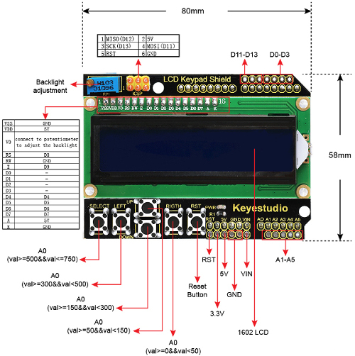

# Lab 6: Display devices, LCD display

#### Contents

1. [Lab prerequisites](#Lab-prerequisites)
2. [Used hardware components](#Used-hardware-components)
3. [Synchronize Git and create a new project](#Synchronize-Git-and-create-a-new-project)
4. [LCD library](#LCD-library)
5. [Decimal counter](#Decimal-counter)
6. [User-defined symbols](#User-defined-symbols)
7. [Clean project and synchronize git](#Clean-project-and-synchronize-git)
8. [Ideas for other tasks](#Ideas-for-other-tasks)


## Lab prerequisites

1. Use schematic of the [LCD keypad shield](../../Docs/arduino_shield.pdf) and find out the connection of LCD display. Which data and control signals are used? What is the meaning of these signals?

    | **Signal(s)** | **Pin(s)** | **Purpose** |
    | :-: | :-: | :-- |
    | RS | PB0 | Register selection signal. Selection between *Instruction register* (0) and *Data register* (1) |
    | R/W |  |  |
    | E |  |  |
    | D[3:0] |  |  |
    | D[7:4] |  |  |

2. Let the following image shows the communication between ATmega328P and LCD display in 4-bit mode. The order of the displayed signals is as follows: RS, E, D4, D5, D6, and D7. How does control circuit HD44780 understand the sequence of these signals?

    &nbsp;
    

    | **Signal(s)** | **Value(s)** | **Purpose** |
    | :-: | :-: | :-- |
    | RS | &nbsp;&nbsp;&nbsp;&nbsp;&nbsp;&nbsp;&nbsp;&nbsp;&nbsp;&nbsp;&nbsp;&nbsp;&nbsp;&nbsp;&nbsp;&nbsp;&nbsp;&nbsp;&nbsp;&nbsp;&nbsp; | &nbsp;&nbsp;&nbsp;&nbsp;&nbsp;&nbsp;&nbsp;&nbsp;&nbsp;&nbsp;&nbsp;&nbsp;&nbsp;&nbsp;&nbsp;&nbsp;&nbsp;&nbsp;&nbsp;&nbsp;&nbsp;&nbsp;&nbsp;&nbsp;&nbsp;&nbsp;&nbsp;&nbsp;&nbsp;&nbsp;&nbsp;&nbsp;&nbsp;&nbsp;&nbsp;&nbsp;&nbsp;&nbsp;&nbsp;&nbsp;&nbsp;&nbsp;&nbsp;&nbsp;&nbsp;&nbsp;&nbsp;&nbsp;&nbsp;&nbsp;&nbsp;&nbsp;&nbsp;&nbsp; |
    | D[7:4] |  |  |
    | D[7:4] |  | ASCII code: |


## Used hardware components

1. [ATmega328P](https://www.microchip.com/wwwproducts/en/ATmega328P) 8-bit AVR microcontroller.
2. [Arduino Uno](../../Docs/arduino_shield.pdf) board.
3. [LCD keypad shield](../../Docs/arduino_shield.pdf) with LCD and five push buttons.
4. 24MHz 8-channel [logic analyzer](https://www.saleae.com/).

&nbsp;



## Synchronize Git and create a new project

1. In VS Code open your Digital-electronics-2 working directory and synchronize the contents with single git command `git pull` or sequence of two commands `git fetch` followed by `git merge`.

2. Create a new folder `Labs/06-lcd` and copy files from the last project.


## LCD library

*In the lab, we are using [LCD library for HD44780 based LCDs](http://www.peterfleury.epizy.com/avr-software.html) developed by Peter Fleury*

1. Use online manual of LCD library and add the input parameters and description of the functions to the following table.

    | **Function** | **Parameter(s)** | **Description** |
    | :-: | :-: | :-- |
    | `lcd_init` | `LCD_DISP_OFF`<br>&nbsp;<br>&nbsp;<br>&nbsp; | Display off&nbsp;&nbsp;&nbsp;&nbsp;&nbsp;&nbsp;&nbsp;&nbsp;&nbsp;&nbsp;&nbsp;&nbsp;&nbsp;&nbsp;&nbsp;&nbsp;&nbsp;&nbsp;&nbsp;&nbsp;&nbsp;&nbsp;&nbsp;&nbsp;&nbsp;&nbsp;&nbsp;&nbsp;&nbsp;&nbsp;&nbsp;&nbsp;&nbsp;&nbsp;&nbsp;&nbsp;&nbsp;&nbsp;&nbsp;&nbsp;&nbsp;&nbsp;&nbsp;&nbsp;&nbsp;&nbsp;&nbsp;&nbsp;&nbsp;&nbsp;&nbsp;&nbsp;&nbsp;&nbsp;&nbsp;&nbsp;&nbsp;&nbsp;&nbsp;&nbsp;&nbsp;&nbsp;&nbsp;&nbsp;&nbsp;&nbsp;&nbsp;&nbsp;&nbsp;<br>&nbsp;<br>&nbsp;<br>&nbsp;
    | `lcd_clrscr` | | |
    | `lcd_home` | | |
    | `lcd_gotoxy` | | |
    | `lcd_putc` | | |
    | `lcd_puts` | | |

2. Use template from [teacher's GitHub]((https://github.com/tomas-fryza/Digital-electronics-2/blob/master/Labs/06-lcd/main.c)) and test all functions mentioned above. Comment (or uncomment) source files you need within the list of compiled files in `06-lcd/Makefile`.


## Decimal counter

1. According to the listing bellow, verify how you can convert a variable value to string and then display it on LCD. Display one variable value in decimal, binary, and hexadecimal. What are the parameters of standard C function `itoa`?

    ```C
    #include <stdlib.h>

    uint8_t value = 31;
    char lcd_string[3];
    ...

    itoa(value, lcd_string, 16);
    lcd_putc('$');
    lcd_puts(lcd_string);
    ```

2. Configure Timer1 clock source, enable its overflow interrupt, create a decimal counter from 0 to 255, and show the value on LCD display.


## User-defined symbols

*User-defined symbols are represented by eight bytes (lines) and they are stored in the beginning of [CGRAM display memory](https://www.mikroe.com/ebooks/pic-microcontrollers-programming-in-c/additional-components).*


1. Design at least two user characters, store them in the display memory according to the following code and display them on LCD.

    ```C
    /* Variables ---------------------------------------------------------*/
    // User-defined LCD chars
    uint8_t lcd_charset[] = {0x0a, ...};
    ...

    // Set pointer to beginning of CGRAM memory
    lcd_command(_BV(LCD_CGRAM));
    // Store new chars to memory line by line
    lcd_data(lcd_charset[0]);
    ...

    // Clear display for the first use
    lcd_clrscr();
    ...

    // Display first user-defined character
    lcd_putc(0x00);
    ```


## Clean project and synchronize git

Remove all binaries and object files from the working directory. Then use git commands, commit all modified/created files to your local repository and push them to remote repository or use VS Code options to perform these operations.


## Ideas for other tasks

1. Use new characters and create a bar graph at LCD. Let the bar state corresponds to decimal counter value, similar to the following figure.


