# Lab 7: ADC and UART serial communication

### Learning objectives

The purpose of the laboratory exercise is to understand analog-to-digital number conversion and the use of an internal 8-channel 10-bit AD converter. Another goal is to understand serial asynchronous communication, data frame structure and communication options using an internal USART unit.

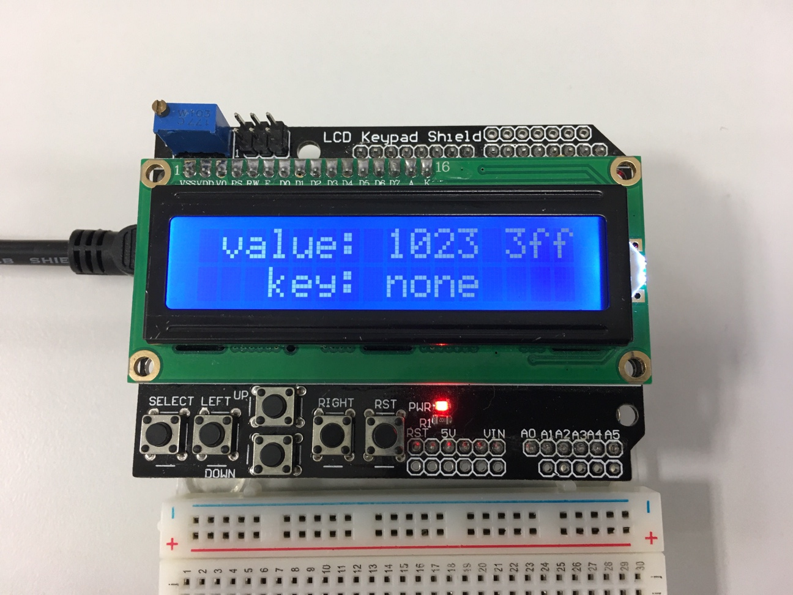


## Preparation tasks (done before the lab at home)

Use schematic of the [LCD keypad shield](../../Docs/arduino_shield.pdf) and find out the connection of five push buttons: Select, Left, Up, Down, and Right.

&nbsp;

&nbsp;

&nbsp;

&nbsp;

&nbsp;

&nbsp;

According to the connection, calculate the voltage value on pin PC0[A0] if one button is pressed at a time. In this case, the voltage on the pin is given by the [voltage divider](https://www.allaboutcircuits.com/tools/voltage-divider-calculator/), where resistors R3, R4, R5 and R6 are applied successively.

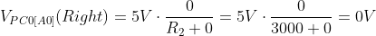

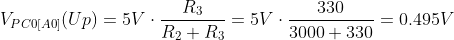

&nbsp;

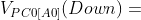

&nbsp;

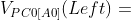

&nbsp;

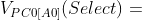

&nbsp;

What is the voltage value if none of the push buttons is pressed?

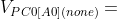

&nbsp;

Calculate the ADC values for these voltages according to the following equation if reference is Vref=5V and number of bits for analog to digital conversion is n=10.

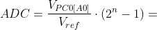

   | **Push button** | **PC0[A0] voltage** | **ADC value (calculated)** | **ADC value (measured)** |
   | :-: | :-: | :-: | :-: |
   | Right  | 0&nbsp;V | 0   |  |
   | Up     | 0.495&nbsp;V | 101 |  |
   | Down   |       |     |  |
   | Left   |       |     |  |
   | Select |       |     |  |
   | none   |       |     |  |


## Part 1: Synchronize repositories and create a new folder

Run Git Bash (Windows) of Terminal (Linux), navigate to your working directory, and update local repository. Create a new working folder `Labs/07-uart` for this exercise.


## Part 2: Analog-to-Digital Conversion

We live in an analog world, surrounded by digital devices. Everything we see, feel or measure is analog in nature such as light, temperature, speed, pressure etc. It is obvious that we need something that could convert these analog parameters to digital value for a microcontroller or micro-processor to understand it.

An [Analog to Digital Converter](https://components101.com/articles/analog-to-digital-adc-converters) (ADC) is a circuit that converts a continuous voltage value (analog) to a binary value (digital) that can be understood by a digital device which could then be used for digital computation. These ADC circuits can be found as an individual ADC ICs by themselves or embedded into a modern microcontroller.

The internal ADC module of ATmega328P can be used in relatively slow and not extremely accurate data acquisitions. But it is a good choice in most situations, like reading sensor data or reading waveforms.

AVR ADC module has 10-bit resolution with +/-2LSB accuracy. It means it returns a 10-bit integer value, i.e. a range of 0 to 1023. It can convert data at up to 76.9kSPS, which goes down when higher resolution is used. We mentioned that there are 8 ADC channels available on pins, but there are also three internal channels that can be selected with the multiplexer decoder. These are temperature sensor (channel 8), bandgap reference (1.1V) and GND (0V) [[3]](https://embedds.com/adc-on-atmega328-part-1/).

The operation with the AD converter is performed through ADMUX, ADCSRA, ADCL+ADCH, ADCSRB, and DIDR0 registers. See [ATmega328P datasheet](https://www.microchip.com/wwwproducts/en/ATmega328p) (**Analog-to-Digital Converter > Register Description**) and complete the following table.

   | **Operation** | **Register(s)** | **Bit(s)** | **Description** |
   | :-: | :-- | :-- | :-- |
   | Voltage reference | ADMUX | REFS1:0 | 01: AVcc voltage reference, 5V |
   | Input channel |  | MUX3:0 | 0000: ADC0, 0001: ADC1, ... |
   | ADC enable | ADCSRA |  |  |
   | Start conversion |  |  |  |
   | ADC interrupt enable |  |  |  |
   | ADC clock prescaler |  | ADPS2:0 | 000: Division factor 2, 001: 2, 010: 4, ...|
   | ADC result |  |  |  |


### Version: Atmel Studio 7

Create a new GCC C Executable Project for ATmega328P within `07-uart` working folder and copy/paste [template code](main.c) to your `main.c` source file.

In **Solution Explorer** click on the project name, then in menu **Project**, select **Add Existing Item... Shift+Alt+A** and add:
   * UART files [`uart.h`](../library/include/uart.h), [`uart.c`](../library/uart.c) from `Examples/library/include` and `Examples/library` folders,
   * LCD library files `lcd.h`, `lcd_definitions.h`, `lcd.c` from the previous labs,
   * Timer library `timer.h` from the previous labs.


### Version: Command-line toolchain

Copy `main.c` and `Makefile` files from previous lab to `Labs/07-uart` folder.

Copy/paste [template code](main.c) to your `07-uart/main.c` source file.

Add the source files of UART and LCD libraries between the compiled files in `07-uart/Makefile`.

```Makefile
# Add or comment libraries you are using in the project
SRCS += $(LIBRARY_DIR)/lcd.c
SRCS += $(LIBRARY_DIR)/uart.c
#SRCS += $(LIBRARY_DIR)/twi.c
#SRCS += $(LIBRARY_DIR)/gpio.c
#SRCS += $(LIBRARY_DIR)/segment.c
```


### Both versions

In `main.c` configure ADC:
   * voltage reference: AVcc with external capacitor,
   * input channel: ADC0,
   * clock prescaler: 128,
   * enable ADC module, and
   * enable interrupt

Use single conversion mode and start each conversion every second (use Timer/Counter1 overflow).

Read the voltage level of Right, Up, Down, Left, Select push buttons and display it on LCD display. Write the values in the table from Preparation tasks section and compare them with the calculated ones.

```c
/**
 * ISR starts when ADC completes the conversion. Display value on LCD
 * and send it to UART.
 */
ISR(ADC_vect)
{
    // WRITE YOUR CODE HERE
    uint16_t value = 0;
    char lcd_string[4] = "0000";

    value = ADC;    // Copy ADC result to 16-bit variable
    itoa(value, lcd_string, 10);    // Convert to string in decimal
    ...
```

Compile the code and download to Arduino Uno board or load `*.hex` firmware to SimulIDE circuit (create an identical connection to the LCD keypad shield).

Based on the converted values, write the part of the code that distinguishes which push button was pressed.

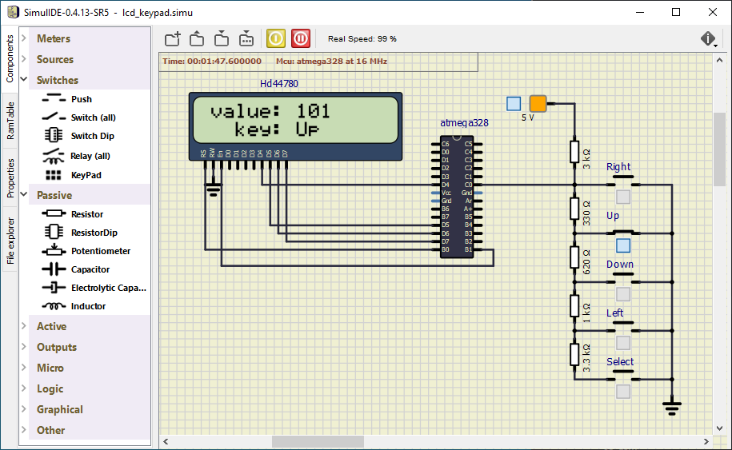


## Part 3: UART communication

The UART (Universal Asynchronous Receiver-Transmitter) is not a communication protocol like SPI and I2C, but a physical circuit in a microcontroller, or a stand-alone integrated circuit, that translates communicated data between serial and parallel forms. It is one of the simplest and easiest method for implement and understanding.

In UART communication, two UARTs communicate directly with each other. The transmitting UART converts parallel data from a CPU into serial form, transmits it in serial to the receiving UART, which then converts the serial data back into parallel data for the receiving device. Only two wires are needed to transmit data between two UARTs. Data flows from the Tx pin of the transmitting UART to the Rx pin of the receiving UART [[4]](https://www.circuitbasics.com/basics-uart-communication/).

UARTs transmit data asynchronously, which means there is no external clock signal to synchronize the output of bits from the transmitting UART. Instead, timing is agreed upon in advance between both units, and special **Start** (log. 0) and 1 or 2 **Stop** (log. 1) bits are added to each data package. These bits define the beginning and end of the data packet so the receiving UART knows when to start reading the bits. In addition to the start and stop bits, the packet/frame also contains data bits and optional parity.

The amount of **data** in each packet can be set from 5 to 9 bits. If it is not otherwise stated, data is transferred least-significant bit (LSB) first.

**Parity** is a form of very simple, low-level error checking and can be Even or Odd. To produce the parity bit, add all 5-9 data bits and extend them to an even or odd number. For example, assuming parity is set to even and was added to a data byte `0110_1010`, which has an even number of 1's (4), the parity bit would be set to 0. Conversely, if the parity mode was set to odd, the parity bit would be 1.

One of the most common UART formats is called **9600 8N1**, which means 8 data bits, no parity, 1 stop bit and a symbol rate of 9600&nbsp;Bd.

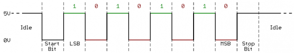

> Let the following image shows one frame of UART communication transmitting from the ATmega328P in 8N1 mode. What ASCII code/character does it represent? According to bit period, estimate the symbol rate.
>
   &nbsp;
   

> 8N1 means that 8 data bits are transmitted, no parity is used, and the number of stop bits is one. Because the frame always starts with a low level start bit and the order of the data bits is from LSB to MSB, the data transmitted bu UART is therefore `0100_0101` (0x41) and according to the [ASCII](http://www.asciitable.com/) (American Standard Code for Information Interchange) table, it represents lettre `A`.
>
> The figure further shows that the bit period, i.e. the duration of one bit, is 104&nbsp;us. The symbol rate of the communication is thus 1/104e-6 = 9615, i.e. approximately 9600&nbsp;Bd.
>

In the lab, we are using [UART library](http://www.peterfleury.epizy.com/avr-software.html) developed by Peter Fleury. Use online manual of UART library and add the input parameters and description of the functions to the following table.

   | **Function name** | **Function parameters** | **Description** | **Example** |
   | :-- | :-- | :-- | :-- |
   | `uart_init` | `UART_BAUD_SELECT(9600, F_CPU)` | Initialize UART to 8N1 and set baudrate to 9600&nbsp;Bd | `uart_init(UART_BAUD_SELECT(9600, F_CPU));` |
   | `uart_getc` |  |  |
   | `uart_putc` |  |  |
   | `uart_puts` |  |  |

Extend the application from the previous point and send information about the results of the analog to digital conversion and the pressed button to the UART transmitter. Use internal UART module with the following parametres: 8N1 mode, baud rate 9600.


### Version: SimulIDE

In SimulIDE, right click to ATmega328 package and select **Open Serial Monitor**. In this window you can receive signals from the microcontroller, but also send them back.

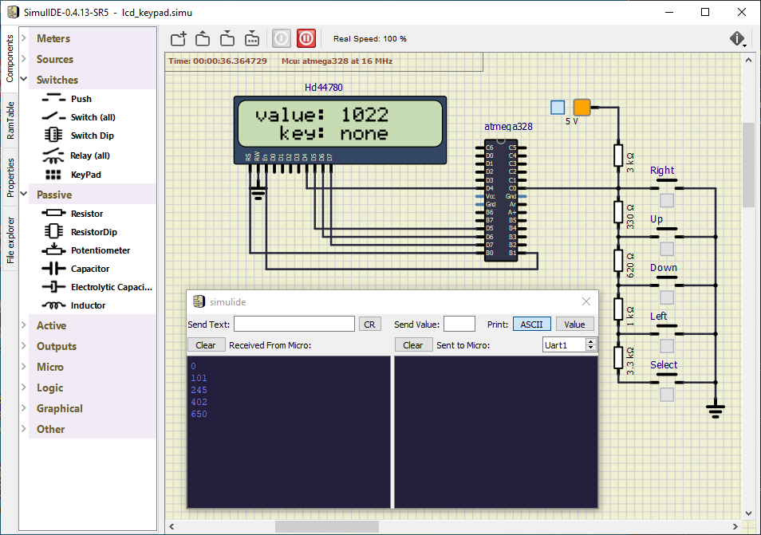


### Version: Real hardware

Use PuTTY SSH Client to receive values from Arduino board. Set connection type to **Serial** and check that the configuration is the same as in the ATmega328 application. Note that, serial line to connect to (here COM3 on Windows) could be different. In Linux, use `dmesg` command to verify your port (such as `/dev/ttyUSB0`).

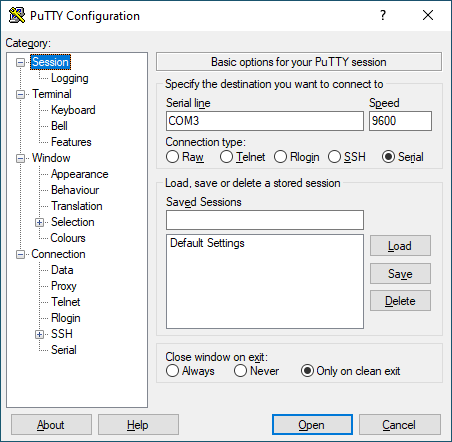


> WARNING: Before Arduino board re-programming process, PuTTY SSH Client must be closed!
>


## Synchronize repositories

Use [git commands](https://github.com/tomas-fryza/Digital-electronics-2/wiki/Git-useful-commands) to add, commit, and push all local changes to your remote repository. Check the repository at GitHub web page for changes.


## Experiments on your own

1. Design a piece of code to calculate the parity bit from the specified value. Display the parity of ADC converted value on the LCD and UART.

Extra. Design your own library for working with analog to digital convertor.


### Version: Real hardware

3. What is the meaning of ASCII control characters `\r`, `\n`, and `\b`? What codes are defined for these characters in ASCII table?

4. Use [ANSI escape sequences](https://en.wikipedia.org/wiki/ANSI_escape_code) and modify color and format of transmitted strings according to the following code. Try other formatting styles.

   ```C
   /* Color/formatting sequence always starts by "\033[" and ends by "m" strings.
   * One or more formatting codes "#", separated by ";" can be used within
   * one line, such as:
   *    \033[#m      or
   *    \033[#;#m    or
   *    \033[#;#;#m  etc. */
   uart_puts("\033[4;32m");        // 4: underline style; 32: green foreground
   uart_puts("This is all Green and Underlined.");
   uart_puts("\033[0m");           // 0: reset all attributes
   uart_puts("This is Normal text again.");
   ```

5. Program an interactive console that communicates between ATmega328P and the computer (PuTTY application) via UART. Let the main screen of the console is as follows:

   ```bash
   --- Interactive UART console ---
   1: read current Timer/counter1 value
   2: reset Timer/counter1
   > 
   ```

   After pressing the '1' key on computer keyboard, ATmega328P receives ASCII code of the key and sends the current Timer1 value back to PuTTY. After pressing the '2' key, ATmega328P resets Timer1 value, etc. Use ANSI escape sequences to highlight information within PuTTY console.

   ```C
   uint8_t c;
   ...
    
   c = uart_getc();
   if (c != '\0') {        // Data available from UART
       if (c == '1') {     // Key '1' received
           ...
       }
   }
   ```

6. Program a software UART transmitter that will be able to generate UART data on any output pin of the ATmega328P microcontroller. Let the bit rate be approximately 9600 Bd, do not use the delay library. Also consider the possibility of calculating the parity bit. Verify the UART communication with logic analyzer.


## Lab assignment

1. Preparation tasks (done before the lab at home). Submit:
   * Table with voltage divider, calculated, and measured ADC values for all buttons.

2. ADC. Submit:
   * Listing of `ADC_vect` interrupt routine with complete code for sending data to the LCD/UART and identification of the pressed button.
   * Screenshot of SimulIDE circuit when "Power Circuit" is applied.

3. UART. Submit:
   * (Hand-drawn) picture of UART signal when transmitting data `DE2` in 4800 7O2 mode (7 data bits, odd parity, 2 stop bits, 4800&nbsp;Bd),
   * Listing of code for calculating/displaying parity bit.

The deadline for submitting the task is the day before the next laboratory exercise. Use [BUT e-learning](https://moodle.vutbr.cz/) web page and submit a single PDF file.


## References

1. [Voltage Divider Calculator](https://www.allaboutcircuits.com/tools/voltage-divider-calculator/)
2. [Introduction to Analog to Digital Converters (ADC Converters)](https://components101.com/articles/analog-to-digital-adc-converters)
3. Embedded projects from around the web. [ADC on Atmega328. Part 1](https://embedds.com/adc-on-atmega328-part-1/)
4. Circuit Basics. [Basics of UART Communication](https://www.circuitbasics.com/basics-uart-communication/)
5. [ASCII Table and Description](http://www.asciitable.com/)
