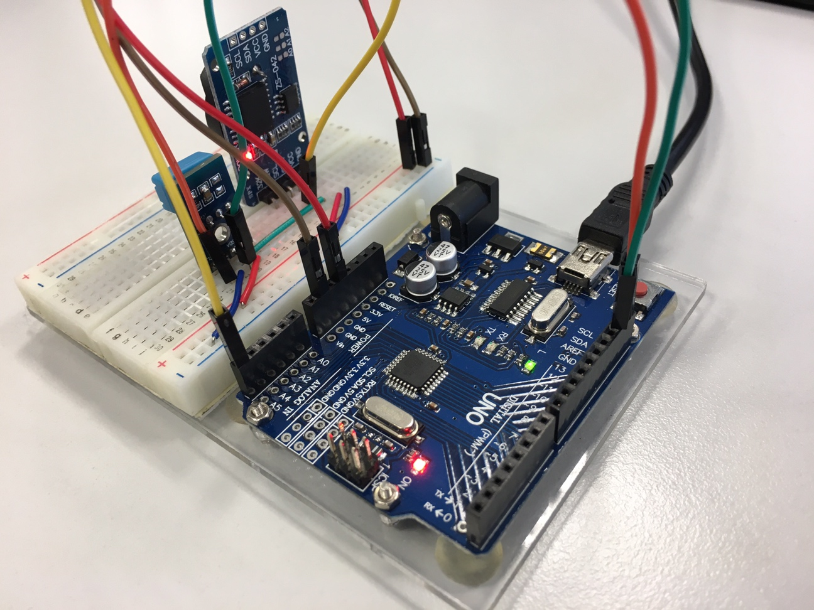
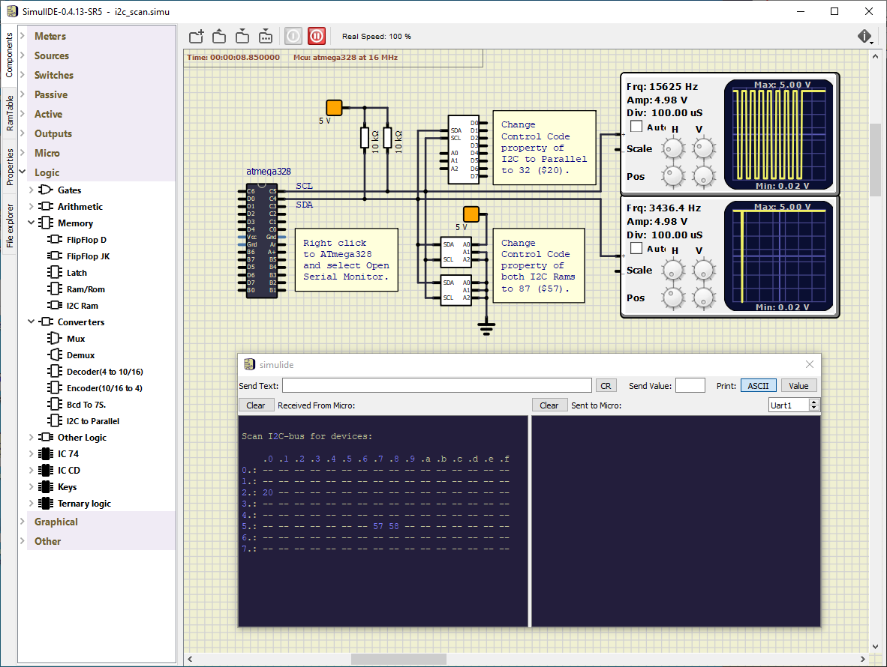
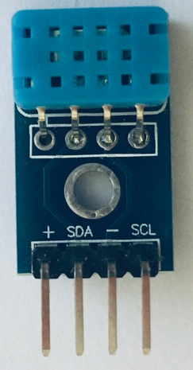
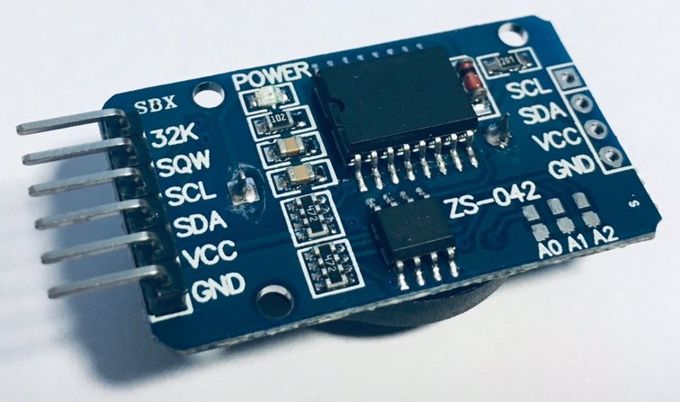
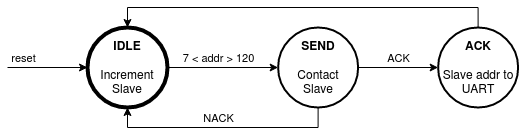

# Lab 8: I2C/TWI serial communication

### Learning objectives

The purpose of the laboratory exercise is to understand serial synchronous communication using the I2C (Inter-Integrated Circuit) bus, as well as the structure of the address and data frame and the possibilities of communication using the internal TWI (Two Wire Interface) unit. Another goal is to understand the structure of FSM (Finite-State Machine) in C.




## Preparation tasks (done before the lab at home)

Use schematic of the [Arduino Uno](../../Docs/arduino_shield.pdf) board and find out to which pins the SDA and SCL signals are connected.

   | **Signal** | **MCU pin** | **Arduino pin(s)** |
   | :-: | :-: | :-: |
   | SDA (data)  |  |  |
   | SCL (clock) |  |  |

&nbsp;
What is the general structure of I2C address and data frames?

   | **Frame type** | **8** | **7** | **6** | **5** | **4** | **3** | **2** | **1** | **0** | **Description**&nbsp;&nbsp;&nbsp;&nbsp;&nbsp;&nbsp;&nbsp;&nbsp;&nbsp;&nbsp;&nbsp;&nbsp;&nbsp;&nbsp;&nbsp;&nbsp;&nbsp;&nbsp;&nbsp;&nbsp;&nbsp;&nbsp;&nbsp;&nbsp;&nbsp;&nbsp;&nbsp;&nbsp;&nbsp;&nbsp;&nbsp;&nbsp;&nbsp;&nbsp;&nbsp;&nbsp;&nbsp;&nbsp;&nbsp;&nbsp;&nbsp;&nbsp;&nbsp;&nbsp; |
   | :-: | :-: | :-: | :-: | :-: | :-: | :-: | :-: | :-: | :-: | :-- |
   | Address | | | | | | | | | | |
   | Data    | | | | | | | | | | |


## Part 1: Synchronize repositories and create a new folder

Run Git Bash (Windows) of Terminal (Linux), navigate to your working directory, and update local repository. Create a new working folder `Labs/08-i2c` for this exercise.


## Part 2: I2C bus


**TODO:** Description


> Let the following image shows several frames of I2C communication between ATmega328P and slave device. What circuit is it and what information was sent over the bus?
>
   &nbsp;
   

> This communication example contains a total of five frames. After the start condition, which is initiated by the master, the address frame is always sent. It contains a 7-bit address of the slave device, supplemented by information on whether the data will be written to the slave or read from it to the master. The ninth bit of the address frame is an acknowledgment provided by the receiving side.
>
> Here, the address is 184 (decimal), i.e. `1011100_0` in binary including R/W=0. The slave address is therefore 1011100 (0x5c) and master will write data to the slave. The slave has acknowledged the address reception, so that the communication can continue. 
>
> According to the list of [I2C addresses](https://learn.adafruit.com/i2c-addresses/the-list) the device could be humidity/temp or pressure sensor. The signals were really recorded when communicating with the humidity and temperature sensor.
>
> The data frame always follows the address one and contains eight data bits from the MSB to the LSB and is again terminated by an acknowledgment from the receiving side. Here, number `2` was writen to the sensor. According to the [sensor manual](../../Docs/dht12_manual.pdf), this is the address of register, to which the integer part of measured temperature is stored. (The following register contains its fractional part.)
>
   | **Register address** | **Description** |
   | :-: | :-- |
   | 0x00 | Humidity integer part |
   | 0x01 | Humidity fractional part |
   | 0x02 | Temperature integer part |
   | 0x03 | Temperature fractional part |
   | 0x04 | Checksum |

> After the repeated start, the same circuit address is sent on the I2C bus, but this time with the read bit R/W=1 (185, `1011100_1`). Subsequently, data frames are sent from the slave to the master until the last of them is confirmed by the NACK value. Then the master generates a stop condition on the bus and the communication is terminated.
>
> The communication in the picture therefore records the temperature transfer from the sensor, when the measured temperature is 25.3 degrees C.
>
   | **Frame #** | **Description** |
   | :-: | :-- |
   | 1 | Address frame with SLA+W = 0x5c (184) |
   | 2 | Data frame sent to the slave represents the ID of internal register |
   | 3 | Address frame with SLA+R = 0x5c (185) |
   | 4 | Data frame with integer part of temperature read from slave |
   | 5 | Data frame with fractional part of temperature read from slave|


## Part 3: I2C scanner

### Version: SimulIDE

In the SimulIDE application, use the circuits: I2C Ram (**Components > Logic > Memory > I2C Ram**), I2C to Parallel (**Components > Logic > Converters > I2C to Parallel**) and create the connection according to the following figure. Also, change **Control Code** property of all devices. These codes represent the I2C addresses of the slave circuits. Pins A2, A1, A0 allow you to specify part of the device address. Thus, up to 8 (2^3 = 8) identical devices can be connected and it will be possible to distinguish them. External pull-up resistors on SDA and SCL signals must be used for correct simulation.




### Version: Real hardware

Use breadboard to connect humidity/temperature DHT12 digital sensor and combined module with real time clock (RTC) device DS3231 and AT24C32 memory to Arduino Uno board. Use 3.3&nbsp;V voltage for both modules. Instead of external pull-up resistors on the SDA and SCL pins, it is possible to use the internal ones, directly in the microcontroller.

   

   | **DHT12** | **Arduino** |
   | :-: | :-: |
   | + | 3.3V |
   | SDA | SDA |
   | - | GND |
   | SCL | SCL |

   &nbsp;
   

   | **RTC+EEPROM** | **Arduino** |
   | :-: | :-: |
   | 32K | Not connected |
   | SQW | Not connected |
   | SCL | SCL |
   | SDA | SDA |
   | VCC | 3.3V |
   | GND | GND |
   &nbsp;
   

### Version: Atmel Studio 7

Create a new GCC C Executable Project for ATmega328P within `08-i2C` working folder and copy/paste [template code](main.c) to your `main.c` source file.

In **Solution Explorer** click on the project name, then in menu **Project**, select **Add Existing Item... Shift+Alt+A** and add:
   * I2C/TWI files `twi.h`, `common.h`, `twi.c` from `Examples/library/include` and `Examples/library` folders,
   * UART library files `uart.h`, `uart.c` from the previous lab,
   * Timer library `timer.h` from the previous labs.

If necessary, add a CPU frequency definition to `twi.h`.

   ```c
   #ifndef F_CPU
   #define F_CPU 16000000
   #endif
   ```


### Version: Command-line toolchain

Copy `main.c` and `Makefile` files from previous lab to `Labs/08-i2c` folder.

Copy/paste [template code](main.c) to your `08-i2c/main.c` source file.

Add the source files of I2C/TWI and UART libraries between the compiled files in `08-i2c/Makefile`.

```Makefile
# Add or comment libraries you are using in the project
#SRCS += $(LIBRARY_DIR)/lcd.c
SRCS += $(LIBRARY_DIR)/uart.c
SRCS += $(LIBRARY_DIR)/twi.c
#SRCS += $(LIBRARY_DIR)/gpio.c
#SRCS += $(LIBRARY_DIR)/segment.c
```


### All versions

Use the [`twi.h`](../library/include/twi.h) header file from the I2C/TWI library to complete the description of the functions in the following table.

   | **Function name** | **Function parameters** | **Description** | **Example** |
   | :-- | :-- | :-- | :-- |
   | `twi_init` | None | Initialize TWI, enable internal pull-up resistors, and set SCL frequency | `twi_init();` |
   | `twi_start` |  |  | `twi_start((addr<<1)+TWI_READ);` |
   | `twi_write` |  |  |  |
   | `twi_read_ack` |  |  |  |
   | `twi_read_nack` |  |  |  |
   | `twi_stop` |  |  |  |

Explore the use of Finite State Machine (FSM) in the `main.c` source file. Note that state names are declared using `typedef enum` as follows

```c
typedef enum {              // FSM declaration
    STATE_IDLE = 1,
    STATE_SEND,
    STATE_ACK
} state_t;
```

and the body and transitions between states are defined using `switch`/`case` C structure.

```c
    static state_t state = STATE_IDLE;  // Current state of the FSM

    // FSM
    switch (state)
    {
    // Increment I2C slave address
    case STATE_IDLE:
        ...
        break;
    
    // Transmit I2C slave address and get result
    case STATE_SEND:
        ...
        break;

    // A module connected to the bus was found
    case STATE_ACK:
        ...
        break;

    // If something unexpected happens then move to IDLE
    default:
        state = STATE_IDLE;
        break;
    }
```

Complete the Timer/Counter1 overflow routine according to the following state diagram and scan slave addresses. Transmit useful information via UART to PuTTY SSH Client or Serial monitor.

   

Form the UART output of your application to a hexadecimal table according to the following figure. Note that, the designation RA represents I2C addresses that are [reserved](https://www.nxp.com/docs/en/user-guide/UM10204.pdf) and cannot be used for slave circuits.

   ```
   Scan I2C-bus for devices:

       .0 .1 .2 .3 .4 .5 .6 .7 .8 .9 .a .b .c .d .e .f
   0.: RA RA RA RA RA RA RA RA -- -- -- -- -- -- -- --
   1.: -- -- -- -- -- -- -- -- -- -- -- -- -- -- -- --
   2.: -- -- -- -- -- -- -- -- -- -- -- -- -- -- -- --
   3.: -- -- -- -- -- -- -- -- -- -- -- -- -- -- -- --
   4.: -- -- -- -- -- -- -- -- -- -- -- -- -- -- -- --
   5.: -- -- -- -- -- -- -- 57 -- -- -- -- -- -- -- --
   6.: -- -- -- -- -- -- -- -- -- -- -- -- -- -- -- --
   7.: -- -- -- -- -- -- -- -- RA RA RA RA RA RA RA RA
   ```


## Part 4: Final application

### Version: SimulIDE

In the SimulIDE application, create the circuit with eight active-low LEDs connected to I2C to Parallel expander. You can use individual components (ie. 8 resistors and 8 LEDs) or **Passive > ResistorDip** and **Outputs > LedBar** according to the following figure. Also, several signals can form a bus **Logic > Other Logic > Bus**.


Create an application that sequentially turns on one of the eight LEDs. ie first LED0, then LED1 and finally LED7, then start again from the beginning. Use Timer/Counter1 and change the value every 262 ms. Send the status of the LEDs to the UART. Try to complement the LED controls according to the Knight Rider style, ie light the LEDs in one direction and then in the opposite one.


### Version: Real hardware

## DHT12 temperature and humidity sensor

Program an FSM application which reads data from humidity/temperature DHT12 digital sensor and sends them periodically via UART to PuTTY SSH Client. Use Timer/Counter1 with a suitable overflow time. Note that, according to the [DHT12 manual](../../Docs/dht12_manual.pdf), the internal DHT12 data registers have the following structure.

   | **Register address** | **Description** |
   | :-: | :-- |
   | 0x00 | Humidity integer part |
   | 0x01 | Humidity fractional part |
   | 0x02 | Temperature integer part |
   | 0x03 | Temperature fractional part |
   | 0x04 | Checksum |

Find out how checksum byte value is calculated.


## Synchronize repositories

Use [git commands](https://github.com/tomas-fryza/Digital-electronics-2/wiki/Git-useful-commands) to add, commit, and push all local changes to your remote repository. Check the repository at GitHub web page for changes.


## Experiments on your own

### Version: SimulIDE

1. Program an application that communicates with memory modules using the I2C bus. Store random data in the first ten address positions of the first and second memory modules. Then copy 5 values from the first memory to the third and another 5 values from the second memory to the third. Send the first ten values from each memory module to the UART.


### Version: Real hardware

2. Extend the humidity/temperature application, use the RTC/EEPROM module and read second/minute values from RTC DS3231 device, and send them via UART to PuTTY SSH Client. According to the [DS3231 manual](../../Docs/ds3231_manual.pdf), the internal RTC registers have the following structure.

   | **Address** | **Bit 7** | **Bits 6:4** | **Bits 3:0** |
   | :-: | :-: | :-: | :-: |
   | 0x00 | 0 | 10 Seconds | Seconds |
   | 0x01 | 0 | 10 Minutes | Minutes |
   | ... | ... | ... | ... |

4. Verify the TWI communication with logic analyzer. Find out in what format the hour information is stored in the circuit. Implement an application that reads the hours and displays it in both 12-hour and 24-hour formats.


## Lab assignment

1. Preparation tasks (done before the lab at home). Submit:
   * Both tables with pins and frame structure.

2. I2C scanner. Submit:
   * Listing of `switch`/`case` FSM body with hexadecimal table forming,
   * Screenshot of PuTTY SSH Client or Serial monitor with hexadecimal table output.

3. I2C final application. Submit:
   * Listing of Timer/Counter1 overflow for LED or humidity/temp application,
   * Screenshot of SimulIDE circuit when "Power Circuit" is applied.

4. I2C communication. Submit:
   * (Hand-drawn) picture of I2C signals when reading 5th value from first memory module and write it to the 1st position of third memory module; use slave address according to the SimulIDE schema above and descibe each part of the picture.

The deadline for submitting the task is the day before the next laboratory exercise. Use [BUT e-learning](https://moodle.vutbr.cz/) web page and submit a single PDF file.


## References

1. Adafruit. [List of I2C addresses](https://learn.adafruit.com/i2c-addresses/the-list)
2. Aosong. [Digital temperature DHT12](../../Docs/dht12_manual.pdf)
3. NXP. [I2C-bus specification and user manual](https://www.nxp.com/docs/en/user-guide/UM10204.pdf)
4. Maxim Integrated. [DS3231, Extremely accurate I2C-Integrated RTC/TCXO/Crystal](../../Docs/ds3231_manual.pdf)
