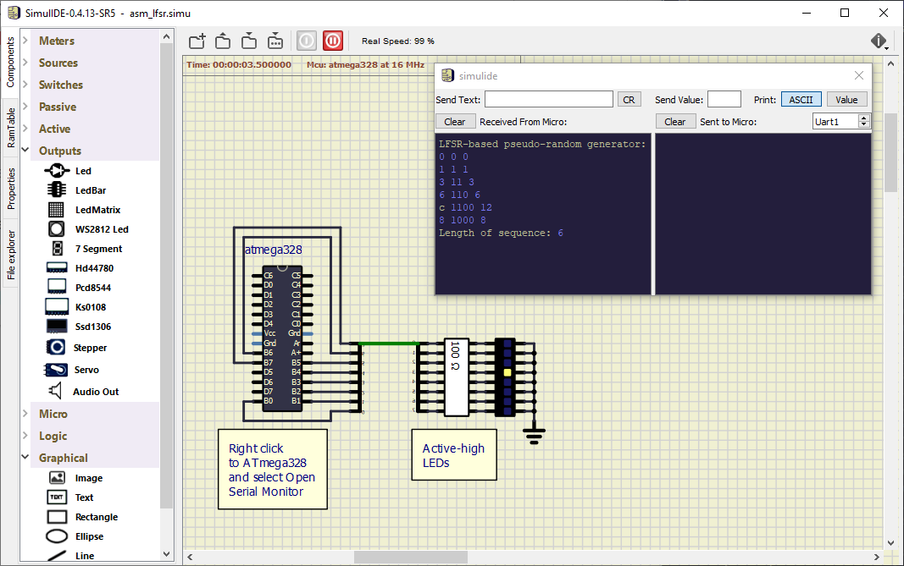

# Lab 9: Combining C and assembly languages

### Learning objectives

The purpose of the laboratory exercise is to ...(Linear Feedback Shift Register)...


## Preparation tasks (done before the lab at home)

TODO: LFSR values for 4-bit structure with Taps 3, 1

   | **Index** | **3** | **2** | **1** | **0** | **3 xnor 1** |
   | :-: | :-: | :-: | :-: | :-: | :-: |
   | 0 | 0 | 0 | 0 | 0 | 1 |
   | 1 | 0 | 0 | 0 | 1 | 1 |
   | 2 | 0 | 0 | 1 | 1 | 0 |
   | 3 |  |  |  |  |  |
   | 4 |  |  |  |  |  |
   | 5 |  |  |  |  |  |
   | 6 |  |  |  |  |  |
   | 7 |  |  |  |  |  |

Use **AVR® Instruction Set Manual** from Microchip [Online Technical Documentation](https://onlinedocs.microchip.com/), find the description of selected instructions, and complete the table.

   | **Instruction** | **Operation** | **Description** | **Cycles** |
   | :-- | :-: | :-- | :-: |
   | `add Rd, Rr` | Rd = Rd + Rr | Adds two registers without Carry flag | 1 |
   | `andi Rd, K` | Rd = Rd and K | Logical AND between register Rd and 8-bit constant K | 1 |
   | `bld Rd, b` |  |  |  |
   | `brne k` |  |  |  |
   | `bst Rd, b` |  |  |  |
   | `eor Rd, Re` |  |  |  |
   | `ldi Rd, K` |  |  |  |
   | `mov Rd, Rr` |  |  |  |
   | `out A, Rr` |  |  |  |
   | `push Rr` |  |  |  |
   | `rcall k` |  |  |  |
   | `rjmp k` |  |  |  |
   | `rol Rd` |  |  |  |
   | `ror Rd` |  |  |  |
   | `sbi A, b` |  |  |  |
   | `nop` |  |  |  |


## Part 1: Synchronize repositories and create a new folder

Run Git Bash (Windows) of Terminal (Linux), navigate to your working directory, and update local repository. Create a new working folder `Labs/09-asm` for this exercise.


## Part 2: Assembly language

TBD


## Part 3: LFSR-based pseudo random generator

### Version: Atmel Studio 7

Create a new GCC C Executable Project for ATmega328P within `09-asm` working folder and copy/paste [template code](main.c) to your `main.c` source file.

In **Solution Explorer** click on the project name, then in menu **Project**, select **Add New Item... Ctrl+Shift+A** and add a new Preprocessing Assembler File (.S) `lfsr.S`. Copy/paste [template code](lfsr.S) into it.

In **Solution Explorer** click on the project name, then in menu **Project**, select **Add Existing Item... Shift+Alt+A** and add:
   * UART library files `uart.h`, `uart.c` from the previous lab,
   * Timer library `timer.h` from the previous labs.


### Version: Command-line toolchain

Copy `main.c` and `Makefile` files from previous lab to `Labs/09-asm` folder.

Copy/paste [template code](main.c) to your `09-asm/main.c` source file.

Create a new source file `lfsr.S` and copy/paste [template code](lfsr.S) into it.

Add the source file of UART library between the compiled files in `09-asm/Makefile`.

```Makefile
# Add or comment libraries you are using in the project
#SRCS += $(LIBRARY_DIR)/lcd.c
SRCS += $(LIBRARY_DIR)/uart.c
#SRCS += $(LIBRARY_DIR)/twi.c
#SRCS += $(LIBRARY_DIR)/gpio.c
#SRCS += $(LIBRARY_DIR)/segment.c
```


### All versions

Set Timer/Counter1 overflow, generate pseudo-random sequences, and transmit results via UART to PuTTY SSH Client or Serial monitor. (In SimulIDE, also display sequences using LEDs.) 



Explore the LFSR algorithm within `rand4_asm` function. Verify which feedback taps generate a maximum length LFSR sequence for 4-structure.

   | **Taps** | **4-bit LFSR sequence**&nbsp;&nbsp;&nbsp;&nbsp;&nbsp;&nbsp;&nbsp;&nbsp;&nbsp;&nbsp;&nbsp;&nbsp;&nbsp;&nbsp;&nbsp;&nbsp;&nbsp;&nbsp;&nbsp;&nbsp;&nbsp;&nbsp;&nbsp; | **Length** |
   | :-: | :-- | :-: |
   | 1, 0 |  |  |
   | 2, 0 |  |  |
   | 3, 0 |  |  |
   | 2, 1 |  |  |
   | 3, 1 | 0, 1, 3, 6, c, 8 | 6 |
   | 3, 2 |  |  |

See **Output Files** in Solution Explorer in Atmel Studio or use `make list` command to generate listing file `.lss` by the compiler. In this file, check: (a) interrupt vectors (How many interrupt routines are used?), (b) body of `rand4_asm` function. Is there any pseudo-instruction?

Use AVR® Instruction Set Manual, convert one instruction from assembly to machine code, and verify your result with listing file.

For each instruction from `rand4_asm` function, determine the number of iterations and use the CPU cycles values to calculate the total duration of this function.

In the `main.c` file, program the function `uint8_t rand4_c(uint8_t value)` in C, which generates a 4-bit LFSR sequence with a maximum length. In the `.lss` file compare both functions, in assembly and your in C. What is the duration of both functions in CPU cycles?

   | **Function** | **Number of instructions** | **Total number of CPU cycles** |
   | :-- | :-: | :-: |
   | `rand4_asm` | | |
   | `rand4_c` | | |


## Part 4: Sum of the products (SoP)

Create a new project `09-asm_sop` and copy needed files from previous project(s).

In assembly, program the `uint8_t sop_asm(*uint8_t a, *uint8_t b, uint8_t length)` function to calculate the sum of the products of two integer vectors `a` and `b`, which have the same number of elements `length`. Transmit the SoP result via UART. For simplicity, consider only 8-bit sum and multiplication operations.

Write the same function `uint8_t sop_c(*uint8_t a, *uint8_t b, uint8_t length)` in C language and compare the duration of both functions using the file `.lss`.


## Synchronize repositories

Use [git commands](https://github.com/tomas-fryza/Digital-electronics-2/wiki/Git-useful-commands) to add, commit, and push all local changes to your remote repository. Check the repository at GitHub web page for changes.


## Experiments on your own

### Version: Real hardware

1. In assembly, program a function `void burst_asm(uint8_t length)` to generate a variable number of short pulses at output pin. Let the pulse width be the shortest one. Write the same function `void burst_c(uint8_t length)` in C and compare duration of both functions. Use a logic analyzer, verify the pulse width and calculate the CPU frequency accordingly.

2. In assembly, program your own delay function with one parameter that specifies the delay time in microseconds. Use a logic analyzer or oscilloscope to verify the correct function when generating pulses on the ATmega328P output pin. Use this function to generate the following acoustic tones: C2, D2, E2, F2, G2, and A2.


### Version: Both SimulIDE and real hardware

3. Verify that assembly function `rand8_asm` is able to generate an 8-bit sequence of maximum length for taps 7, 5, 4, 3.

4. Program a 16-bit LFSR-based pseudo-random generator in assembly language and display values at UART. What LFSR taps provide the maximum length of generated sequence? 

5. In assembly, program a function to find a maximum value of input array. Transmit the result via UART.

6. In assembly, program interrupt service routine for Timer/Counter1 overflow.


## Lab assignment

1. Preparation tasks (done before the lab at home). Submit:
   * Both tables with LFSR values and instructions.

2. 4-bit LFSR generator. Submit:
   * Table with 4-bit pseudo random sequences,
   * Conversion process of your selected instruction into machine code,
   * Listing of C function for 4-bit LFSR generator,
   * Comparison table with number od instructions and CPU cycles.

3. Sum of product. Submit:
   * Listing of assembly function,
   * Listing of C function,
   * Screenshot of SimulIDE circuit when "Power Circuit" is applied.

The deadline for submitting the task is the day before the next laboratory exercise. Use [BUT e-learning](https://moodle.vutbr.cz/) web page and submit a single PDF file.


## References

1. Microchip Atmel. [AVR® Instruction Set Manual](https://onlinedocs.microchip.com/)
