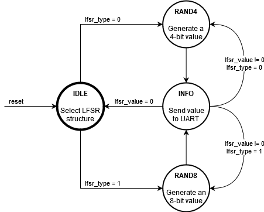

# Lab 9: Combining C and assembly languages

### Learning objectives

The purpose of the laboratory exercise is to ...


## Preparation tasks (done before the lab at home)

TODO: LFSR values for 4-bit structure


Use **AVR® Instruction Set Manual** from Microchip [Online Technical Documentation](https://onlinedocs.microchip.com/), find the description of selected instructions, and complete the table.

   | **Instruction** | **Operation** | **Description** | **Cycles** |
   | :-- | :-: | :-- | :-: |
   | `add Rd, Rr` | Rd = Rd + Rr | Adds two registers without Carry flag | 1 |
   | `andi Rd, K` | Rd = Rd and K | Logical AND between register Rd and 8-bit constant K | 1 |
   | `brne k` |  |  |  |
   | `bst Rd, b` |  |  |  |
   | `eor Rd, Re` |  |  |  |
   | `ldi Rd, K` |  |  |  |
   | `lsl Rd` |  |  |  |
   | `mov Rd, Rr` |  |  |  |
   | `out A, Rr` |  |  |  |
   | `push Rr` |  |  |  |
   | `rcall k` |  |  |  |
   | `rjmp k` |  |  |  |
   | `sbi A, b` |  |  |  |
   | `nop` |  |  |  |


## Part 1: Synchronize repositories and create a new folder

Run Git Bash (Windows) of Terminal (Linux), navigate to your working directory, and update local repository. Create a new working folder `Labs/09-asm` for this exercise.


## Part 2: Assembly language

TBD


## Part 3: LFSR-based pseudo random generator

### Version: Atmel Studio 7

Create a new GCC C Executable Project for ATmega328P within `09-asm` working folder and copy/paste [template code](main.c) to your `main.c` source file.

In **Solution Explorer** click on the project name, then in menu **Project**, select **Add New Item... Ctrl+Shift+A** and add a new Preprocessing Assembler File (.S) `lfsr.S`. Copy/paste [template code](lfsr.S) into it.

In **Solution Explorer** click on the project name, then in menu **Project**, select **Add Existing Item... Shift+Alt+A** and add:
   * UART library files `uart.h`, `uart.c` from the previous lab,
   * Timer library `timer.h` from the previous labs.


### Version: Command-line toolchain

Copy `main.c` and `Makefile` files from previous lab to `Labs/09-asm` folder.

Copy/paste [template code](main.c) to your `09-asm/main.c` source file.

Create a new source file `lfsr.S` and copy/paste [template code](lfsr.S) into it.

Add the source file of UART library between the compiled files in `09-asm/Makefile`.

```Makefile
# Add or comment libraries you are using in the project
#SRCS += $(LIBRARY_DIR)/lcd.c
SRCS += $(LIBRARY_DIR)/uart.c
#SRCS += $(LIBRARY_DIR)/twi.c
#SRCS += $(LIBRARY_DIR)/gpio.c
#SRCS += $(LIBRARY_DIR)/segment.c
```


### All versions

Explore the use of FSM in the application, set Timer/Counter1 overflow, generate pseudo-random sequences, and transmit results via UART to PuTTY SSH Client or Serial monitor.

   

Explore the LFSR algorithm within `rand4_asm` function. What the taps positions mean? Verify which feedback taps generate a maximum length LFSR (Linear Feedback Shift Register) sequence for the 4-structure.

   | **Taps** | **LFSR sequence** | **Length** |
   | :-: | :-- | :-: |
   | 1, 0 |  |  |
   | 2, 0 |  |  |
   | 3, 0 |  |  |
   | 2, 1 |  |  |
   | 3, 1 |  |  |
   | 3, 2 |  |  |

   > Use the following structure of 8-bit LFSR to derive the connection for 4-bit algorithm.
   >
   

See **Output Files** in Solution Explorer in Atmel Studio or use `make list` command to generate listing file `.lss` by the compiler. In this file, check: (a) interrupt vectors (How many interrupt routines are used?), (b) body of `rand4_asm` function. Is there any pseudo-instruction?

Use AVR® Instruction Set Manual, convert one instruction from assembly to machine code, and verify your result with listing file.

For each instruction from `rand4_asm` function, determine the number of iterations and use the CPU cycles values to calculate the total duration of this function.


## Part 4: Variable-length burst generator

1. Create a new project folder `09-asm_burst` and copy needed files from previous project(s).

2. In assembly, program a function `extern void burst_asm(uint8_t number)` to generate a variable number of short pulses at output pin PB5. Let the pulse width be the shortest one. Use logical analyzer, verify the pulses' width, and calculate the CPU frequency.


## Synchronize repositories

Use [git commands](https://github.com/tomas-fryza/Digital-electronics-2/wiki/Git-useful-commands) to add, commit, and push all local changes to your remote repository. Check the repository at GitHub web page for changes.


## Experiments on your own

1. In assembly, program a function to calculate the sum of product of two integer vectors and transmit the result via UART. For simplicity, consider only 8-bit sum and multiplication operations.

2. Program a 16-bit LFSR-based pseudo-random generator in assembly language and display values at UART. What LFSR taps provide the maximum length of generated sequence? 

4. In assembly, program a function to find a maximum value of input array. Transmit the result via UART.

4. In assembly, program your own delay function and let the parameter is duration in microseconds.

6. In assembly, program interrupt service routine for Timer1 overflow.


## Lab assignment

1. Preparation tasks (done before the lab at home). Submit:
   * Both tables with registers and instructions.

2. LFSR generator. Submit:
   * Pseudo random sequence for 4- and 8-bit LFSR structure,
   * Conversion of your selected instructions into machine code, including a documented procedure.

3. Burst generator. Submit:
   * Listing of assembly function,
   * Screenshot of SimulIDE circuit when "Power Circuit" is applied.

4. Sum of product. Submit:
   * Listing of assembly function,
   * Screenshot of SimulIDE circuit when "Power Circuit" is applied.

The deadline for submitting the task is the day before the next laboratory exercise. Use [BUT e-learning](https://moodle.vutbr.cz/) web page and submit a single PDF file.


## References

1. Microchip Atmel. [AVR® Instruction Set Manual](https://onlinedocs.microchip.com/)
