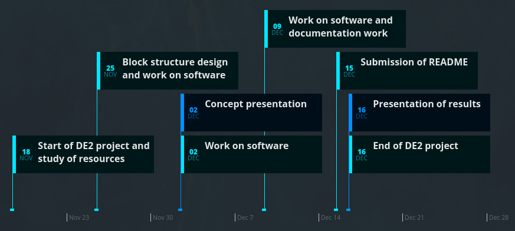

# C project: General instructions

The aim of the C project is an independent study of the assigned topic, design of your own solution, simulation and/or implementation, creation of project documentation and presentation of results.

Students work on the project from the 9th to the 13th week of the semester in the same groups as in labs (ie in pairs or individually). The source code for the AVR must be written in C and implemented on the ATmega328P microcontroller. Smaller functions can be written in AVR assembly language as well. Students may consult with their laboratory tutor and may not assign anyone else, including other students, academics, or PhD students. Students present their results during the last lab before Christmas.

The deadline for submitting the project is the day before the presentation. Use BUT e-learning web page, export your project README file to PDF and submit it. The PDF must include the GitHub link to the project folder. The repository itself must contain:
   * Project README file according to the required structure (You will export and submit this file). The README file can be written in English, Czech, or Slovak,
   * Complete project in Atmel Studio 7 or Command-line tool with AVR 8-bit Toolchain v3.62 for Windows or 3.6.2 for Linux. All source files must be written in English,
   * Libraries of all components that you have developed, including its documentation,
   * Screenshots of simulations,
   * Literature references.

### Project schedule

### Will be evaluated
   * The contents of the submitted README file,
   * The complexity of the created application, functionality,
   * Custom functionality beyond the topic,
   * If the topic has been completed,
   * C guidelines: division of code into functions/libraries, code purity and correctness, indentation, use of comments,
   * Use codes and libraries from previous exercises instead of copying from the Internet,
   * Possible use of assembly language,
   * Completeness and clarity of documentation,
   * Circuit diagram (schema),
   * Discussion of results,
   * 5-minute presentation in English, Czech, or Slovak.

### Bude hodnoceno
   * Obsah odeslaného souboru README,
   * Složitost vytvořené aplikace, funkčnost,
   * Přidání vlastní funkcionality nad rámec zadání,
   * Zda práce odpovídá zadání,
   * C guidelines: rozdělení kódu na funkce/knihovny, čistota a správnost kódu, odsazení, použití komentářů,
   * Využití kódů a knihoven z předchozích cvičení namísto kopírování z internetu,
   * Využití jazyka symbolických adres,
   * Úplnost a jasnost dokumentace,
   * Schéma zapojení,
   * Diskuse o výsledcích,
   * 5minutová prezentace v angličtině, češtině, nebo slovenštině.

### Topics 2020/21

**Lab group on Wednesday 9:00 am:**

Description of 4x3 keyboard control. Application of the door lock system; display; door unlock relay; own library for keypad scanning; time limit for entering the correct 4-digit code; several correct codes to distinguish more people; signaling of entering the wrong code; time delay for re-locking the lock approx. 2 to 3 seconds; sending interesting information about the status of the application to the UART.

*Popis ovládání klávesnice 4x3. Aplikace systému pro otevírání zámku dveří; displej; relé pro odemknutí dveří; vlastní knihovna pro skenování klávesnice; časový limit pro zadání správného 4místného kódu; několik správných kódů pro rozlišení více lidí; signalizace zadání špatného kódu; časová prodleva pro opětovné uzamčení zámku cca 2 až 3 sekundy; odesílání zajímavých informací o stavu aplikace na UART.*

**Lab group on Wednesday 11:00 am:**

Description of ultrasonic sensor HC-SR04 control. Parking assistant application using several ultrasonic sensors (Micro > Sensors > HC-SR04, see an example in SimulIDE: File explorer > Examples > Arduino > Arduino_SR04 > arduino_sr04.simu); display; distance in centimeters; acoustic signaling with different frequencies according to distance; distance indication on LED bar; sending interesting information about the status of the application to the UART.

*Popis ovládání ultrazvukového senzoru HC-SR04. Aplikace parkovacího asistenta pomocí několika ultrazvukových senzorů (Micro> Sensors> HC-SR04, viz příklad přímo v prostředí SimulIDE: File explorer > Examples > Arduino > Arduino_SR04 > arduino_sr04.simu); displej; vzdálenost v centimetrech; akustická signalizace s různými frekvencemi podle vzdálenosti; indikace vzdálenosti na LED panelu; odesílání zajímavých informací o stavu aplikace na UART.*

**Lab group on Wednesday 1:00 pm:**

Function description R-2R ladder Digital to Analog Converter (DAC). Application of analog signal generator using at least 8-bit DAC; several preset signal types; display; 4x3 keypad control; (possibility of DTMF, Dual-Tone Multiple Frequencies tone generation); sending interesting information about the status of the application to the UART.

*Popis funkce R-2R ladder Digital to Analog Converter (DAC). Aplikace generátoru analogového signálu využívající alespoň 8bitový DAC; několik přednastavených typů signálů; displej; ovládání pomocí klávesnice 4x3; (možnost generování tónu DTMF, Dual-Tone Multiple Frequencies); odesílání zajímavých informací o stavu aplikace na UART.*

---

The README file has a complete description of the problem, circuit diagram, graphical representation of the application (flowchart or state diagram), screenshots of simulations, links to source files in the repository, discussion of results, list of references, animation or a link to your own demo video etc. The required structure of your README file is as follows.

# Your project title

### Project objectives

*Write your text here*

## Hardware description

*Write your text here*

## Code description and simulations

*Write your text here*

## Video/Animation

*Write your text here*

## References

*Write your text here*
