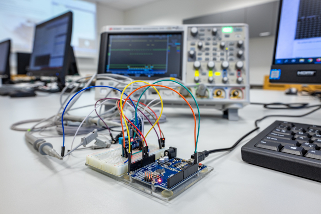
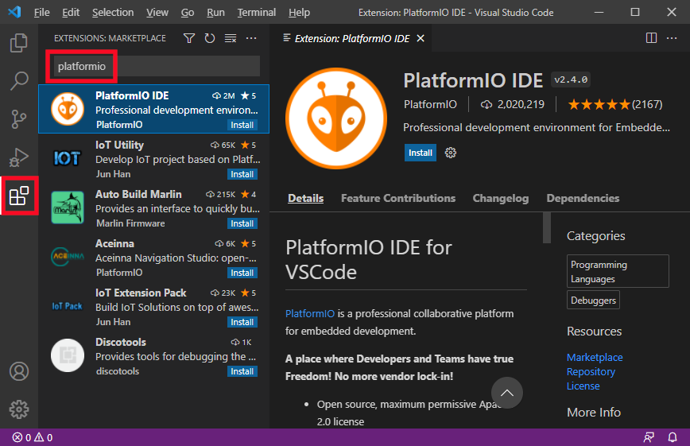
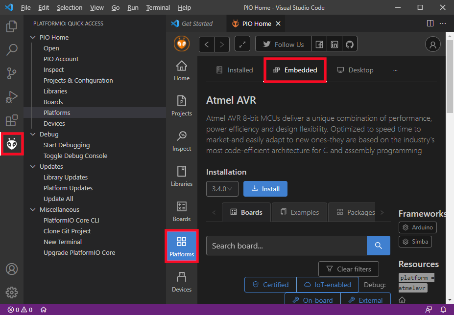
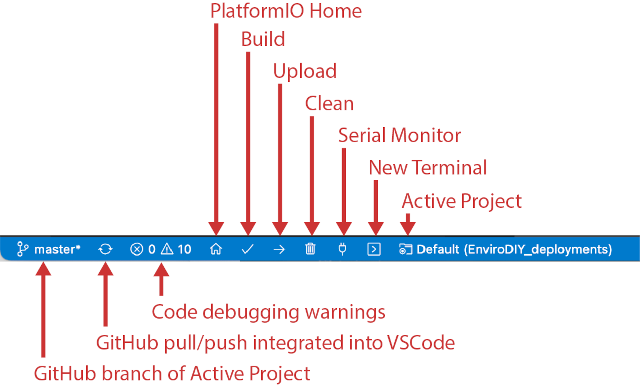

# AVR course

* [Installation](#installation)
* [Usage](#usage)
* [VS Code shortcuts](#vs-code-shortcuts)
* [Labs](#labs)
* [List of examples](#list-of-examples)
* [Components and tools](#components-and-tools)
* [References](#references)

The repository contains AVR lab exercises for bachelor course [*Digital Electronics 2*](https://www.vut.cz/en/students/courses/detail/268611) at Brno University of Technology, Czechia. The course focuses on digital circuits, microprocessor technology, embedded systems and uses the C and ASM languages for programming 8-bit Arduino microcontrollers in PlatformIO and Visual Studio Code IDE.



## Installation

*[PlatformIO](https://platformio.org/) is a cross-platform build system that can be used to develop software platforms for Arduino, ESP32, PIC32, and AVR. PlatformIO can be used with VS Code to provide a powerful set of tools to assist you in development [[1]](https://maker.pro/arduino/tutorial/how-to-use-platformio-in-visual-studio-code-to-program-arduino), [[2]](https://dronebotworkshop.com/platformio/).*

1. Download and install [Visual Studio Code](https://code.visualstudio.com/) source code editor.

2. Run Visual Studio Code, open up the extensions viewer in menu **View > Extensions Ctrl+shift+X**, and then typing `PlatformIO` into the search bar. Press **Install** button on the result `PlatformIO IDE`.

   

   It may take a few minutes depending on your connection speed. Do not close any window and do not open other folders until the installing process is completed. After that, restart the Visual Studio Code.

3. *Install Arduino framework:* Click on the PlatformIO icon in the left-hand margin, then in menu **PIO Home > Platforms > Embedded**. Type `AVR` as a platform's filter and select **Atmel AVR**. Click on the **Install** button.

   

## Usage

1. *Create a new project:* Click on the PlatformIO icon in the left-hand margin, then in menu **PIO Home > Open > New Project**. Type `blink_arduino` as project name, select `Arduino Uno` board, keep `Arduino` framework, and select location to your working folder. Click on the **Finish** button.

2. *Code the application:* Copy/paste [blink example code](https://raw.githubusercontent.com/tomas-fryza/avr-course/master/examples/blink_arduino/main.c) from this repository to your `BLINK_ARDUINO > src > main.cpp` file.

   Rename source file `main.cpp` to `main.c`, ie change the extension to `.c`.

3. *Compile and upload the code:* The handy shortcuts for building and uploading the code is available on the blue footer taskbar. Hover over the icon to get its functionality. First, compile (**Build**) the project and then **Upload** it to Arduino Uno board. You can **Clean** up generated files as well.

   

   *Command Palette:* All available commands in VS Code are also accessible by `F1` or `Ctrl+Shift+P` shortcut and followed by a command. Most useful commands in this course are:

      * `PlatformIO: Build`
      * `PlatformIO: Upload`
      * `PlatformIO: Clean`
      * `PlatformIO: Upload and Monitor`
      * `PlatformIO: PlatfomrIO Home`

## VS Code shortcuts

Other common [shortcuts in VS Code](https://code.visualstudio.com/shortcuts/keyboard-shortcuts-windows.pdf) are:

| **Shortcut** | **Usage**
| :-- | :--
| `F1` or `Ctrl+Shift+P` | Command Palette. Access to all of the VS Code functionality
| `Ctrl+K+O` | Open folder
| `Ctrl+K F` | Close folder
| `Ctrl+Tab` | Switch between open files
| `Ctrl+O` | Open a file
| `Ctrl+Shift+S` | Save all open files
| `Ctrl+Shift+V` | Open Markdown preview
| `Ctrl+K V` | Open Markdown preview to the side
| `Ctrl+B` | Toggle Sidebar visibility

## Labs

1. [Programming in C](lab1-c)
2. [Control of GPIO pins](lab2-gpio)
3. [Timers](lab3-interrupts)
4. [Liquid Crystal Display (LCD)](lab4-lcd)
5. [Universal Asynchronous Receiver-Transmitter (UART)](lab5-uart)
6. [Inter-Integrated Circuits (I2C)](lab6-i2c)
7. [Assembly language and project documentation](lab7-asm)
8. [Project](lab8-project)

## List of examples

* [Basic C template, blink a LED](examples/blink)
* [Project documentation with Doxygen](examples/doxygen)
* [Autonomous slot car](examples/slot-car)

<a name="components"></a>

## Components and tools

The following hardware and software components are mainly used in the lab.

| **Component** | **Link(s)**
| :-- | :--
| ATmega328P microcontroler | [data sheet](https://www.microchip.com/wwwproducts/en/ATmega328P), [instruction set](https://onlinedocs.microchip.com/pr/GUID-0B644D8F-67E7-49E6-82C9-1B2B9ABE6A0D-en-US-19/index.html)
| Arduino Uno board | [schematic](https://oshwlab.com/tomas.fryza/arduino-shields)
| LCD and keypad shield | [schematic](https://oshwlab.com/tomas.fryza/arduino-shields)
| Multi-function shield | [schematic](https://oshwlab.com/tomas.fryza/arduino-shields)
| DHT12 | I2C humidity and temperature sensor: [data sheet](docs/dht12_manual.pdf)
| MPU6050 | I2C gyroscope and accelerometer: [data sheet](docs/dht12_manual.pdf)
| DS3231 | I2C real time clock: [data sheet](docs/ds3231_manual.pdf)
| AT24C32 | I2C EEPROM memory module: [data sheet](docs/at24c32_manual.pdf)
| HC-SR04 | Ultrasonic sensor: [datasheet](https://components101.com/ultrasonic-sensor-working-pinout-datasheet)
| Joystick PS2 | Analog [joystick PS2](https://arduino-shop.cz/arduino/884-arduino-joystick-ps2.html)
| Rotary encoder | [tutorial](https://asset.conrad.com/media10/add/160267/c1/-/en/000151034DS01/list-technickych-udaju-151034-on-semiconductor-2n7000-tranzistor-mosfet-1-n-kanal-400-mw-to-92.pdf)
| Touch sensor | TTP223 touch sensor module: [tutorial](https://www.instructables.com/Tutorial-for-TTP223-Touch-Sensor-Module-Capacitive/)
| IR module | HW-201 IR obstacle avoidance module: [tutorial](https://arduinointro.com/articles/projects/detecting-objects-using-the-infrared-ir-obstacle-sensor)
| GPS module | GPS module NEO-6M GYNEO6MV2
| Bluetooth modules | HC-05
| Servos | Micro servo SG90
| Soil moisture sensor | [tutorial](https://diyprojectslab.com/soil-moisture-sensor-v1-2-with-arduino/)
| Relays | Modules with 1, 2, and 4 relays
| Displays | HD44780-based, Nokia displays, 4-digit LED display TM1637, 8x8 LED display MAX7219
| OLED display | I2C OLED display 128x64, driver SH1106
| Keypad | 4x4 keypad: [tutorial](https://www.circuitbasics.com/how-to-set-up-a-keypad-on-an-arduino/)
| Basic components | Pasive and active components: push buttons, resistors, 10kohm potenciometers, (multicolor) LEDs, LED bargraphs, N-MOSFET transistors 2N7000, [light dependent resistor LDR, photoresistor](Light Dependent Resistor LDR, Photoresistor), IR LED 940 nm, IR receiver
| Current sensor | Current sensor 5A ACS712
| ESP8266 Wi-Fi module | [AT commands](docs/esp8266_at_instruction_set.pdf)
| Logic analyzer | 24MHz 8-channel [logic analyzer](https://www.ebay.com/sch/i.html?LH_CAds=&_ex_kw=&_fpos=&_fspt=1&_mPrRngCbx=1&_nkw=24mhz%20logic%20analyzer&_sacat=&_sadis=&_sop=12&_udhi=&_udlo=): [software](https://www.saleae.com/)
| Osciloscope DSOX3034T | Oscilloscope Keysight Technologies [DSOX3034T](https://www.keysight.com/en/pdx-x202175-pn-DSOX3034T/oscilloscope-350-mhz-4-analog-channels?&cc=CZ&lc=eng) (350 MHz, 4 analog channels), including 16 logic timing channels [DSOXT3MSO](https://www.keysight.com/en/pdx-x205238-pn-DSOXT3MSO/3000t-x-series-oscilloscope-mso-upgrade?cc=CZ&lc=eng) and serial protocol triggering and decode options [D3000BDLA](https://www.keysight.com/en/pd-2990560-pn-D3000BDLA/ultimate-software-bundle-for-the-3000a-t-x-series?&cc=CZ&lc=eng)
| Multimeter | Multimetrix DMM230
| Visual Studio Code | [web page](https://code.visualstudio.com/)
| PlatformIO | [web page](https://platformio.org/)
| GCC Compilers for AVR | [web page](https://www.microchip.com/en-us/development-tools-tools-and-software/gcc-compilers-avr-and-arm#)
| SimulIDE | Real time electronic circuit simulator. With PIC, AVR and Arduino simulation: [web page](https://www.simulide.com/p/home.html)
| Git | [git](https://git-scm.com/)

### Tested on

| **Version**                | **Result (yyyy-mm-dd)** | **Note**
| :------------------------- | :---------------------: | :-------
| Linux Mint 21.2 (Victoria) | OK (2024-01-20)         | Laptop
| Windows 10                 | OK (2022-09-08)         | Lab SC 6.61
| Linux Mint 20.3 (Una)      | OK (2022-02-23)         | Laptop
| Windows 10                 | OK (2021-11-25)         | Office

```bash
# FYI: How to check OS version in Linux
cat /etc/os-release

# Or by Neofetch
neofetch
```

<a name="references"></a>

## References

1. Peter Fleury, [AVR-GCC libraries](http://www.peterfleury.epizy.com/avr-software.html?i=1)

2. Barr Group, [Embedded C Coding Standard](https://barrgroup.com/Embedded-Systems/Books/Embedded-C-Coding-Standard)

3. 4Geeks. [How to use Gitpod](https://4geeks.com/lesson/how-to-use-gitpod)
