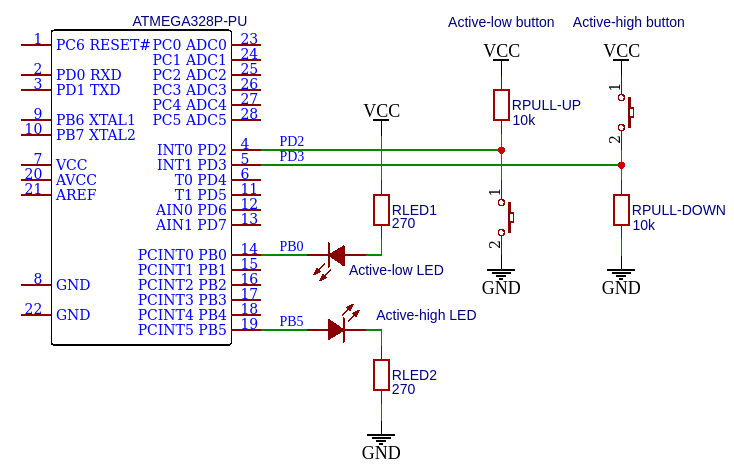

# Lab 1: Git version-control system, AVR tools

* [Pre-Lab preparation](#preparation)
* [Part 1: GitHub](#part1)
* [Part 2: Install and test AVR tools](#part2)
* [(Optional) Part 4: Logic analyzer](#part4)
* [Challenges](#challenges)
* [References](#references)

### Components list

* Arduino Uno board, USB cable
* Breadboard
* 2 LEDs, 2 resistors
* Jumper wires
* Logic analyzer

### Learning objectives

After completing this lab you will be able to:

* Use markdown README files
* Create git repository
* Understand basic structure of C files
* Compile and download firmware to AVR device
* Use breadboard and connect electronic devices to AVR pins

The purpose of this laboratory exercise is to learn how to use the `git` versioning system, write the markdown readme file, learn the basic structure of C code, and how to use development tools to program ATmega328P microcontroller on the Arduino Uno board.

<a name="preparation"></a>

## Pre-Lab preparation

1. If you don't have any, create a free account on [GitHub](https://github.com/login).

2. For future synchronization of local folders with GitHub, download and install [git](https://git-scm.com/). Git is free, open source, and available on Windows, Mac, and Linux platforms. Window users may also need to use the Git Bash application (installed automatically with git) for command line operations.

3. (Optional) Download and install [SimulIDE](https://www.simulide.com/p/home.html) electronic circuit simulator.

4. (Optional) If you have option to use Arduino Uno board and logic analyzer, also download and install [Saleae Logic 2](https://www.saleae.com/downloads/) or [Saleae Logic 1](https://support.saleae.com/logic-software/legacy-software/older-software-releases#logic-1-x-download-links) software.

<a name="part1"></a>

## Part 1: GitHub

GitHub serves as a platform for hosting code, facilitating collaboration, and managing version control. It enables you and your collaborators to work together on projects, retain a history of all prior changes, create distinct branches, and offers a multitude of additional features.

1. In GitHub, create a new public repository titled **avr-course**. Initialize a README, C template `.gitignore`, and [MIT license](https://choosealicense.com/licenses/mit/).

2. Use any available Git manuals, such as [Markdown Guide, Basic Syntax](https://www.markdownguide.org/basic-syntax/) and add the following sections to your README file.

   * Headers H1, H2, H3
   * Emphasis (*italics*, **bold**)
   * Lists (ordered, unordered)
   * Links
   * Table
   * Listing of C source code (with syntax highlighting)

3. Use your favorite file manager and run Git Bash (Windows) or Terminal (Linux) inside your home folder `Documents`.

4. With help of Git command, clone a local copy of your public repository.

   > **Important:** To avoid future problems, never use national characters (such as éščřèêö, ...) and spaces in folder- and file-names.
   >
   > **Help:** Useful git command is `git clone` - Create a local copy of remote repository. This command is executed just once; later synchronization between remote and local repositories is performed differently.
   >
   > Useful bash commands are `cd` - Change working directory. `mkdir` - Create directory. `ls` - List information about files in the current directory. `ls -a` - List information aout all files in the current directory. `pwd` - Print the name of the current working directory.

   ```bash
   ## Windows Git Bash or Linux:
   $ git clone https://github.com/your-github-account/avr-course
   $ cd avr-course/
   $ ls -a
   .gitignore  LICENSE  README.md
   ```

5. Set username and email for your repository (values will be associated with your later commits):

   ```shell
   $ git config user.name "your-git-user-name"
   $ git config user.email "your-email@address.com"
   ```

   You can verify that the changes were made correctly by:

   ```shell
   $ git config --list
   ```

<a name="part2"></a>

## Part 2: Install and test AVR tools

1. Run Visual Studio Code, follow [instructions](../../README.md) and install the PlatformIO plugin.

2. Create a new project `lab1-blink_arduino`, select `Arduino Uno` board, and change project location to your local repository folder `Documents/avr-course`. Copy/paste [blink example code](https://raw.githubusercontent.com/tomas-fryza/avr-course/master/examples/blink_arduino/main.c) to your `LAB1-BLINK_ARDUINO > src > main.cpp` file.

3. IMPORTANT: Rename `LAB1-BLINK_ARDUINO > src > main.cpp` file to `main.c`, ie change the extension to `.c`.

   The final project structure should look like this:

   ```c
   LAB1-BLINK_ARDUINO  // PlatfomIO project
   ├── include         // Included files
   ├── lib             // Libraries
   ├── src             // Source file(s)
   │   └── main.c
   ├── test            // No need this
   └── platformio.ini  // Project Configuration File
   ```

4. Compile and download the firmware to target ATmega328P microcontroller. Go through all the lines of code and make sure you understand their function. Change the delay duration and observe the behavior of on-board LED.

   * See Arduino Uno [pinout](https://docs.arduino.cc/static/6ec5e4c2a6c0e9e46389d4f6dc924073/2f891/Pinout-UNOrev3_latest.png)
   * See Arduino Docs for [GPIO / Pin Management](https://docs.arduino.cc/learn/starting-guide/getting-started-arduino#gpio--pin-management)

5. Use breadboard, wires, resistor, and a second LED. Connect it to a GPIO pin PB0 in active-low way and modify your code to blink both LEDs.

   * See this [breadboard description](https://computers.tutsplus.com/tutorials/how-to-use-a-breadboard-and-build-a-led-circuit--mac-54746) or [that one](https://www.sciencebuddies.org/science-fair-projects/references/how-to-use-a-breadboard)
   * See LED resistor value [calculation](https://electronicsclub.info/leds.htm)
   * Connection of external LED in active-low way:

      

      > **Note:** Picture was created by [Autodesk Tinkercad](https://www.tinkercad.com/).

   * General connections of LEDs and push buttons in active-low and active-high way:

      

      > **Note:** Picture was created by [EasyEDA](https://easyeda.com/).

6. On breadboard, connect two LEDs and control them by a single output pin PB0. Is it possible to get all commbinations, i.e. ON+ON, ON+OFF, OFF+ON, and OFF+OFF?

7. After completing your work, ensure that you synchronize the contents of your working folder with both the local and remote repository versions. This practice guarantees that none of your changes are lost. You can achieve this by using **Source Control (Ctrl+Shift+G)** in Visual Studio Code or by utilizing Git commands to add, commit, and push all local changes to your remote repository. Check GitHub web page for changes.

   > **Help:** Useful git commands are `git status` - Get state of working directory and staging area. `git add` - Add new and modified files to the staging area. `git commit` - Record changes to the local repository. `git push` - Push changes to remote repository. `git pull` - Update local repository and working folder. Note that, a brief description of useful git commands can be found [here](https://github.com/tomas-fryza/avr-course/wiki/Useful-Git-commands) and detailed description of all commands is [here](https://github.com/joshnh/Git-Commands).
   >
   > ```bash
   > ## Windows Git Bash or Linux:
   > $ git status
   > $ git add -A
   > $ git status
   > $ git commit -m "Creating lab1-blink program"
   > $ git status
   > $ git push
   > $ git status
   > ```

   


<a name="part4"></a>

## (Optional) Part 4: Logic analyzer

1. To verify the duration of delay function, use jumper wire and connect Channel 0 to Arduino board pin 13 (pin PB5 is connected here). Connect logic analyser to computer via USB cable.

2. Run Saleae Logic software. In Logic ver. 1 press two green arrows, set the sampling rate to 2&nbsp;MS/s and the recording time to 1 second. Click the **Start** button to start the sampling.

   

<a name="challenges"></a>

## Challenges

1. Install the AVR development tools on your computer.

2. Modify the code from `lab1-blink_arduino` example and build an application that will repeatedly trasnmit the string `PARIS` on a LED in the Morse code. Choose the duration of "dot" and "dash" so that they are visible during the simulation and/or implementation. Note that the proper Morse code timing is explained [here](https://morsecode.world/international/timing.html).

3. Simulate the Morse code application in SimulIDE.

4. Draw a schematic of Morse code application, i.e. connection of AVR device, two LEDs (one in active-high, second in active-low way), two resistors, and supply voltage. The image can be drawn on a computer or by hand. Always name all components, their values and pin names!

<a name="references"></a>

## References

1. [MIT license](https://choosealicense.com/licenses/mit/)

2. [Markdown Guide, Basic Syntax](https://www.markdownguide.org/basic-syntax/)

3. GitHub, Inc. [Mastering Markdown](https://guides.github.com/features/mastering-markdown/)

4. Tomas Fryza. [Useful Git commands](https://github.com/tomas-fryza/avr-course/wiki/Useful-Git-commands)

5. Joshua Hibbert. [Git Commands](https://github.com/joshnh/Git-Commands)

6. Stephen C. Phillips. [Morse Code Timing](https://morsecode.world/international/timing.html)

7. Science Buddies. [How to Use a Breadboard for Electronics and Circuits](https://www.sciencebuddies.org/science-fair-projects/references/how-to-use-a-breadboard)
