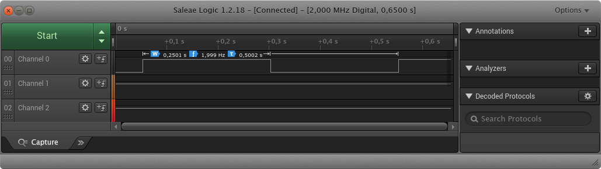

# Lab 1: Git version-control system, AVR toolchain

#### Table of contents

1. [Lab prerequisites](#Lab-prerequisites)
2. [Hardware components](#Hardware-components)
3. [GitHub](#GitHub)
4. [Linux terminal](#Linux-terminal)
5. [Test toolchain](#Test-toolchain)
6. [Clean project and synchronize git](#Clean-project-and-synchronize-git)
7. [Ideas for other tasks](#Ideas-for-other-tasks)


## Lab prerequisites

1. Create an account on [GitHub](https://github.com/) server.


## Hardware components

1. [ATmega328P](https://www.microchip.com/wwwproducts/en/ATmega328P) 8-bit AVR microcontroller
2. [Arduino Uno](../../docs/arduino_shield.pdf) board
3. 24MHz 8-channel [logic analyzer](https://www.saleae.com/)


## GitHub

1. In GitHub, create a new public repository titled **Digital-electronics-2**. Initialize a README, .gitignore, and [MIT license](https://choosealicense.com/licenses/mit/).

2. Modify your README file according to [How to make the perfect Readme.md on GitHub](https://medium.com/swlh/how-to-make-the-perfect-readme-md-on-github-92ed5771c061), [Basic writing and formatting syntax](https://help.github.com/en/articles/basic-writing-and-formatting-syntax) or [Mastering Markdown](https://guides.github.com/features/mastering-markdown/) articles and test: Headers, Emphasis, List, Table.


## Linux terminal

1. Try basic commands in the Linux terminal:

| **Command** | **Description** |
| :-: | --------------- |
| `Ctrl+Alt+T` | Open Linux terminal in Ubuntu based distributions
| `Tab` | Automatic completion what you are typing or suggest options to you
| `Up/Down` | Browse command history
| `ls` | List directory contents
| `cd` | Change the current directory (change to parent directory: `cd ..`)
| `mkdir` | Make directories
| `cp` | Copy files and directories
| `pwd` | Print name of current/working directory
| `mc` | GNU Midnight Commander (file manager)

2. In the lab, make your own home folder within `Documents`, and with help of `git` command create a local copy of your public repository:

    ```bash
    $ cd
    $ pwd
    /home/lab661

    $ cd Documents/
    $ mkdir your-name
    $ cd your-name/
    $ pwd
    /home/lab661/Documents/your-name

    $ git clone https://github.com/your-github-account/Digital-electronics-2
    $ cd Digital-electronics-2/
    $ ls
    LICENSE  README.md
    ```

3. Download `docs` and `firmware` folders from [teacher's template](https://gitlab.com/tomas.fryza/avr-template) and copy them to your `Digital-electronics-2` local repository.

    ```bash
    $ ls
    docs  firmware  LICENSE  README.md
    ```


## Test toolchain

1. Run Visual Studio Code source code editor, open `Digital-electronics-2` folder, run internal terminal in menu **Terminal > New Terminal**, and change path to `firmware/01-demo`. What is the meaning of each part of source file `main.c`? What is the meaning of the following commands?

    ```bash
    $ cd firmware/01-demo/
    $ make all
    $ make size
    $ make flash
    $ make clean
    ```

2. Run Saleae Logic software from VS Code terminal

    ```bash
    $ Logic &
    ```

    connect Channel 0 to Arduino board pin 13, and use logical analyzer to verify duration of `_delay_ms()` function.

    

3. What is the meaning of `|`, `&`, `^`, `~`, `<<`, `_BV()` operations in C source file? See [AVR Libc Reference Manual](https://www.microchip.com/webdoc/AVRLibcReferenceManual/) for answer.


## Clean project and synchronize git

1. Remove all binaries and object files from the working directory by command

    ```bash
    $ make clean
    ```

2. Use `cd ..` command in VS Code terminal and change the working directory to `Digital-electronics-2`. Then use [git commands](https://github.com/joshnh/Git-Commands) to add, commit, and push all local changes to your remote repository. Check the repository at GitHub web page for changes.

    ```bash
    $ pwd
    /home/lab661/Documents/your-name/Digital-electronics-2/firmware/01-demo

    $ cd ..
    $ cd ..
    $ pwd
    /home/lab661/Documents/your-name/Digital-electronics-2

    $ git status
    $ git add <your-modified-files>
    $ git commit -m "[PROJECT] Adding 01-demo project"
    $ git push
    ```


## Ideas for other tasks

1. Follow the [Linux](../../docs/HOWTO_linux.md) or [Windows](../../docs/HOWTO_windows.md) instructions and try to install all the development tools on your computer.
