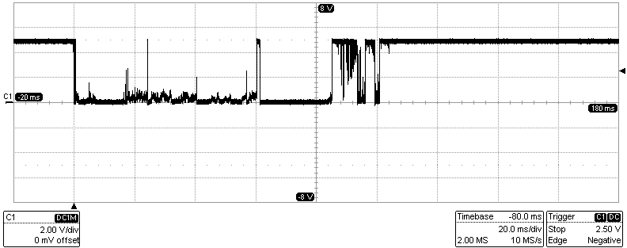

# Lab 2. Control of GPIO, LED, push button

#### Table of contents

1. [Lab prerequisites](#Lab-prerequisites)
2. [Synchronize Git and create a new project](#Synchronize-Git-and-create-a-new-project)
3. [Control two LEDs](#Control-two-LEDs)
4. [Push button](#Push-button)
5. [Switch debouncing](#Switch-debouncing)
6. [Clean project and synchronize git](#Clean-project-and-synchronize-git)
7. [Ideas for other tasks](#Ideas-for-other-tasks)


## Lab prerequisites

TBD


## Synchronize Git and create a new project

1. In Visual Studio Code editor (VS Code) open your Digital-electronics-2 working directory and synchronize the contents with [GitHub](https://github.com/joshnh/Git-Commands).

    ```bash
    $ pwd
    /home/lab661/Documents/your-name/Digital-electronics-2
    $ git pull
    ```

2. Create a new folder `firmware/02-leds` and copy three files from the demo template `main.c`, `Makefile`, and `README.md`.

    ```bash
    $ cd firmware/
    $ mkdir 02-leds
    $ cp 01-demo/main.c 01-demo/Makefile 01-demo/README.md 02-leds/
    $ cd 02-leds/
    $ ls
    main.c  Makefile  README.md
    ```

    > Help for most commands can be displayed in the terminal by adding the parameter `--help`, such as `cp --help`, `mkdir --help`, etc.
    > 


## Control two LEDs

1. Use [ATmega328P reference manual](https://www.microchip.com/wwwproducts/en/ATmega328p) to find out the meaning of control registers DDRB, PORTB, PINB.

2. Draw the basic ways to connect a LED to the output pin of the microcontroller.

3. See [schematic of Arduino Uno board](../../docs/arduino_shield.pdf) in docs folder of Digital-electronics-2 repository and find out which pins can be used as output pins.

4. Determine the value of resistor with respect to the required [LED current](https://electronicsclub.info/leds.htm).

5. Use breadboard, connect resistor and second LED to Arduino output pin and program an application that blinks alternately with a pair of LEDs. Use the delay library as in the previous exercise.

    > In VS Code terminal use commands `make all` and `make flash` to compile and download the code to AVR flash program memory.
    >


## Push button

1. Draw the basic ways to connect a push button to the microcontroller input pin.

2. Use breadboard, connect push button to Arduino input pin and program an application that toggles the LEDs each time the push button is pressed. Use the [AVR Libc library macros](https://www.microchip.com/webdoc/AVRLibcReferenceManual/ch20s22s02.html) to test bit values in control register:

    ```C
    if (bit_is_set(PINA, 0)) {...}      // Only if PINA bit number 0 is 1 (set)
    if (bit_is_clear(PINB, 5)) {...}    // Only if PINB bit number 5 is 0 (clear)
    loop_until_bit_is_set(PINC, 2);     // Stay here until PIN2 bit becomes 1
    loop_until_bit_is_clear(PINA, 7);   // Stay here until PINA7 bit becomes 0
    ```


## Switch debouncing

*[Bouncing](https://whatis.techtarget.com/definition/debouncing) is the tendency of any two metal contacts in an electronic device to generate multiple signals as the contacts close or open; debouncing is any kind of hardware device or software that ensures that only a single signal will be acted upon for a single opening or closing of a contact.*



1. Use AVR Libc and time delay library functions to debounce a push button. Create an application that samples the input signal and decides that the push button was pressed based on a series of the same values, eg. four zero bits consecutively present on the input pin.


## Clean project and synchronize git

1. Remove all binaries and object files from the working directory by command

    ```bash
    $ make clean
    ```

2. Use `cd ..` command in VS Code terminal and change the working directory to `Digital-electronics-2`. Then use [git commands](https://github.com/joshnh/Git-Commands) to add, commit, and push all local changes to your remote repository. Check the repository at GitHub web page for changes.

    ```bash
    $ pwd
    /home/lab661/Documents/your-name/Digital-electronics-2/firmware/02-leds

    $ cd ..
    $ cd ..
    $ pwd
    /home/lab661/Documents/your-name/Digital-electronics-2

    $ git status
    $ git add <your-modified-files>
    $ git commit -m "[PROJECT] Creating 02-led project"
    $ git push
    ```


## Ideas for other tasks

1. Use [Fritzing application](https://fritzing.org/home/) and draw the `Breadboard view` of your project.

2. Program the [PWM generator](https://www.analogictips.com/pulse-width-modulation-pwm/) using the delay library. Let the duty cycle of the PWM signal be changed continuously and the signal is connected to one of the LEDs. How does a change of duty cycle affect the brightness of an LED?
