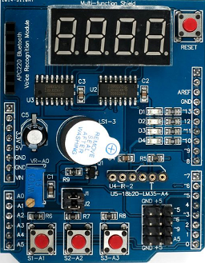

# Lab 5. Display devices, 7-segment display

#### Table of contents

1. [Lab prerequisites](#Lab-prerequisites)
2. [Hardware components](#Hardware-components)
3. [Synchronize Git and create a new project](#Synchronize-Git-and-create-a-new-project)
4. 
5. [Clean project and synchronize git](#Clean-project-and-synchronize-git)
6. [Ideas for other tasks](#Ideas-for-other-tasks)

## Lab prerequisites

1. According to the [ATmega328P datasheet](https://www.microchip.com/wwwproducts/en/ATmega328p) which I/O registers and which bits configure the Pin Change Interrupts? What vector name has the PCINT [interrupt service routine](https://www.nongnu.org/avr-libc/user-manual/group__avr__interrupts.html)?

TBD TABLE

## Hardware components

1. [ATmega328P](https://www.microchip.com/wwwproducts/en/ATmega328P) 8-bit AVR microcontroller
2. [Arduino Uno](../../docs/arduino_shield.pdf) board
3. [Multi-function shield](../../docs/arduino_shield.pdf) with four LEDs, three push buttons, four seven-segment displays
4. 24MHz 8-channel [logic analyzer](https://www.saleae.com/)

## Synchronize Git and create a new project

1. In VS Code open your Digital-electronics-2 working directory and synchronize the contents with single git command `git pull` or sequence of two commands `git fetch` followed by `git merge`.

2. Create a new folder `firmware/05-segment` and copy files from the last project.

## Pin Change Interrupts

1. Program an application that uses three push buttons and Pin Change Interrupts 11:9 to toggle a single LED. According to the [ATmega328P datasheet](https://www.microchip.com/wwwproducts/en/ATmega328p) configure the Pin Change Interrupts in PCICR (Pin Change Interrupt Control Register) and PCMSK1 (Pin Change Mask Register 1) registers.

## Seven-segment display

## Clean project and synchronize git

Remove all binaries and object files from the working directory and push all local changes to your remote repository.
