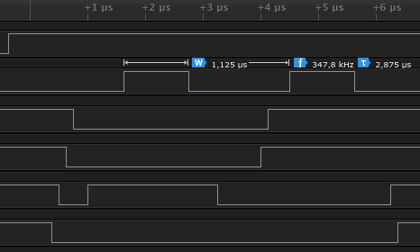
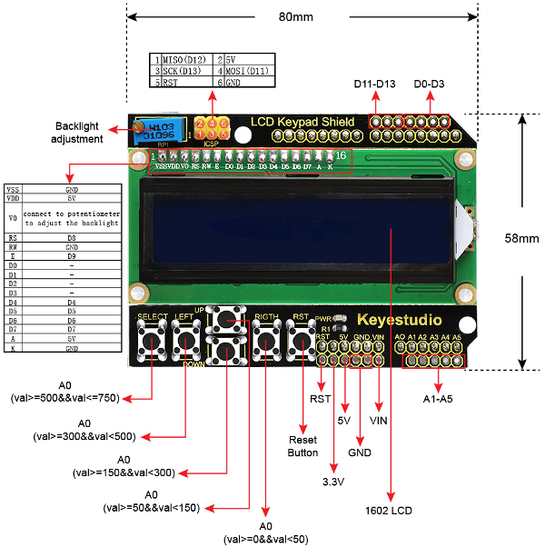

# Lab 6. Display devices, LCD display

1. [Lab prerequisites](#Lab-prerequisites)
2. [Hardware components](#Hardware-components)
3. [Synchronize Git and create a new project](#Synchronize-Git-and-create-a-new-project)
4. [XXX](#XXX)
5. [XXX](#XXX)
6. [XXX](#XXX)
7. [Clean project and synchronize git](#Clean-project-and-synchronize-git)
8. [Ideas for other tasks](#Ideas-for-other-tasks)

## Lab prerequisites

1. Use schematic of the [LCD keypad shield](../../docs/arduino_shield.pdf) and find out the connection of LCD display. Which data and control signals are used? What is the meaning of these signals?

    | **Signal(s)** | **Pin(s)** | **Purpose** |
    | :-: | :-: | :-- |
    | RS | PB0 | Register selection signal. Selection between *Instruction register* (0) and *Data register* (1) |
    | R/W |  |  |
    | E |  |  |
    | D[3:0] |  |  |
    | D[7:4] |  |  |

2. Let the following image shows the communication between ATmega328P and LCD display in 4-bit mode. The order of the displayed signals is as follows: RS, E, D4, D5, D6, and D7. How does control circuit HD44780 understand the sequence of these signals?

    &nbsp;
    

    | **Signal(s)** | **Value(s)** | **Purpose** |
    | :-: | :-: | :-- |
    | RS | &nbsp;&nbsp;&nbsp;&nbsp;&nbsp;&nbsp;&nbsp;&nbsp;&nbsp;&nbsp;&nbsp;&nbsp;&nbsp;&nbsp;&nbsp;&nbsp;&nbsp;&nbsp;&nbsp;&nbsp;&nbsp; | &nbsp;&nbsp;&nbsp;&nbsp;&nbsp;&nbsp;&nbsp;&nbsp;&nbsp;&nbsp;&nbsp;&nbsp;&nbsp;&nbsp;&nbsp;&nbsp;&nbsp;&nbsp;&nbsp;&nbsp;&nbsp;&nbsp;&nbsp;&nbsp;&nbsp;&nbsp;&nbsp;&nbsp;&nbsp;&nbsp;&nbsp;&nbsp;&nbsp;&nbsp;&nbsp;&nbsp;&nbsp;&nbsp;&nbsp;&nbsp;&nbsp;&nbsp;&nbsp;&nbsp;&nbsp;&nbsp;&nbsp;&nbsp;&nbsp;&nbsp;&nbsp;&nbsp;&nbsp;&nbsp; |
    | D[7:4] |  |  |
    | D[7:4] |  |  |
    |  |  | ASCII code: |

## Hardware components

1. [ATmega328P](https://www.microchip.com/wwwproducts/en/ATmega328P) 8-bit AVR microcontroller
2. [Arduino Uno](../../docs/arduino_shield.pdf) board
3. [LCD keypad shield](../../docs/arduino_shield.pdf) with LCD and five push buttons
4. 24MHz 8-channel [logic analyzer](https://www.saleae.com/)

&nbsp;

## Synchronize Git and create a new project

1. In VS Code open your Digital-electronics-2 working directory and synchronize the contents with single git command `git pull` or sequence of two commands `git fetch` followed by `git merge`.

2. Create a new folder `firmware/06-lcd` and copy files from the last project.

TBD

## Clean project and synchronize git

Remove all binaries and object files from the working directory. Then use git commands, commit all modified/created files to your local repository and push them to remote repository or use VS Code options to perform these operations.

## Ideas for other tasks

1 . Xxx.
