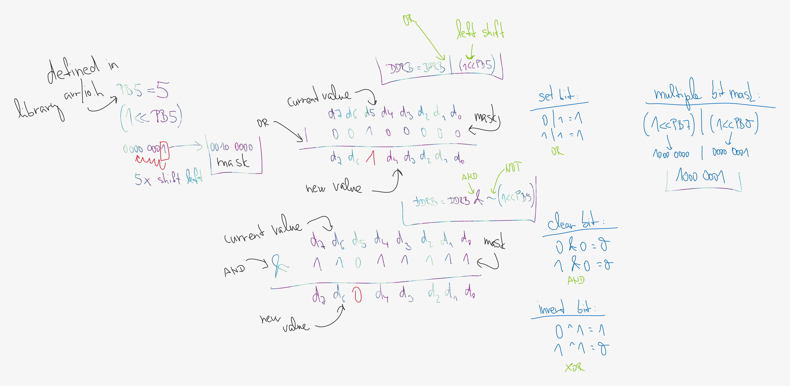

# Lab 1: Programming in C

* [Pre-Lab preparation](#preparation)
* [Part 1: Hello world](#part1)
* [Part 2: Variables and operators](#part2)
* [Challenges](#challenges)
* [References](#references)

### Learning objectives

* Understand the basic structure of C code
* Use C code control structures: loops, conditions
* Understand the binary operators

<a name="preparation"></a>

## Pre-Lab preparation

1. Complete the following table by entering the number of bits and the numeric range for the selected data types defined in C.

   | **Data type** | **Number of bits** | **Range** | **Description** |
   | :-: | :-: | :-: | :-- |
   | `uint8_t`  | 8 | 0, 1, ..., 255 | Unsigned 8-bit integer |
   | `int8_t`   |  |  |  |
   | `uint16_t` |  |  |  |
   | `int16_t`  |  |  |  |
   | `float`    |  | -3.4e+38, ..., 3.4e+38 | Single-precision floating-point |
   | `void`     | -- | -- | Depending on the context, it means *no type*, *no value* or *no parameters* |

<a name="part1"></a>

## Part 1: Hello world

1. Use one of the following online C editors/compilers to test your first C code:
   * [Online C Compiler](https://www.onlinegdb.com/online_c_compiler)
   * [Programiz C Online Compiler](https://www.programiz.com/c-programming/online-compiler/)
   * [OneCompiler](https://onecompiler.com/c)
   * ...

2. Use the `printf` function to test the following escape sequences:

   * **Newline** (`\n`): Moves the cursor to the beginning of the next line.

   * **Carriage Return** (`\r`): Moves the cursor to the beginning of the current line, allowing you to overwrite text on the same line.

      > Note that, on Windows, the end of a line is typically represented by `\r\n` (carriage return + newline). This combination moves the cursor to the beginning of the line (`\r`) and then to the next line (`\n`). On Linux/macOS, only `\n` is used to represent a new line.

   * **Tab** (`\t`): Inserts a horizontal tab, typically advancing the cursor to the next tab stop (commonly set at 4 or 8 spaces).

   * **Backspace** (`\b`): Moves the cursor one position to the left, useful for deleting characters.

   * **Escape** (`\x1b`): Initiates an escape sequence used to control text formatting, colors, and other terminal features, such as changing text color with [ANSI escape codes](https://gist.github.com/fnky/458719343aabd01cfb17a3a4f7296797).

      > Format: `\x1b[<style>m` or `\x1b[<style>;<style>m`
      >
      > Common ANSI Escape Codes:
      >   * Bold: `\x1b[1m`
      >   * Red: `\x1b[31m`
      >   * Green: `\x1b[32m`
      >   * Reset (normal): `\x1b[0m`
      >
      > ```c
      > // Green text
      > printf("This is \x1b[32mGREEN\x1b[0m text\n");
      > ```

<a name="part2"></a>

## Part 2: Variables and operators

1. Use the standard C integer library to verify the ranges of integer data types from the Pre-Lab section. Keep in mind that the `sizeof` function returns the number of bytes used by a data type.

   ```c
   #include <stdio.h>    // Standard C input/output library
   #include <stdint.h>   // Standard C integer library

   int main(void)        // Main function with no input parameters
   {                     // Beginning of function body
       int8_t  a = 200;  // Definition of two local variables
       uint8_t b = 200;  // Unsigned 8-bit integer variable

       // Integer `a` will be printed using the format specifier `%d`
       printf("Print int8 value: %d\n", a);

       // `%d` is used to print the unsigned integer `b`
       printf("Print uint8 value: %d\n", b);

       // Prints the size of the 32-bit integer in bytes
       printf("Size of int32_t: %d B\n", sizeof(int32_t));

       return 0;         // Main function returns 0 indicating successful execution
   }                     // End of function body
   ```

2. Write a program that calculates the factorial of a given number `n`. The factorial is the product of all positive integers from 1 to `n`. Note that you can use **if** statements and **while** loops.

   For example:
      * factorial(5) should return 120 because 5! = 5 * 4 * 3 * 2 * 1 = 120.
      * factorial(0) should return 1, as the factorial of 0 is defined to be 1.

   > Condition syntax:
   > ```c
   > if (condition) {
   >     // Code to execute if condition is true
   > } else {
   >     // Code to execute if condition is false (optional)
   > }

3. Write a program that prints a right-angled triangle made up of asterisks (`*`). The program should take one variable, which specifies the number of lines in the triangle. Each subsequent line should contain one additional asterisk, starting with one asterisk on the first line, two on the second line, and so on. 

   For example, if the parameter is `5`, the output should look like this:

   ```shell
   *
   **
   ***
   ****
   *****
   ```

   You can achieve this by utilizing `for` loops and `if` statements to control the number of symbols printed on each line.

   > Loop syntax and example:
   > ```c
   > for (initialization; condition; increment/decrement) {
   >     // Code to be executed in each iteration
   > }
   >
   > for (uint8_t i = 0; i < 5; i++) {
   >     printf("*");
   > }
   > ```

4. In C, you can represent and test 8-bit integers in different numeral systems: hexadecimal, decimal, and binary.

   * Decimal: Use the standard number format (base 10).
   * Hexadecimal: Prefix the number with `0x`.
   * Binary: Prefix the number with `0b`.

   ```c
   #include <stdio.h>
   #include <stdint.h>

   int main(void) {
       uint8_t hex_value = 0x1F;  // Hexadecimal value
       uint8_t dec_value = 31;    // Decimal value
       uint8_t bin_value = 0b00011111;  // Binary value

       printf("Hexadecimal: 0x%X\n", hex_value);
       printf("Decimal: %d\n", dec_value);
       printf("Convert binary to decimal: %d\n", bin_value);

       return 0;
   }
   ```

   Try declaring several variables in different number formats and display their values ​​using `printf` and the correct format specifiers.

   > | **Specifier** | **Description**                                        | **Example**                  |
   > |:-------------:|--------------------------------------------------------|------------------------------|
   > | `%d` or `%i`  | Prints a signed decimal integer (base 10).              | `printf("%d", 42);`          |
   > | `%u`          | Prints an unsigned decimal integer (base 10).           | `printf("%u", 42);`          |
   > | `%x` or `%X`  | Prints an unsigned hexadecimal integer (lower/uppercase)| `printf("%x", 255);`         |
   > | `%o`          | Prints an unsigned octal integer (base 8).              | `printf("%o", 255);`         |
   > | `%f`          | Prints a floating-point number (decimal notation).      | `printf("%f", 3.14);`        |
   > | `%e` or `%E`  | Prints a floating-point number in scientific notation.  | `printf("%e", 3.14);`        |
   > | `%c`          | Prints a single character.                              | `printf("%c", 'A');`         |
   > | `%s`          | Prints a string of characters.                          | `printf("%s", "Hello");`     |
   > | `%p`          | Prints a pointer (memory address).                      | `printf("%p", &variable);`   |
   > | `%lf`         | Prints a double-precision floating-point number.        | `printf("%lf", 3.14159);`    |
   > | `%ld` or `%li`| Prints a long signed integer.                           | `printf("%ld", 123456L);`    |
   > | `%lu`         | Prints a long unsigned integer.                         | `printf("%lu", 123456UL);`   |
   > | `%zd`         | Prints a `size_t` type (used for sizes of objects).     | `printf("%zd", sizeof(x));`  |
   > | `%%`          | Prints a literal percent symbol (`%`).                  | `printf("%%");`              |
   > 
   > **Notes:**
   > * Hexadecimal: `%x` prints letters in lowercase (e.g., `0x1a`), and `%X` prints them in uppercase (e.g., `0x1A`).
   > * Floating-point precision: You can control the precision of floating-point numbers, e.g., `%.2f` prints two decimal places.

5. In C, binary (bitwise) operators allow you to directly manipulate individual bits in a variable. These operators are very useful for tasks like setting, clearing, toggling, or checking specific bits, especially useful in embedded systems programming, hardware control, or low-level optimizations.

   **Common bitwise operators in C:**
   * AND (`&`): Used to clear specific bits (with combination of `~`).
      ```c
      variable &= ~(1 << bit_position);
      ```
   * OR (`|`): Used to set specific bits.
      ```c
      variable |= (1 << bit_position);
      ```
   * XOR (`^`): Used to toggle (flip) specific bits.
      ```c
      variable ^= (1 << bit_position);
      ```
   * NOT (`~`): Inverts all the bits of a variable.
   * Left Shift (`<<`): Shifts bits to the left, effectively multiplying by powers of 2.
   * Right Shift (`>>`): Shifts bits to the right, effectively dividing by powers of 2.

   | **b** | **a** |**b OR a** | **b AND a** | **b XOR a** | **NOT b** |
   | :-: | :-: | :-: | :-: | :-: | :-: |
   | 0 | 0 | 0 | 0 | 0 | 1 |
   | 0 | 1 | 1 | 0 | 1 | 1 |
   | 1 | 0 | 1 | 0 | 1 | 0 |
   | 1 | 1 | 1 | 1 | 0 | 0 |

   

   Write a C program that demonstrates the use of bitwise operators (`&`, `|`, `^`, `~`, `<<`, `>>`) on 8-bit integer values.

<a name="challenges"></a>

## Challenges

1. Write a C program that simulates a simple progress bar using ASCII characters and `printf`. The progress bar should fill up from 0% to 100% using the `#` character and update in real-time.

   Example output:
      ```shell
      [##########..................................] 20%
      ```
      ```shell
      [###################.........................] 40%
      ```
      ```shell
      [#############################...............] 60%
      ```
      ```shell
      [######################################......] 80%
      ```
      ```shell
      [############################################] 100%
      ```

   Hints:
      * Use the loop counter to control how many `#` and `.` characters are printed.
      * Use `fflush(stdout);` after `printf` to ensure immediate output.
      * Use `usleep(100000);` delay from `unistd.h` library between updates for visual effect.

   ```c
   #include <stdio.h>
   #include <unistd.h>  // For sleep function (POSIX)

   int main(void) {
       uint8_t total = 50;  // Total width of the progress bar

       ...

           printf("] %d%%\r", (i * 100) / total);  // Print percentage
           fflush(stdout);  // Force output to be shown immediately
           usleep(100000);  // Delay for 100ms

       printf("\n");
       return 0;
   }
   ```

2. Write a program that determines whether a given number is prime or not and generate all prime numbers up to 1000.

3. Implement a program to generate Fibonacci numbers. This is a classic sequence where each number is the sum of the two preceding ones (0, 1, 1, 2, 3, 5, 8, ...).

<a name="references"></a>

## References

1. [OnlineGDB online compiler and debugger for c/c++](https://www.onlinegdb.com/online_c_compiler)

2. Parewa Labs Pvt. Ltd. [C User-defined functions](https://www.programiz.com/c-programming/c-user-defined-functions)
