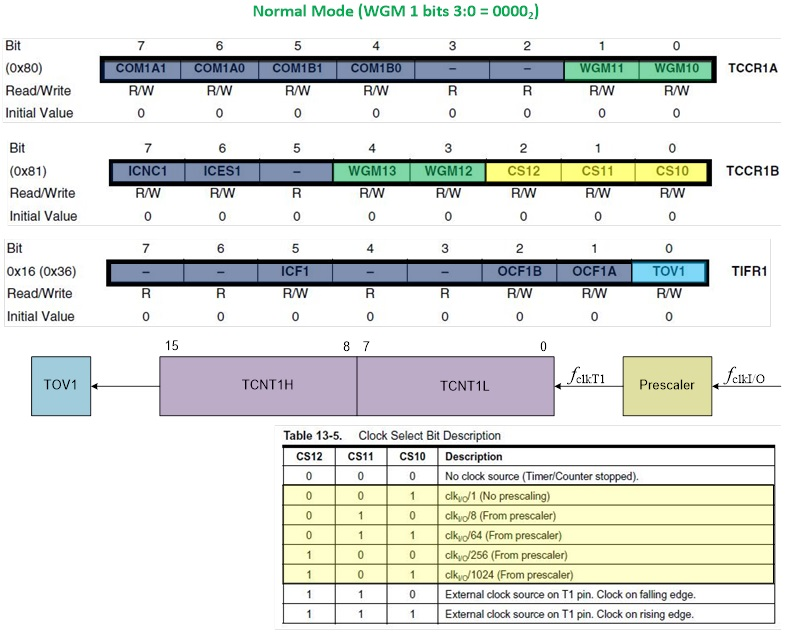

# Lab 3: Timers

* [Pre-Lab preparation](#preparation)
* [Part 1: Polling and interrupts](#part1)
* [Part 2: Timer overflow](#part2)
* [Part 3: Extend the overflow](#part3)
* [Challenges](#challenges)
* [References](#references)

### Component list

* Arduino Uno board, USB cable
* Breadboard
* 2 LEDs or 1 two-color LED
* 2 resistors
* 1 push button
* Jumper wires

### Learning objectives

* Use `#define` compiler directives
* Use internal microcontroller timers
* Understand overflow
* Combine different interrupts

<a name="preparation"></a>

## Pre-Lab preparation

Consider an *n*-bit number that we increment based on the clock signal. If we reach its maximum value and try to increase it, the value will be reset. We call this state an **overflow**. The overflow time depends on the frequency of the clock signal, the number of bits, and on the prescaler value:


> **Note:** The equation was generated by [Online LaTeX Equation Editor](https://www.codecogs.com/latex/eqneditor.php) using the following code.
>
> ```LaTeX
> t_{OVF} = \frac{1}{f_{CPU}}\cdot 2^{nbit}\cdot prescaler
> ```

1. Complete the `GPIO_toggle` function in `gpio.h` library from the previous lab.

2. Calculate the overflow times for three Timer/Counter modules that contain ATmega328P if CPU clock frequency is 16&nbsp;MHz. Complete the following table for given prescaler values. Note that, Timer/Counter2 is able to set 7 prescaler values, including 32 and 128 and other timers have only 5 prescaler values.

   | **Module** | **Number of bits** | **1** | **8** | **32** | **64** | **128** | **256** | **1024** |
   | :-: | :-: | :-: | :-: | :-: | :-: | :-: | :-: | :-: |
   | Timer/Counter0 | 8  | 16u | 128u | -- | | -- | | |
   | Timer/Counter1 | 16 |     |      | -- | | -- | | |
   | Timer/Counter2 | 8  |     |      |    | |    | | |

<a name="part1"></a>

## Part 1: Polling and interrupts

The state of continuous monitoring of any parameter is called **polling**. The microcontroller keeps checking the status of other devices; and while doing so, it does no other operation and consumes all its processing time for [monitoring](https://www.renesas.com/us/en/support/technical-resources/engineer-school/mcu-programming-peripherals-04-interrupts.html).

While polling is a straightforward method for monitoring state changes, it comes with a trade-off. If the polling interval is too long, there may be a significant delay between the occurrence and detection of a state change, potentially leading to missing the change entirely if the state reverts before the next check. On the other hand, a shorter interval provides quicker and more dependable detection, but it also consumes considerably more processing time and power, as there are more unsuccessful checks.

An alternative approach is to employ **interrupts**. In this approach, a state change triggers an interrupt signal that prompts the CPU to pause its current operation (while preserving its current state), execute the interrupt-related processing, and subsequently restore its prior state before resuming from where it had been interrupted.


An interrupt is a fundamental feature of a microcontroller. It represents a signal sent to the processor by hardware or software, signifying an event that requires immediate attention. When an interrupt is triggered, the controller finishes executing the current instruction and proceeds to execute an **Interrupt Service Routine (ISR)** or Interrupt Handler. ISR tells the processor or controller what to do when the [interrupt occurs](https://www.tutorialspoint.com/embedded_systems/es_interrupts.htm). After the interrupt code is executed, the program continues exactly where it left off.

Interrupts can be set up for events such as a counter's value, a pin changing state, receiving data through serial communication, or when the Analog-to-Digital Converter has completed the conversion process. See the [ATmega328P datasheet](https://www.microchip.com/wwwproducts/en/ATmega328p) (section **Interrupts > Interrupt Vectors in ATmega328 and ATmega328P**) for sources of interruptions that can occur on ATmega328P.

All interrupts are disabled by default. If you want to use them, you must first enable them individually in specific control registers and then enable them centrally with the `sei()` command (Set interrupt). You can also centrally disable all interrupts with the `cli()` command (Clear interrupt).

<a name="part2"></a>

## Part 2: Timer overflow

A timer (or counter) is an integral hardware component in a microcontroller unit (MCU) designed for measuring time-based events. The ATmega328P MCU features three timers, designated as Timer/Counter0, Timer/Counter1, and Timer/Counter2. Timer0 and Timer2 are 8-bit timers, whereas Timer1 is a 16-bit timer.

The counter increments in alignment with the microcontroller clock, ranging from 0 to 255 for an 8-bit counter or 65,535 for a 16-bit counter. If counting continues, the timer value overflows to the default value of zero. Various clock sources can be designated for each timer by utilizing a CPU frequency divider equipped with predetermined prescaler values, including 8, 64, 256, 1024, and [other options](https://www.arxterra.com/12-timer-interrupts/).



1. The timer modules can be configured with several special purpose registers. According to the [ATmega328P datasheet](https://www.microchip.com/wwwproducts/en/ATmega328p) (eg in the **8-bit Timer/Counter0 with PWM > Register Description** section), which I/O registers and which bits configure the timer operations?

   | **Module** | **Operation** | **I/O register(s)** | **Bit(s)** |
   | :-: | :-- | :-: | :-- |
   | Timer/Counter0 | Prescaler<br><br>8-bit data value<br>Overflow interrupt enable | <br><br><br> | <br><br><br> |
   | Timer/Counter1 | Prescaler<br><br>16-bit data value<br>Overflow interrupt enable | TCCR1B<br><br>TCNT1H, TCNT1L<br>TIMSK1 | CS12, CS11, CS10<br>(000: stopped, 001: 1, 010: 8, 011: 64, 100: 256, 101: 1024)<br>TCNT1[15:0]<br>TOIE1 (1: enable, 0: disable) |
   | Timer/Counter2 | Prescaler<br><br>8-bit data value<br>Overflow interrupt enable | <br><br><br> | <br><br><br> |

2. In Visual Studio Code create a new PlatformIO project `lab3-timers` for `Arduino Uno` board and change project location to your local folder.

3. IMPORTANT: Rename `LAB3-TIMERS > src > main.cpp` file to `main.c`, ie change the extension to `.c`.

4. In PlatformIO project, create a new folder `LAB3-TIMERS > lib > gpio`. Copy your GPIO library files `gpio.c` and `gpio.h` from the previous lab to this folder.

5. In PlatformIO project, create a new file `LAB3-TIMERS > include > timer.h`. Copy/paste [header file](https://raw.githubusercontent.com/tomas-fryza/avr-course/refs/heads/master/library/timer/timer.h) to `timer.h`. See the final project structure:

   ```c
   LAB3-TIMERS         // PlatfomIO project
   ├── include         // Included file(s)
   │   └── timer.h
   ├── lib             // Libraries
   │   └── gpio        // Your GPIO library (from the previous Lab)
   │       ├── gpio.c
   │       └── gpio.h
   ├── src             // Source file(s)
   │   └── main.c
   ├── test            // No need this
   └── platformio.ini  // Project Configuration File
   ```

   To simplify the configuration of control registers, we defined Timer/Counter1 macros with meaningful names in the `timer.h` file. Because we only define macros and not function bodies, the `timer.c` source file is **not needed** this time!

6. Copy/paste the following template to `LAB3-TIMERS > src > main.c` source file and complete the code to blink the on-board LED every 262 ms using Timer1 overflow interrupt.

   ```c
   // -- Includes -------------------------------------------------------
   #include <avr/io.h>         // AVR device-specific IO definitions
   #include <avr/interrupt.h>  // Interrupts standard C library for AVR-GCC
   #include <gpio.h>           // GPIO library for AVR-GCC
   #include "timer.h"          // Timer library for AVR-GCC

   int main(void)
   {
       ...
       // Enable overflow interrupt
       TIM1_ovf_enable();
       ...
       // Enables interrupts by setting the global interrupt mask
       sei();
       ...
   }

   // Interrupt service routines
   ISR(TIMER1_OVF_vect)
   {
       ...
   }
   ```

7. In `timer.h` header file, define similar macros also for Timer/Counter0.

8. On the breadboard, connect an LED and a resistor to pin PB0. Alternatively, you can use a [two-color LED](http://lednique.com/leds-with-more-than-two-pins/) (a 3-pin LED) and resistors. If you choose the two-color LED, connect its pins to PB0 and PB1. In `main.c` file, modify the code to use Timer0 and Timer1 interrupts to control all the LEDs. Compile the code and upload it to the ATmega328P microcontroller. Ensure that the LEDs operate correctly as per the modified code.

9. (Optional:) Consider an active-low push button with internal pull-up resistor on the PD2 pin.  Use Timer0 4-ms overflow to read button status. If the push button is pressed, turn on the on-board LED; turn the LED off after releasing the button. Note: Within the Timer0 interrupt service routine, use a read function from your GPIO library to get the button status.

<a name="part3"></a>

## Part 3: Extend the overflow

1. Use Timer/Counter0 16-ms overflow and toggle external LED approximately every 100&nbsp;ms (6 overflows x 16 ms = 100 ms).

   **Note:** Use **static** variables declared in functions that use them for even better isolation or use volatile for all variables used in both Interrupt routines and main code loop. According to [[7]](https://stackoverflow.com/questions/52996693/static-variables-inside-interrupts) the declaration line `static uint8_t n_ovfs = 0;` is only executed the first time, but the variable value is updated/stored each time the ISR is called.

   ```c
   ISR(TIMER0_OVF_vect)
   {
       static uint8_t n_ovfs = 0;

       n_ovfs++;
       if (n_ovfs >= 6)
       {
           // Do this every 6 x 16 ms = 100 ms
           n_ovfs = 0;
           ...
       }
       // Else do nothing and exit the ISR
   }
   ```

2. Reduce the overflow time by storing a non-zero value in the Timer/Counter0 data register TCNT0 after each overflow.

   ```c
   ISR(TIMER0_OVF_vect)
   {
       static uint8_t n_ovfs = 0;

       // Change 8-bit timer value anytime it overflows
       TCNT0 = 128;

       n_ovfs++;
       if (n_ovfs >= 6)
       {
           n_ovfs = 0;
           ...
       }

       // Overflow time: t_ovf = 1/f_cpu * (2^bit-init) * prescaler
       // Normal counting:
       // TCNT0 = 0, 1, 2, ...., 128, 129, ...., 254, 255, 0, 1
       //        |---------------------------------------|
       //                         16 ms
       // t_ovf = 1/16e6 * 256 * 1024 = 16 ms
       //
       // Shortened counting:
       // TCNT0 = 0, 128, 129, ...., 254, 255, 0, 128, ....
       //        |---------------------------|
       //                     8 ms
       // t_ovf = 1/16e6 * (256-128) * 1024 = 8 ms
   }
   ```

3. (Optional:) Use CTC (Clear Timer on Compare Match) mode of Timer0 and create a 1-millisecond time base with `TIMER0_COMPA_vect` interrupt vector. Toggle output pin using this interrupt and verify 1-millisecond duration by a logic analyzer.

<a name="challenges"></a>

## Challenges

1. In `timer.h` header file, complete macros for all three timers.

2. Enhance the current application to control four LEDs in the [Knight Rider style](https://www.youtube.com/watch?v=w-P-2LdS6zk). Avoid using the delay library and instead, implement this functionality using a single Timer/Counter.

3. Use the [ATmega328P datasheet](https://www.microchip.com/wwwproducts/en/ATmega328p) (section **8-bit Timer/Counter0 with PWM > Modes of Operation**) to find the main differences between:
   * Normal mode,
   * Clear Timer on Compare mode,
   * Fast PWM mode, and
   * Phase Correct PWM Mode.

<a name="references"></a>

## References

1. Tomas Fryza. [Schematic of Arduino Uno board](https://oshwlab.com/tomas.fryza/arduino-shields)

2. Microchip Technology Inc. [ATmega328P datasheet](https://www.microchip.com/wwwproducts/en/ATmega328p)

3. Renesas Electronics Corporation. [Essentials of Microcontroller Use Learning about Peripherals: Interrupts](https://www.renesas.com/us/en/support/technical-resources/engineer-school/mcu-programming-peripherals-04-interrupts.html)

4. Tutorials Point. [Embedded Systems - Interrupts](https://www.tutorialspoint.com/embedded_systems/es_interrupts.htm)

5. [C library manual](https://www.nongnu.org/avr-libc/user-manual/group__avr__interrupts.html)

6. norwega. [Knight Rider style chaser](https://www.youtube.com/watch?v=w-P-2LdS6zk)

7. StackOverflow. [Static variables inside interrupts](https://stackoverflow.com/questions/52996693/static-variables-inside-interrupts)

8. Tutorials Point. [Arduino - Pulse Width Modulation](https://www.tutorialspoint.com/arduino/arduino_pulse_width_modulation.htm)

9. [Interrupts and 16-bit Timer/Counter 1: Atmel AVR Timers and Interrupts](https://www.arxterra.com/12-timer-interrupts/)
