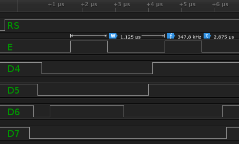
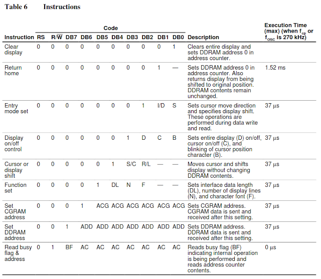
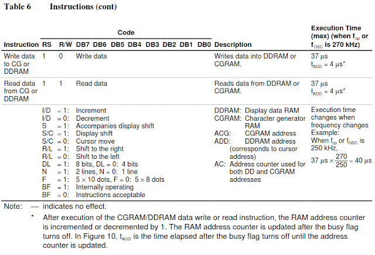
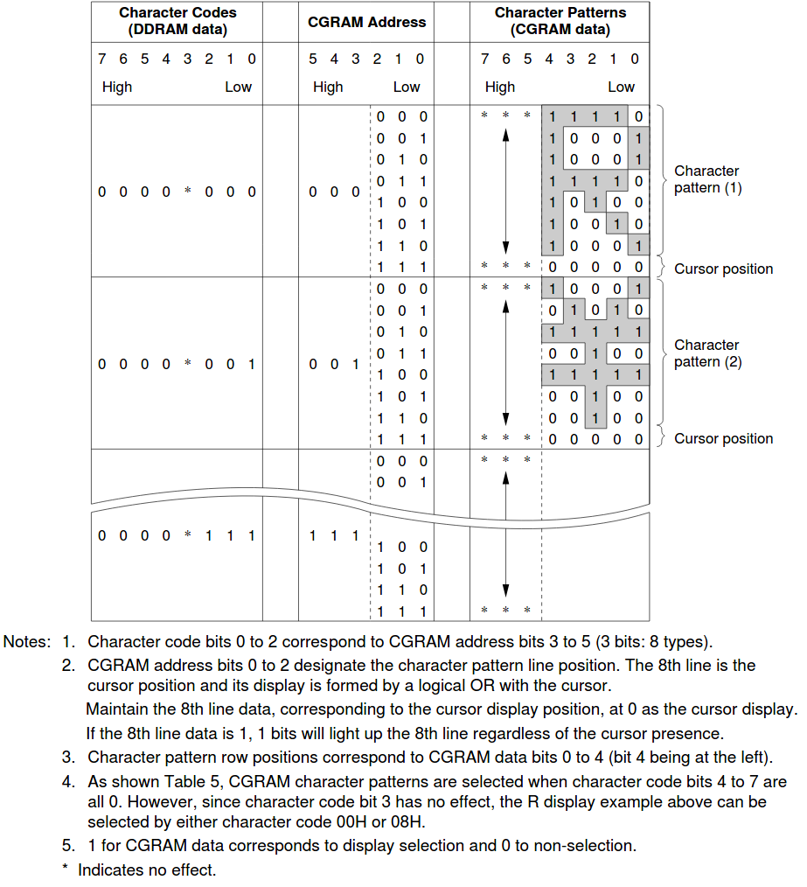
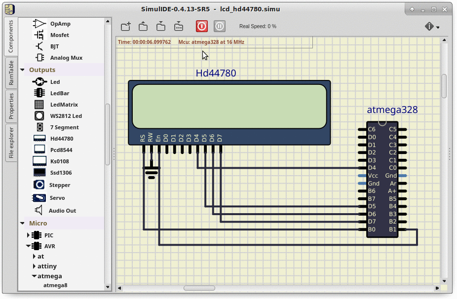

# Lab 4: LCD (Liquid crystal display)

* [Pre-Lab preparation](#preparation)
* [Part 1: LCD screen module](#part1)
* [Part 2: Library for HD44780 based LCDs](#part2)
* [Part 3: Stopwatch](#part3)
* [Part 4: Custom characters](#part4)
* [Challenges](#challenges)
* [References](#references)

### Component list

* Arduino Uno board, USB cable
* LCD keypad shield

### Learning objectives

* Use alphanumeric LCD
* Understand the digital communication between MCU and HD44780
* Understand the ASCII table
* Use library functions for LCD
* Generate custom characters on LCD

<a name="preparation"></a>

## Pre-Lab preparation

1. Use schematic of the [LCD keypad shield](https://oshwlab.com/tomas.fryza/arduino-shields) and find out the connection of LCD display. What data and control signals are used? What is the meaning of these signals?

   | **LCD signal(s)** | **AVR pin(s)** | **Description** |
   | :-: | :-: | :-- |
   | RS | PB0 | Register selection signal. Selection between Instruction register (RS=0) and Data register (RS=1) |
   | R/W |  |  |
   | E |  |  |
   | D[3:0] |  |  |
   | D[7:4] |  |  |
   | K |  |  |

2. What is the ASCII table? What are the codes/values for uppercase letters `A` to `E`, lowercase letters `a` to `e`, and numbers `0` to `4` in this table?

   | **Char** | **Decimal** | **Hexadecimal** |
   | :-: | :-: | :-: |
   | `A` | 65 | 0x41 |
   | `B` |  |  |
   | ... |  |  |
   | `a` | 97 | 0x61 |
   | `b` |  |  |
   | ... |  |  |
   | `0` | 48 | 0x30 |
   | `1` |  |  |
   | ... |  |  |

<a name="part1"></a>

## Part 1: LCD screen module

**LCD (Liquid Crystal Display)** is an electronic device which is used for display any ASCII text. There are many different screen sizes e.g. 16x1, 16x2, 16x4, 20x4, 40x4 characters and each character is made of 5x8 matrix pixel dots. LCD displays have different LED back-light in yellow-green, white and blue color. LCD modules are mostly available in COB (Chip-On-Board) type. With this method, the controller IC chip or driver (here: HD44780) is directly mounted on the backside of the LCD module itself.

The control is based on the Hitachi HD44780 chipset (or a compatible), which is found on most text-based LCDs, and hence the driving software remains the same even for different screen sizes. The driver contains instruction set, character set, and in addition you can also generate your own characters.

The HD44780 is capable of operating in 8-bit mode i.e. faster, but 11 microcontroller pins (8 data + 3 control) are needed. Because the speed is not really that important as the amount of data needed to drive the display is low, the 4-bit mode is more appropriate for microcontrollers since only 4+2=6 (or 4+3=7) pins are needed.

In 8-bit mode we send the command/data to the LCD using eight data lines (D0-D7), while in 4-bit mode we use four data lines (D4-D7) to send commands and data. Inside the HD44780 there is still an 8-bit operation so for 4-bit mode, two writes to get 8-bit quantity inside the chip are made (first high four bits and then low four bits with an E clock pulse).

In the lab, the LCD1602 display module is used. The display consists of 2 rows of 16 characters each. It has an LED back-light and it communicates through a parallel interface with only 6 wires (+ 1 signal for backglight control):

* RS - register select. Selects the data or instruction register inside the HD44780
* E - enable. This loads the data into the HD44780 on the falling edge
* (at LCD keypad shield, R/W pin is permanently connected to GND)
* D7:4 - Upper nibble used in 4-bit mode
* K - Back-light cathode


When a command is given to LCD, the command register (RS = 0) is selected and when data is sent to LCD, the data register (RS = 1) is selected. A **command** is an instruction entered on the LCD in order to perform the required function. In order to display textual information, **data** is send to LCD.

> ### Example of HD44780 communication
>
> **Question:** Let the following image shows the communication between ATmega328P and LCD display in 4-bit mode. How does HD44780 chipset understand the sequence of these signals?
>
> &nbsp;
> 
>
> **Answer:** The following signals are read on the first falling edge of the enable, therefore: `RS = 1` (data register) and higher four data bits `D7:4 = 0100`. On the second falling edge of enable, the lower four data bits are `D7:4 = 0011`. The whole byte transmitted to the LCD is therefore `0100_0011` (0x43) and according to the ASCII (American Standard Code for Information Interchange) table, it represents letter `C`.
>
> The Hitachi HD44780 has many commands, the most useful for initialization, xy location settings, and print [[1]](https://www.sparkfun.com/datasheets/LCD/HD44780.pdf).
>
> If you are an advanced programmer and would like to create your own library for interfacing your microcontroller with an LCD module then you have to understand those instructions and commands which can be found its datasheet.





<a name="part2"></a>

## Part 2: Library for HD44780 based LCDs

In the lab, we are using [LCD library for HD44780 based LCDs](http://www.peterfleury.epizy.com/avr-software.html) developed by Peter Fleury.

1. Use the online manual of LCD library (generated by [Doxygen tool](https://www.doxygen.nl/manual/docblocks.html#specialblock)) and add input parameters and description of the following functions.

   | **Function name** | **Function parameters** | **Description** | **Example** |
   | :-- | :-- | :-- | :-- |
   | `lcd_init` | `LCD_DISP_OFF`<br>`LCD_DISP_ON`<br>`LCD_DISP_ON_CURSOR`<br>`LCD_DISP_ON_CURSOR_BLINK` | Display off&nbsp;&nbsp;&nbsp;&nbsp;&nbsp;&nbsp;&nbsp;&nbsp;&nbsp;&nbsp;&nbsp;&nbsp;&nbsp;&nbsp;&nbsp;&nbsp;&nbsp;&nbsp;&nbsp;&nbsp;&nbsp;&nbsp;&nbsp;&nbsp;&nbsp;&nbsp;&nbsp;&nbsp;&nbsp;&nbsp;&nbsp;&nbsp;&nbsp;&nbsp;&nbsp;&nbsp;&nbsp;&nbsp;&nbsp;&nbsp;&nbsp;&nbsp;&nbsp;&nbsp;&nbsp;<br>...&nbsp;<br>...&nbsp;<br>...&nbsp; | `lcd_init(LCD_DISP_OFF);`<br>...&nbsp;<br>...&nbsp;<br>...&nbsp; |
   | `lcd_clrscr` | | | `lcd_clrscr();` |
   | `lcd_gotoxy` | | | |
   | `lcd_putc` | | | |
   | `lcd_puts` | | | |
   | `lcd_custom_char` | | | |

2. In Visual Studio Code create a new PlatformIO project `lab4-lcd` for `Arduino Uno` board and change project location to your local folder.

3. IMPORTANT: Rename `LAB4-LCD > src > main.cpp` file to `main.c`, ie change the extension to `.c`.

4. Copy the `timer.h` header file from the previous lab to `LCD4-LCD > include` folder.

5. In PlatformIO project, create a new folder `LAB4-LCD > lib > gpio`. Copy your GPIO library files `gpio.c` and `gpio.h` from the previous labs to this folder.

6. In PlatformIO project, create a new folder `LAB4-LCD > lib > lcd`. Within this folder, create three new files `lcd.c`, `lcd.h`, and `lcd_definitions.h`. The final project structure should look like this:

   ```c
   LAB4-LCD            // PlatfomIO project
   ├── include         // Included file(s)
   │   └── timer.h
   ├── lib             // Libraries
   │   └── gpio        // Your GPIO library
   │   │   ├── gpio.c
   │   │   └── gpio.h
   │   └── lcd         // Peter Fleury's LCD library
   │       ├── lcd.c
   │       ├── lcd.h
   │       └── lcd_definitions.h
   ├── src             // Source file(s)
   │   └── main.c
   ├── test            // No need this
   └── platformio.ini  // Project Configuration File
   ```

   1. Copy/paste [header file](https://raw.githubusercontent.com/tomas-fryza/avr-course/master/library/include/lcd.h) to `lcd.h`
   2. Copy/paste [header file](https://raw.githubusercontent.com/tomas-fryza/avr-course/master/library/include/lcd_definitions.h) to `lcd_definitions.h`
   3. Copy/paste [library source file](https://raw.githubusercontent.com/tomas-fryza/avr-course/master/library/lcd.c) to `lcd.c`

7. Go through the `lcd_definitions.h` and `main.c` files and make sure you understand each line. Build and upload the code to Arduino Uno board.

8. Copy/paste [template code](https://raw.githubusercontent.com/tomas-fryza/avr-course/master/lab4-lcd/main.c) to `LAB4-LCD > src > main.c` source file.

9. Use library functions `lcd_gotoxy()`, `lcd_puts()`, `lcd_putc()` and display strings/characters on the LCD as shown in the figure bellow. Explanation: You will later display the square of seconds at position "a", the process bar at "b", and the rotating text at position "c". Note, there is a non-blinking cursor after letter "c".

   

> **Note:** The figure above was created by online [LCD Display Screenshot Generator](http://avtanski.net/projects/lcd/).

10. Use the PB2 pin to control the back-light of the LCD screen. (Optionally: Create a new library function for this purpose.)

<a name="part3"></a>

## Part 3: Stopwatch

1. Use Timer/Counter2 16-ms overflow and update the stopwatch LCD value approximately every 100&nbsp;ms (6 x 16 ms = 100 ms) as explained in the previous lab. Display tenths of a second only in the form `00:00.tenths`, ie let the stopwatch counts from `00:00.0` to `00:00.9` and then starts again. Update LCD values within the forever loop in `main` function when global flag variable `update_lcd_stopwatch` is equal to `1`.

   

   **IMPORTANT:** Because library functions only allow to display a string (`lcd_puts`) or individual characters (`lcd_putc`), the variables' number values need to be converted to such strings. To do this, use the `itoa(number, string, num_base)` function from the standard `stdlib.h` library. The `num_base` parameter allows you to display the `number` in decimal, hexadecimal, or binary.

   ```c
   ...
   #include <stdlib.h>         // C library. Needed for number conversions
   ...
   /* Global variables --------------------------------------------------*/
   // Flag for printing new stopwatch data to LCD
   volatile uint8_t update_lcd_stopwatch = 0;

   // Stopwatch values
   // Declaration of "stopwatch" variable with structure "Stopwatch_structure"
   struct Stopwatch_structure {
       uint8_t tenths;  // Tenths of a second
       uint8_t secs;    // Seconds
       uint8_t mins;    // Minutes
   } stopwatch;

   int main(void)
   {
       char string[2];  // String for converted numbers by itoa()
       ...

       // Infinite loop
       while (1)
       {
           if (update_lcd_stopwatch == 1)
           {
               itoa(stopwatch.tenths, string, 10);  // Convert decimal value to string
               // Display "00:00.tenths"
               lcd_gotoxy(7, 0);
               lcd_puts(string);

               // WRITE YOUR CODE HERE

               update_lcd_stopwatch = 0;
           }
       }
   }

   ISR(TIMER2_OVF_vect)
   {
       ...
       update_lcd_stopwatch = 1;
   }
   ```

2. A flowchart is a visual representation of a certain process or flow of instructions of an algorithm that helps to understand it. A flowchart basically uses rectangles, diamonds, ovals and various other shapes to make the problem easier to understand.

   

3. Complete the stopwatch flowchart of the Timer/Counter2 interrupt service routine with seconds. According to the flowchart, program the `ISR()` source code. Let the stopwatch counts from `00:00.0` to `00:59.9` and then starts again.

   

<a name="part4"></a>

## Part 4: Custom characters

All LCD displays based on the Hitachi HD44780 controller have two types of memory that store defined characters: CGROM and CGRAM (Character Generator ROM & RAM). The CGROM memory is non-volatile and cannot be modified, while the CGRAM memory is volatile and can be modified at any time [[4]](https://lastminuteengineers.com/arduino-1602-character-lcd-tutorial/).

CGROM memory is used to store all permanent fonts that can be displayed using their ASCII code. For example, if we write 0x43, then we get the character "C" on the display. In total, it can generate 192 5x8 character patterns.


CGRAM is another memory that can be used for storing user defined characters. This RAM is limited to 64 bytes. Meaning, for 5x8 pixel based LCD, up to 8 user-defined characters can be stored in the CGRAM. It is useful if you want to use a character that is not part of the standard 127-character ASCII table.



A custom character is an array of 8 bytes. Each byte (only 5 bits are considered) in the array defines one row of the character in the 5x8 matrix. Whereas, the zeros and ones in the byte indicate which pixels in the row should be on and which ones should be off.

Use [LCD pattern library](https://www.quinapalus.com/hd44780udg.html) and generate two 5 by 8 custom characters. Use the foíllowing structure to display them on the sceen.

   ```c
   ...
   int main(void)
   {
       // Custom character definition https://www.quinapalus.com/hd44780udg.html
       uint8_t new_char1[8] = {0x2,0x3,0x2,0x2,0xe,0x1e,0xc,0x0};
       ...
       // Custom character(s)
       lcd_custom_char(7, new_char1);
       lcd_gotoxy(13, 0);
       lcd_putc(7);
       ...
   }
   ```

2. Design at least two more custom character, store it in CGRAM memory according to the previous code, and display all three new characters on the LCD screen.

<a name="challenges"></a>

## Challenges

1. Complete the `TIMER2_OVF_vect` interrupt routine with stopwatch code and display `minutes:seconds.tenths`.

   

2. In `lcd.h` and `lcd.c` files create a new library function to turn on/off LCD's backlight.

3. Display the square value of the `seconds` at LCD position "a".

   

4. Use new characters and create a progress bar at LCD position "b". Let the full bar state corresponds to one second.

   

   

   Hint: Use Timer/Counter0 with 16ms overflow and change custom characters at specific display position.

5. From LCD position "c", displays running text, ie text that moves characters to the left twice per second. Hint: Use Timer/Counter1 with an 262ms prescaler and every 2nd overflow move the auxiliary variable along the defined string, such as `uint8_t running_text[] = "   I like Digital electronics!\n";`.

   

6. Draw a flowchart for `TIMER2_OVF_vect` interrupt service routine which overflows every 16&nbsp;ms but it updates the stopwatch LCD screen approximately every 100&nbsp;ms (6 x 16&nbsp;ms = 100&nbsp;ms). Display tenths of a second, seconds, and minutes and let the stopwatch counts from `00:00.0` to `59:59.9` and then starts again. The image can be drawn on a computer or by hand. Use clear description of individual algorithm steps.

<a name="references"></a>

## References

1. HITACHI. [HD44780U, Dot Matrix Liquid Crystal Display Controller/Driver](https://www.sparkfun.com/datasheets/LCD/HD44780.pdf)

2. Peter Fleury. [LCD library for HD44780 based LCDs](http://www.peterfleury.epizy.com/avr-software.html)

3. avtanski.net. [LCD Display Screenshot Generator](http://avtanski.net/projects/lcd/)

4. LastMinuteEngineers.com. [Interfacing 16×2 Character LCD Module with Arduino](https://lastminuteengineers.com/arduino-1602-character-lcd-tutorial/)

5. omerk.github.io. [Custom Character Generator for HD44780 LCD Modules](https://omerk.github.io/lcdchargen/)

6. Protostack Pty Ltd. [HD44780 Character LCD Displays – Part 1](https://protostack.com.au/2010/03/character-lcd-displays-part-1/)

7. [Circuit Basics](https://www.circuitbasics.com/)

8. [CGRAM display memory](https://www.mikroe.com/ebooks/pic-microcontrollers-programming-in-c/additional-components)

9. Tomas Fryza. [Schematic of LCD Keypad shield](https://oshwlab.com/tomas.fryza/arduino-shields)
