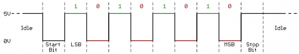

# Lab 5: UART (Universal Asynchronous Receiver-Transmitter)

* [Pre-Lab preparation](#preparation)
* [Part 1: Basics of UART communication](#part1)
* [Part 2: UART transmitter](#part2)
* [Part 3: Bidirectional communication between Arduino board and computer](#part3)
* [Challenges](#challenges)
* [References](#references)

### Component list

* Arduino Uno board, USB cable
* Logic analyzer

### Learning objectives

* Understand the UART communication
* Decode UART frames
* Use functions from UART library
* Use logic analyzer

<a name="preparation"></a>

## Pre-Lab preparation

1. Use schematic of [Arduino Uno](https://oshwlab.com/tomas.fryza/arduino-shields) board and find out on which Arduino Uno pins the UART transmitter (Tx) and receiver (Rx) are located.

2. Remind yourself, what an [ASCII table](http://www.asciitable.com/) is. What codes are defined for control characters `Esc`, `Space`, `Tab`, and `Enter`?

<a name="part1"></a>

## Part 1: Basics of UART communication

The UART (Universal Asynchronous Receiver-Transmitter) is not a communication protocol like SPI and I2C, but a physical circuit in a microcontroller, or a stand-alone integrated circuit, that translates communicated data between serial and parallel forms. It is one of the simplest and easiest method for implement and understanding.

In UART communication, two UARTs communicate directly with each other. The transmitting UART converts parallel data from a CPU into serial form, transmits it in serial to the receiving UART, which then converts the serial data back into parallel data for the receiving device. Only two wires are needed to transmit data between two UARTs. Data flows from the Tx pin of the transmitting UART to the Rx pin of the receiving UART: [link](https://www.circuitbasics.com/basics-uart-communication/), [link](https://www.analog.com/en/analog-dialogue/articles/uart-a-hardware-communication-protocol.html).

UARTs transmit data asynchronously, which means there is no external clock signal to synchronize the output of bits from the transmitting UART. Instead, timing is agreed upon in advance between both units, and special **Start** (log. 0) and 1 or 2 **Stop** (log. 1) bits are added to each data package. These bits define the beginning and end of the data packet so the receiving UART knows when to start reading the bits. In addition to the start and stop bits, the packet/frame also contains data bits and optional parity.

The amount of **data** in each packet can be set from 5 to 9 bits. If it is not otherwise stated, data is transferred least-significant bit (LSB) first.

**Parity** is a form of very simple, low-level error checking and can be Even or Odd. To produce the parity bit, add all 5-9 data bits and extend them to an even or odd number. For example, assuming parity is set to even and was added to a data byte `0110_1010`, which has an even number of 1's (4), the parity bit would be set to 0. Conversely, if the parity mode was set to odd, the parity bit would be 1.

One of the most common UART formats is called **9600 8N1**, which means 8 data bits, no parity, 1 stop bit and a symbol rate of 9600&nbsp;Bd.



> ### Example of UART communication
>
> **Question:** Let the following image shows one frame of UART communication transmitting from the ATmega328P in 8N1 mode. What ASCII code/character does it represent? According to bit period, estimate the symbol rate.
>
> &nbsp;
> 
>
> **Answer:** 8N1 means that 8 data bits are transmitted, no parity is used, and the number of stop bits is one. Because the frame always starts with a low level start bit and the order of the data bits is from LSB to MSB, the data transmitted bu UART is therefore `0100_0101` (0x45) and according to the [ASCII](http://www.asciitable.com/) (American Standard Code for Information Interchange) table, it represents the letter `E`.
>
> The figure further shows that the bit period, i.e. the duration of one bit, is 104&nbsp;us. The symbol rate of the communication is thus 1/104e-6 = 9615, i.e. approximately 9600&nbsp;Bd.

<a name="part2"></a>

## Part 2: UART transmitter

In the lab, we are using [UART library](http://www.peterfleury.epizy.com/avr-software.html) developed by Peter Fleury.

1. Use online manual of UART library and add input parameters and description of the following functions.

   | **Function name** | **Function parameter(s)** | **Description** | **Example** |
   | :-- | :-- | :-- | :-- |
   | `uart_init` | `UART_BAUD_SELECT(9600, F_CPU)` | Initialize UART to 8N1 and set baudrate to 9600&nbsp;Bd | `uart_init(UART_BAUD_SELECT(9600, F_CPU));` |
   | `uart_getc` | None | Returns in the lower byte the received character and in the higher byte the last receive error | `uint16_t value = uart_getc();` |
   | `uart_putc` | | | |
   | `uart_puts` | | | |

2. In Visual Studio Code create a new PlatformIO project `lab5-uart` for `Arduino Uno` board and change project location to your local folder.

3. IMPORTANT: Rename `LAB5-UART > src > main.cpp` file to `main.c`, ie change the extension to `.c`.

4. Copy/paste [template code](https://raw.githubusercontent.com/tomas-fryza/avr-course/master/lab5-uart/main.c) to `LAB5-UART > src > main.c` source file.

5. Copy the `timer.h` header file from the previous labs to `LCD5-UART > include` folder.

6. In PlatformIO project, create a new folder `LAB5-UART > lib > uart`. Within this folder, create two new files `uart.c` and `uart.h`. The final project structure should look like this:

   ```c
   LAB5-UART           // PlatfomIO project
   ├── include         // Included file(s)
   │   └── timer.h
   ├── lib             // Libraries
   │   └── uart        // Peter Fleury's UART library
   │       ├── uart.c
   │       └── uart.h
   ├── src             // Source file(s)
   │   └── main.c
   ├── test            // No need this
   └── platformio.ini  // Project Configuration File
   ```

   1. Copy/paste [library source file](https://raw.githubusercontent.com/tomas-fryza/avr-course/master/library/uart.c) to `uart.c`
   2. Copy/paste [header file](https://raw.githubusercontent.com/tomas-fryza/avr-course/master/library/include/uart.h) to `uart.h`

7. Go through the `main.c` file and make sure you understand each line. Build and upload the code to Arduino Uno board. What is the meaning of ASCII control characters `\r`, `\n`, and `\t`?

   Use **PlatformIO: Serial Monitor** or **PuTTY application** to receive values from Arduino board.
   
   > In PuTTY, set connection type to `Serial` and check that configuration is the same as in the ATmega328P application, ie. 9600 8N1 mode. Note that, **serial line** (here COM3 on Windows) could be different. In Linux, use `dmesg` command to verify your port (such as `/dev/ttyUSB0`).
   >
   >   
   >   
   >
   > **Warning:** Before Arduino board re-programming process, PuTTY app must be closed!
   >
   > In SimulIDE, right click to ATmega328 package and select **Open Serial Monitor**. In this window you can receive data from the microcontroller, but also send them back.

8. Configure Timer1 to overflow once per second and transmit UART string `Paris`.

9. Connect the logic analyzer to the `Tx` wire. Launch the logic analyzer software Logic and **Start** the capture. Saleae Logic software offers a decoding feature to transform the captured signals into meaningful UART messages. Click to **+ button** in **Analyzers** part and setup **Async Serial** decoder.

   

   > **Note:** To perform this analysis, you will need a logic analyzer such as [Saleae](https://www.saleae.com/) or [similar](https://www.amazon.com/KeeYees-Analyzer-Device-Channel-Arduino/dp/B07K6HXDH1/ref=sr_1_6?keywords=saleae+logic+analyzer&qid=1667214875&qu=eyJxc2MiOiI0LjIyIiwicXNhIjoiMy45NSIsInFzcCI6IjMuMDMifQ%3D%3D&sprefix=saleae+%2Caps%2C169&sr=8-6) device. Additionally, you should download and install the [Saleae Logic 1](https://support.saleae.com/logic-software/legacy-software/older-software-releases#logic-1-x-download-links) or [Saleae Logic 2](https://www.saleae.com/downloads/) software on your computer.
   >
   > You can find a comprehensive tutorial on utilizing a logic analyzer in this [video](https://www.youtube.com/watch?v=CE4-T53Bhu0).

<a name="part3"></a>

## Part 3: Bidirectional communication between Arduino board and computer

In this part, you will establish communication between a PC and an Arduino board. Each key press on the computer keyboard will be transmitted via UART to the microcontroller. The Arduino will convert the received key code into several numeric systems and then send these codes back to the PC.

1. Use the `uart_getc` function to receive characters. Display the ASCII code of each received character in hexadecimal, decimal, and binary formats. Disable the Timer1 overflow interrupt and continuously read received characters in the main loop.

   ```c
   ...
   int main(void)
   {
       uint16_t value;
       char string[8];  // String for converted numbers by itoa()

       ...
       while (1)
       {
           // Get received data from UART
           value = uart_getc();
           if ((value & 0xff00) == 0)  // If successfully received data from UART
           {
               // Transmit the received character back via UART
               uart_putc(value);

               // Transmit the ASCII code also in hex, dec, and bin
               itoa(value, string, 16)

               // WRITE YOUR CODE HERE

               // New line
               uart_puts("\r\n");
           }
       }
       return 0;
   }
   ```

   Complete the table.

   | **Char** | **Decimal** | **Hexadecimal** | **Binary** |
   | :-: | :-: | :-: | :-: |
   | `Esc` | 27 | 0x1b | `0b0001_1011` |
   | `Space` |  |  |  |
   | `Tab` |  |  |  |
   | `Backspace` |  |  |  |
   | `Enter` |  |  |  |
   | `0` | 48 | 0x30 | `0b0011_0000` |
   | `1` |  |  |  |
   | `2` |  |  |  |
   | `A` | 65 | 0x41 | `0b0100_0001` |
   | `B` |  |  |  |
   | `C` |  |  |  |
   | `a` | 97 | 0x61 | `0b0110_0001` |
   | `b` |  |  |  |
   | `c` |  |  |  |

2. Use [ANSI Escape Sequences](https://gist.github.com/fnky/458719343aabd01cfb17a3a4f7296797) and modify color and format of one column from the previous table. Try other formatting styles as well.

   ```c
   /* 
    * Color/formatting sequence is prefixed with `Escape` (`\x1b` in hexadecimal,
    * \033, etc), followed by opening square bracket `[`, commands delimited by 
    * semi colon `;` and ended by `m` character.
    *
    * Examples:
    *   \x1b[1;32m  - Set style to bold, green foreground
    *               - Will send sequence of "Esc [ 1 ; 3 2 m"
    *   \x1b[4;31m  - Set underline style, red foreground
    *   \x1b[0m     - Reset all attributes
    */
   uart_puts("\x1b[1;32m");  // 1: bold style; 32: green foreground
   uart_puts("This is all Green and Bold\r\n");
   uart_puts("\x1b[0m");     // 0: reset all attributes
   uart_puts("This is Normal text again\r\n");
   ```

   To enable ANSI color codes in PlatformOI serial monitor, add the following line to `platformio.ini` project configuration file.

   ```bash
   # Enable ANSI color codes in serial monitor
   monitor_raw = yes
   ```

3. Enhance the code from the previous task and read the contents of the Timer 1 data register and send it via UART to the computer when the key code `1` is received. In all other cases, the functionality of the code will remain the same as in the previous example.

   > **Warning:** Keep UART strings as short as possible. But if you need to transmit a larger amount of data, it is necessary to increase the size of the transmit/receive buffer in the `uart.h` file, eg to 128.
   >
   >```c
   >/** @brief  Size of the circular receive buffer, must be power of 2
   > *
   > *  You may need to adapt this constant to your target and your application by adding
   > *  CDEFS += -DUART_RX_BUFFER_SIZE=nn to your Makefile.
   > */
   >#ifndef UART_RX_BUFFER_SIZE
   ># define UART_RX_BUFFER_SIZE 128
   >#endif
   >
   >/** @brief  Size of the circular transmit buffer, must be power of 2
   > *
   > *  You may need to adapt this constant to your target and your application by adding
   > *  CDEFS += -DUART_TX_BUFFER_SIZE=nn to your Makefile.
   > */
   >#ifndef UART_TX_BUFFER_SIZE
   ># define UART_TX_BUFFER_SIZE 128
   >#endif
   >```

<a name="challenges"></a>

## Challenges

1. Program a loop to calculate even parity bit from received character value.

   

2. Verify basic AT commands of Wi-Fi module ESP8266 ESP-01. Connect Wi-Fi module to Arduino Uno board according to the following instructions.

   | **ESP-01 pin** | **Arduino Uno pin** | **ESP-01 pin** | **Arduino Uno pin** |
   | :-: | :-: | :-: | :-: |
   | U0TXD | Tx (pin 1) | GND | GND |
   | CHIP_EN | 3.3V | GPIO2 | Not connected |
   | EXT_RSTB | Not connected | GPIO0 | Not connected |
   | 3.3V | 3.3V | U0RXD | Rx (pin 0) |

   

   In your code, disable interruptions by commenting `// sei();` function. The reason is the micro controller will not affect UART lines and whole communication will be done between Serial Monitor and Wi-Fi module. To use PlatfomIO Serial Monitor, add the following command to `platformio.ini` project configuration file: `monitor_speed = 115200`. Compile and upload the application. Test the following AT commands and see the module's responses. If needed, use Logic analyzer to read the response of Wi-Fi module.

   * `AT` - Check the communication with module
   * `AT+CWMODE=1` - Set the module mode
   * `AT+GMR` - Get the module version
   * `AT+CWLAPOPT=1,6` - Limit the list to `rssi` and `ssid` parameters only
   * `AT+CWLAP` - List `ssid` and `rssi` parameters of available Wi-Fi APs (takes few seconds)

   The complete list and description of all AT commands are available [here](https://github.com/tomas-fryza/avr-course/blob/master/docs/esp8266_at_instruction_set.pdf) or [here](https://digilent.com/reference/pmod/pmodesp32/reference-manual). To avoid a conflict with Wi-Fi module, remove the Tx and Rx wires when uploading the firmware and put them back after the upload is complete.

3. Draw a timing diagram of the output from UART/USART when transmitting three character data `De2` in 4800 7O2 mode (7 data bits, odd parity, 2 stop bits, 4800&nbsp;Bd). The image can be drawn on a computer (by [WaveDrom](https://wavedrom.com/) for example) or by hand. Name all parts of timing diagram.

4. Program a software UART transmitter (emulated UART) that will be able to generate UART data on any output pin of the ATmega328P microcontroller. Let the bit rate be approximately 9600&nbsp;Bd and do not use the delay library. Also consider the possibility of calculating the parity bit. Verify the UART communication with logic analyzer or oscilloscope.

<a name="references"></a>

## References

1. Tomas Fryza. [Schematic of Arduino Uno](https://oshwlab.com/tomas.fryza/arduino-shields) board

2. [ASCII Table](http://www.asciitable.com/)

3. Circuit Basics. [Basics of UART Communication](https://www.circuitbasics.com/basics-uart-communication/)

4. Eric Peňa, Mary Grace Legaspi. [UART: A Hardware Communication Protocol Understanding Universal Asynchronous Receiver/Transmitter](https://www.analog.com/en/analog-dialogue/articles/uart-a-hardware-communication-protocol.html)

5. Peter Fleury. [UART library](http://www.peterfleury.epizy.com/avr-software.html)

6. Kolban Technical Tutorials. [ESP32 Technical Tutorials: Using a logic analyzer](https://www.youtube.com/watch?v=CE4-T53Bhu0)

7. Christian Petersen. [ANSI Escape Sequences](https://gist.github.com/fnky/458719343aabd01cfb17a3a4f7296797)
