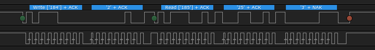

# Lab 6: I2C (Inter-Integrated Circuits)

* [Pre-Lab preparation](#preparation)
* [Part 1: I2C bus](#part1)
* [Part 2: I2C scanner](#part2)
* [Part 3: Communication with I2C devices](#part3)
* [Part 4: OLED display 128x64](#part4)
* [Challenges](#challenges)
* [References](#references)

### Component list

* Arduino Uno board, USB cable
* Breadboard
* DHT12 humidity/temperature sensor
  * Optional: RTC DS3231 and AT24C32 EEPROM memory module
  * Optional: GY-521 module with MPU-6050 microelectromechanical systems
* Logic analyzer
* Jumper wires

### Learning objectives

* Understand the I2C communication
* Use functions from I2C library
* Perform data transfers between MCU and I2C devices

<a name="preparation"></a>

## Pre-Lab preparation

1. Use schematic of the [Arduino Uno](https://oshwlab.com/tomas.fryza/arduino-shields) board and find out on which Arduino Uno pins the SDA and SCL signals are located.

2. Remind yourself, what the general structure of [I2C address and data frame](https://www.electronicshub.org/basics-i2c-communication/) is.

<a name="part1"></a>

## Part 1: I2C bus

I2C (Inter-Integrated Circuit) is a serial communication protocol designed for a two-wire interface, enabling the connection of low-speed devices such as sensors, EEPROMs, A/D and D/A converters, I/O interfaces, and other similar peripherals within embedded systems. Originally developed by Philips, this protocol has gained widespread adoption and is now utilized by nearly all major IC manufacturers.

I2C utilizes just two wires: **SCL** (Serial Clock) and **SDA** (Serial Data). Both of these wires should be connected to a resistor and pulled up to +Vdd. Additionally, I2C level shifters are available for connecting two I2C buses with different voltage levels.

In an I2C bus configuration, there is always one **Master** device and one or more **Slave** devices. Each Slave device is identified by a [unique address](https://i2c.info/).


The initial I2C specifications defined maximum clock frequency of 100 kHz. This was later increased to 400 kHz as Fast mode. There is also a High speed mode which can go up to 3.4 MHz and there is also a 5 MHz ultra-fast mode.

In idle state both lines (SCL and SDA) are high. The communication is initiated by the master device. It generates the Start condition (S) followed by the address of the slave device (SLA). If the bit 0 of the address byte was set to 0 the master device will write to the slave device (SLA+W). Otherwise, the next byte will be read from the slave device (SLA+R). Each byte is supplemented by an ACK (low level) or NACK (high level) acknowledgment bit, which is always transmitted by the device receiving the previous byte.

The address byte is followed by one or more data bytes, where each contains 8 bits and is again terminated by ACK/NACK. Once all bytes are read or written the master device generates Stop condition (P). This means that the master device switches the SDA line from low voltage level to high voltage level before the SCL line switches from [high to low](https://www.electronicshub.org/basics-i2c-communication/).


Note that, most I2C devices support repeated start condition. This means that before the communication ends with a stop condition, master device can repeat start condition with address byte and change the mode from writing to reading.

> ### Example of I2C communication
>
> **Question:** Let the following image shows several frames of I2C communication between ATmega328P and a slave device. What circuit is it and what information was sent over the bus?
>
> &nbsp;
> 
>
> **Answer:** This communication example contains a total of five frames. After the start condition, which is initiated by the master, the address frame is always sent. It contains a 7-bit address of the slave device, supplemented by information on whether the data will be written to the slave or read from it to the master. The ninth bit of the address frame is an acknowledgment provided by the receiving side.
>
> Here, the address is 184 (decimal), i.e. `101_1100-0` in binary including R/W=0. The slave address is therefore 101_1100 (0x5c) and master will write data to the slave. The slave has acknowledged the address reception, so that the communication can continue.
>
> According to the list of [I2C addresses](https://learn.adafruit.com/i2c-addresses/the-list) the device could be humidity/temp or pressure sensor. The signals were really recorded when communicating with the humidity and temperature sensor.
>
> The data frame always follows the address one and contains eight data bits from the MSB to the LSB and is again terminated by an acknowledgment from the receiving side. Here, number `2` was written to the sensor. According to the [DHT12 sensor manual](https://github.com/tomas-fryza/avr-course/blob/master/docs/dht12_manual.pdf), this is the memory address, to which the integer part of measured temperature is stored. (The following register contains its decimal part.)
>
> | **Memory location** | **Description** |
> | :-: | :-- |
> | 0x00 | Humidity integer part |
> | 0x01 | Humidity decimal part |
> | 0x02 | Temperature integer part |
> | 0x03 | Temperature decimal part |
> | 0x04 | Checksum |
>
> After the repeated start, the same circuit address is sent on the I2C bus, but this time with the read bit R/W=1 (185, `1011100_1`). Subsequently, data frames are sent from the slave to the master until the last of them is confirmed by the NACK value. Then the master generates a stop condition on the bus and the communication is terminated.
>
> The communication in the picture therefore records the temperature transfer from the sensor, when the measured temperature is 25.3 degrees Celsius.
>
> | **Frame #** | **Description** |
> | :-: | :-- |
> | 1 | Address frame with SLA+W = 184 (0x5c<<1 + 0) |
> | 2 | Data frame sent to the Slave represents the ID of internal memory location |
> | 3 | Address frame with SLA+R = 185 (0x5c<<1 + 1) |
> | 4 | Data frame with integer part of temperature read from Slave |
> | 5 | Data frame with decimal part of temperature read from Slave |

<a name="part2"></a>

## Part 2: I2C scanner

The goal of this task is to create a program that will verify the presence of devices connected to the I2C bus by sequentially trying all address combinations.

1. In Visual Studio Code create a new PlatformIO project `lab6-i2c` for `Arduino Uno` board and change project location to your local folder.

2. IMPORTANT: Rename `LAB6-I2C > src > main.cpp` file to `main.c`, ie change the extension to `.c`.

3. Copy/paste [template code](https://raw.githubusercontent.com/tomas-fryza/avr-course/master/lab6-i2c/main.c) to `LAB6-I2C > src > main.c` source file.

4. Copy the `timer` and `uart` libraries from the previous lab to the proper locations within the `LAB6-IC2` project.

5. In PlatformIO project, create a new folder `LAB6-I2C > lib > twi`. Within this folder, create two new files `twi.c` and `twi.h`. The final project structure should look like this:

   ```c
   LAB6-I2C            // PlatfomIO project
   ├── include         // Included file(s)
   │   └── timer.h
   ├── lib             // Libraries
   │   ├── twi         // Tomas Fryza's TWI/I2C library
   │   │   ├── twi.c
   │   │   └── twi.h
   │   └── uart        // Peter Fleury's UART library
   │       ├── uart.c
   │       └── uart.h
   ├── src             // Source file(s)
   │   └── main.c
   ├── test            // No need this
   └── platformio.ini  // Project Configuration File
   ```

   1. Copy/paste [library source file](https://raw.githubusercontent.com/tomas-fryza/avr-course/master/library/twi/twi.c) to `twi.c`
   2. Copy/paste [header file](https://raw.githubusercontent.com/tomas-fryza/avr-course/master/library/twi/twi.h) to `twi.h`

6. In the lab, we are using I2C/TWI library developed by Tomas Fryza according to Microchip Atmel ATmega16 and ATmega328P manuals. Use the `twi.h` header file and complete the following table by input parameters and functions descriptions.

   | **Function name** | **Function parameters** | **Description** | **Example** |
   | :-- | :-- | :-- | :-- |
   | `twi_init` | None | Initialize TWI unit, enable internal pull-up resistors, and set SCL frequency | `twi_init();` |
   | `twi_start` |  | <br>&nbsp; |  |
   | `twi_write` |  | <br>&nbsp; | `twi_write((sla<<1) \| TWI_WRITE);` |
   | `twi_read` | <br>&nbsp; |  |  |
   | `twi_stop` |  |  | `twi_stop();` |
   | `twi_test_address` | `sla` Slave address | Test presence of one I2C device on the bus. | `twi_test_address(0x3c);` |
   | `twi_readfrom_mem_into` | | | |

7. Use breadboard, jumper wires, and connect I2C devices to Arduino Uno board as follows: SDA - SDA, SCL - SCL, VCC - 5V, GND - GND.

   

   > **Note:** Connect the components on the breadboard only when the supply voltage/USB is disconnected! There is no need to connect external pull-up resistors on the SDA and SCL pins, because the internal ones are used.

   

   * Humidity/temperature [DHT12](https://github.com/tomas-fryza/avr-course/blob/master/docs/dht12_manual.pdf) digital sensor

   * SH1106 I2C [OLED display](https://randomnerdtutorials.com/esp32-ssd1306-oled-display-arduino-ide/) 128x64

   * Optional: Combined module with [RTC DS3231](https://github.com/tomas-fryza/avr-course/blob/master/docs/ds3231_manual.pdf) (Real Time Clock) and [AT24C32](https://github.com/tomas-fryza/avr-course/blob/master/docs/at24c32_manual.pdf) EEPROM memory

   * Optional: [GY-521 module](https://github.com/tomas-fryza/avr-course/blob/master/docs/mpu-6050_datasheet.pdf) (MPU-6050 Microelectromechanical systems that features a 3-axis gyroscope, a 3-axis accelerometer, a digital motion processor (DMP), and a temperature sensor).

8. Perform a scan to detect the slave addresses of connected I2C devices. Endeavor to determine the corresponding chip associated with each address. Note that UART baud rate in `main.c` is set to 115200, therefore you need to add a line to your `platformio.ini` config file to make sure the Serial Monitor is using the same. Open the Serial Monitor in PlatformIO after the Upload.

   ```shell
   monitor_speed = 115200
   ```

9. Connect the logic analyzer to the I2C and Tx wires. Launch the logic analyzer software Logic and Start the capture. Add two protocol analyzers: **I2C** and **Async Serial**.

<a name="part3"></a>

## Part 3: Communication with I2C devices

The goal of this task is to communicate with the DHT12 temperature and humidity sensor assigned to the I2C slave address `0x5c`.

1. Program an application which reads data from humidity/temperature DHT12 sensor and sends them periodically via UART to Serial Monitor or PuTTY SSH Client. Note that, according to the [DHT12 manual](../docs/dht12_manual.pdf), the internal DHT12 data registers have the following structure.

   | **Memory location** | **Description** |
   | :-: | :-- |
   | 0x00 | Humidity integer part |
   | 0x01 | Humidity decimal part |
   | 0x02 | Temperature integer part |
   | 0x03 | Temperature decimal part |
   | 0x04 | Checksum |

   Note that a structured variable in C can be used for received values.

   ```c
   // -- Includes -------------------------------------------------------
   #include "timer.h"
   ...

   // -- Defines --------------------------------------------------------
   #define DHT_ADR 0x5c
   #define DHT_HUM_MEM 0
   #define DHT_TEMP_MEM 2


   // -- Global variables -----------------------------------------------
   volatile uint8_t flag_update_uart = 0;
   volatile uint8_t dht12_values[5];


   // -- Function definitions -------------------------------------------
   /*
    * Function: Main function where the program execution begins
    * Purpose:  Wait for new data from the sensor and sent them to UART.
    * Returns:  none
    */
   int main(void)
   {
       char string[3];  // String for converting numbers by itoa()

       twi_init();
       uart_init(UART_BAUD_SELECT(115200, F_CPU));

       sei();  // Needed for UART

       // Test if sensor is ready
       if (twi_test_address(DHT_ADR) != 0)
       {
           uart_puts("[ERROR] I2C device not detected\r\n");
           while (1);
       }

       // Timer1
       TIM1_ovf_1sec();
       TIM1_ovf_enable();

       // Infinite loop
       while (1)
       {
           if (flag_update_uart == 1)
           {
               itoa(dht12_values[0], string, 10);
               uart_puts(string);
               uart_puts(".");
               itoa(dht12_values[1], string, 10);
               uart_puts(string);
               uart_puts(" °C\r\n");

               // Do not print it again and wait for the new data
               flag_update_uart = 0;
           }
       }

       // Will never reach this
       return 0;
   }


   // -- Interrupt service routines -------------------------------------
   /*
    * Function: Timer/Counter1 overflow interrupt
    * Purpose:  Read data from DHT12 sensor, SLA = 0x5c.
    */
   ISR(TIMER1_OVF_vect)
   {
       twi_readfrom_mem_into(DHT_ADR, DHT_TEMP_MEM, dht12_values, 2);
       flag_update_uart = 1;
   }
   ```

2. Modify the code and read values from all DHT12 memory locations every 5 seconds, print them to UART, and verify the checksum byte.

   > **Alternation:** Program an application which reads data from RTC DS3231 chip and sends them periodically via UART to Serial Monitor or PuTTY SSH Client. Note that, according to the [DS3231 manual](../docs/ds3231_manual.pdf), the internal RTC memory have the following structure.
   >
   > | **Address** | **Bit 7** | **Bits 6:4** | **Bits 3:0** |
   > | :-: | :-: | :-: | :-: |
   > | 0x00 | 0 | 10 Seconds | Seconds |
   > | 0x01 | 0 | 10 Minutes | Minutes |
   > | 0x02 | 0 | 12/24 AM/PM 10 Hour | Hour |
   > | ... | ... | ... | ... |

3. Verify the I2C communication with logic analyzer.

<a name="part4"></a>

## Part 4: OLED display 128x64

An OLED I2C display, or OLED I2C screen, is a type of display technology that combines an OLED (Organic Light Emitting Diode) panel with an I2C (Inter-Integrated Circuit) interface for communication. The I2C interface simplifies the connection between the display and a microcontroller, making it easier to control and integrate into various electronic projects.

1. Create a new PlatformIO project `lab6-i2c-oled`, copy `twi` library to `lib/twi` folder, and create a new library `lib/oled` with the following files.

   > **Note:** The library for OLED displays with SSD1306 or SH1106 controler was created by [Sylaina](https://github.com/Sylaina/oled-display) and slightly modified by Tomas Fryza for the purpose of this course.

   * [font.h](https://raw.githubusercontent.com/tomas-fryza/avr-course/master/library/oled/font.h)
   * [oled.c](https://raw.githubusercontent.com/tomas-fryza/avr-course/master/library/oled/oled.c)
   * [oled.h](https://raw.githubusercontent.com/tomas-fryza/avr-course/master/library/oled/oled.h)

   Rename the main source file to `src/main.c` and copy/paste [this code](https://raw.githubusercontent.com/tomas-fryza/avr-course/master/solutions/lab6-i2c-oled/src/main.c).

   The final project structure should look like this:

   ```c
   LAB6-I2C-OLED       // PlatfomIO project
   ├── include
   ├── lib             // Libraries
   │   ├── oled        // Sylaina's OLED library
   │   │   ├── font.h
   │   │   ├── oled.c
   │   │   └── oled.h
   │   └── twi         // Tomas Fryza's TWI/I2C library
   │       ├── twi.c
   │       └── twi.h
   ├── src             // Source file(s)
   │   └── main.c
   ├── test            // No need this
   └── platformio.ini  // Project Configuration File
   ```

2. Compile the project and upload it to MCU. Use other functions from `oled.h` library and draw lines and rectangles on the display.

3. Combine temperature and OLED examples and print DHT12 sensor values on OLED display.

<a name="challenges"></a>

## Challenges

1. Program functions that will be able to read only one value from the RTC DS3231 at a time.

   | **Function name** | **Function parameters** | **Description** | **Example** |
   | :-- | :-- | :-- | :-- |
   | `rtc_read_seconds` | None | Read seconds from RTC | `secs = rtc_read_seconds();` |
   | `rtc_read_minutes` | None | Read minutes from RTC | `mins = rtc_read_minutes();` |
   | `rtc_read_hours` | None | Read hours from RTC | `hours = rtc_read_hours();` |

2. Program the functions that will be able to save the current time values to the RTC DS3231.

3. Consider an application for temperature and humidity measurements. Use sensor DHT12, real time clock DS3231, LCD, and one LED. Every minute, the temperature, humidity, and time is requested from Slave devices and values are displayed on LCD screen. When the temperature is above the threshold, turn on the LED.

   Draw a flowchart of `TIMER1_OVF_vect` (which overflows every 1&nbsp;sec) for such Meteo station. The image can be drawn on a computer or by hand. Use clear description of individual algorithm steps.

4. Draw a timing diagram of I2C signals when calling function `rtc_read_years()`. Let this function reads one byte-value from RTC DS3231 address `06h` (see RTC datasheet) in the range `00` to `99`. Specify when the SDA line is controlled by the Master device and when by the Slave device. Draw the whole request/receive process, from Start to Stop condition. The image can be drawn on a computer (by [WaveDrom](https://wavedrom.com/) for example) or by hand. Name all parts of timing diagram.

5. Program an application which reads data from [GY-521 module](https://github.com/tomas-fryza/avr-course/blob/master/docs/mpu-6050_datasheet.pdf). It consists of MPU-6050 Microelectromechanical systems that features a 3-axis gyroscope, a 3-axis accelerometer, a digital motion processor (DMP), and a temperature sensor.

6. In the SimulIDE application, create the circuit with eight active-low LEDs connected to I2C to Parallel expander. You can use individual components (ie. 8 resistors and 8 LEDs) or single **Passive > ResistorDip** and **Outputs > LedBar** according to the following figure. Several signals can form a bus **Logic > Other Logic > Bus**, as well.

   

   Create an application that sequentially turns on one of the eight LEDs. ie first LED0, then LED1 and finally LED7, then start again from the beginning. Use Timer/Counter1 and change the value every 262 ms. Send the status of the LEDs to the UART. Try to complement the LED controls according to the Knight Rider style, ie light the LEDs in one direction and then in the opposite one.

7. In the SimulIDE application, use the following components: I2C Ram (**Components > Logic > Memory > I2C Ram**), I2C to Parallel (**Components > Logic > Converters > I2C to Parallel**) and create a schematic according to the following figure. Also, change **Control Code** property of all I2C devices. These codes represent the I2C addresses of the Slave circuits. Pins A2, A1, A0 allow you to specify part of the device address. Thus, up to 8 (2^3 = 8) identical devices can be connected and it will be possible to distinguish them. External pull-up resistors on SDA and SCL signals must be used for correct simulation.

   

   Program an application that communicates with memory modules using the I2C bus. Store random data in the first ten address positions of the first and second memory modules. Then copy 5 values from the first memory to the third and another 5 values from the second memory to the third one. Send the first ten values from each memory module to the UART.

<a name="references"></a>

## References

1. Tomas Fryza. [Schematic of Arduino Uno](https://oshwlab.com/tomas.fryza/arduino-shields) board

2. Ezoic. [I2C Info - I2C Bus, Interface and Protocol](https://i2c.info/)

3. Electronicshub.org. [Basics of I2C Communication | Hardware, Data Transfer, Configuration](https://www.electronicshub.org/basics-i2c-communication/)

4. Adafruit. [List of I2C addresses](https://learn.adafruit.com/i2c-addresses/the-list)

5. Aosong. [Digital temperature DHT12](../../docs/dht12_manual.pdf)

6. NXP. [I2C-bus specification and user manual](https://www.pololu.com/file/download/UM10204.pdf?file_id=0J435)

7. Maxim Integrated. [DS3231, Extremely accurate I2C-Integrated RTC/TCXO/Crystal](../../docs/ds3231_manual.pdf)

8. LastMinuteEngineers. [Interface DS3231 Precision RTC Module with Arduino](https://lastminuteengineers.com/ds3231-rtc-arduino-tutorial/)

9. Sylaina. [OLED for AVR mikrocontrollers](https://github.com/Sylaina/oled-display)
