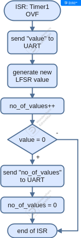
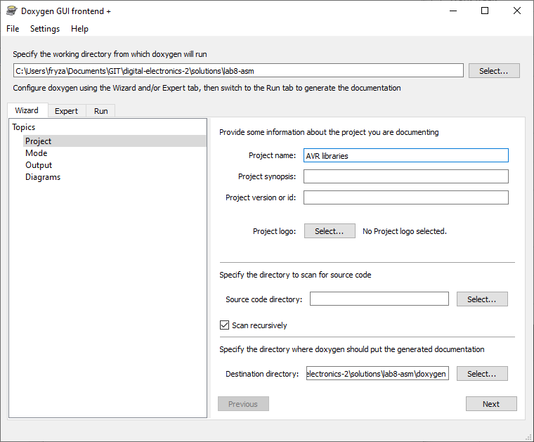
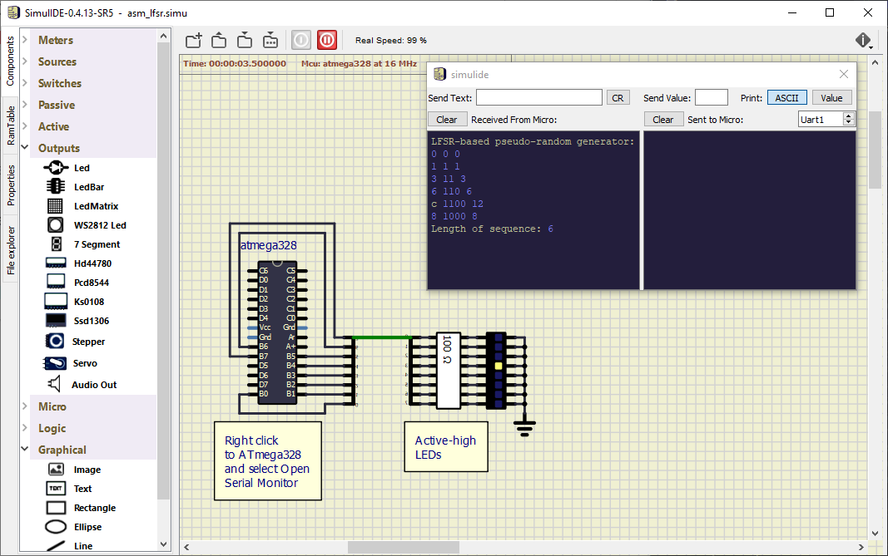

# Lab 7: Assembly language and project documentation

* [Pre-Lab preparation](#preparation)
* [Part 1: Assembly language](#part1)
* [Part 2: LFSR-based pseudo random generator](#part2)
* [Part 3: Generate documentation from source code](#part3)
* [Challenges](#challenges)
* [References](#references)

### Component list

* Arduino Uno board, USB cable

### Learning objectives

* Use basic AVR instructions
* Convert AVR instruction to hexadecimal machine code
* Pass parameters from C code to assembly and vice versa

<a name="preparation"></a>

## Pre-Lab preparation

1. Use **AVR® Instruction Set Manual** from Microchip [Online Technical Documentation](https://onlinedocs.microchip.com/), find the description of selected instructions, and complete the table.

   | **Instruction** | **Operation** | **Description** | **Cycles** |
   | :-- | :-: | :-- | :-: |
   | `add Rd, Rr` |  |  |  |
   | `andi Rd, K` | Rd = Rd and K | Logical AND between register Rd and 8-bit constant K | 1 |
   | `bld Rd, b` |  |  |  |
   | `bst Rd, b` |  |  |  |
   | `com Rd` |  |  |  |
   | `eor Rd, Rr` |  |  |  |
   | `mul Rd, Rr` |  |  |  |
   | `pop Rd` |  |  |  |
   | `push Rr` |  |  |  |
   | `ret` |  |  |  |
   | `rol Rd` |  |  |  |
   | `ror Rd` |  |  |  |

<a name="part1"></a>

## Part 1: Assembly language

Any program is just a series of instructions, that fetch and manipulate data. In most applications, this means reading the inputs, checking their status, switching on the outputs accordingly, or transferring data to another device, such as a display or serial line.

A number of simple binary instructions are used to perform these basic tasks, and each has an equivalent assembly language instruction that people can understand. Using assembly language allows you to understand much more about how the micro controller works and how it is put together. It also produces very small and therefore fast code. The disadvantage is that you as a programmer have to do everything, including memory management and program structure, which can be very time consuming.

To avoid this, higher-level languages are more often used to write programs for micro controllers, especially C but also Basic and Java. A high level means that each line of C (or other language) can be translated into one or many lines of assembly language.

The compiler also deals with program structure and memory management, making writing code much easier. Commonly used routines, such as delays, can also be stored in libraries and easily reused. In addition, the C compiler makes it easier to work with numbers larger than one byte.

For time- or memory space-critical applications, it can often be desirable to combine C code (for easy maintenance) and assembly code (for maximal speed or minimal code size) together. To allow a program written in C to call a subroutine written in assembly language, you must be familiar with the register usage convention of the C compiler [[2]](https://people.ece.cornell.edu/land/courses/ece4760/FinalProjects/s2012/xg46_jy363/xg46_jy363/Reference/Mixing%20C%20and%20assembly;%20language%20programs.pdf).

Parameters between C and assembly may be passed via registers and/or the Stack memory. Using the register way, parameters are passed via R25:R8 (18 regs, first function parameter is stored in R25:24, second in R23:22, etc.). If the parameters require more memory, then the Stack is used to pass additional parameters. Return value is placed in the same registers, ie. an 8-bit value gets returned in R24, an 16-bit value in two registers R25:24, an 32-bit value gets returned in four registers R25:22, and an 64-bit value gets returned in R25:18 [[3]](https://msoe.us/taylor/tutorial/ce2810/candasm).

1. In Visual Studio Code create a new PlatformIO project `lab7-asm` for `Arduino Uno` board and change project location to your local folder.

2. IMPORTANT: Rename `LAB7-ASM > src > main.cpp` file to `main.c`, ie change the extension to `.c`.

3. Copy/paste [template code](https://raw.githubusercontent.com/tomas-fryza/avr-course/master/lab7-asm/main.c) to `LAB7-ASM > src > main.c` source file.

4. Copy `timer` and `uart` libraries from the previous labs to the proper locations within the `LAB7-ASM` project.

5. In PlatformIO project, create two new files `lfsr.S` and `mac.S` within `LAB7-ASM > src` source folder. The final project structure should look like this:

   ```c
   LAB7-ASM            // PlatfomIO project
   ├── include         // Included file(s)
   │   └── timer.h
   ├── lib             // Libraries
   │   └── uart        // Peter Fleury's UART library
   │       ├── uart.c
   │       └── uart.h
   ├── src             // Source file(s)
   │   ├── lfsr.S      // Assembly implementation of LFSR-based generator
   │   ├── mac.S       // Assembly example of Multiply-and-Accumulate
   │   └── main.c
   ├── test            // No need this
   └── platformio.ini  // Project Configuration File
   ```

   1. Copy/paste assembly [Multiply–and-Accumulate](https://raw.githubusercontent.com/tomas-fryza/avr-course/master/lab7-asm/mac.S) file to `mac.S`
   2. Copy/paste assembly [LFSR](https://raw.githubusercontent.com/tomas-fryza/avr-course/master/lab7-asm/lfsr.S) generator to `lfsr.S`

6. Go through the `main.c` file and make sure you understand each line. Use **AVR® Instruction Set Manual** from Microchip [Online Technical Documentation](https://onlinedocs.microchip.com/), find the description of instructions used in `mac.S`, and complete the table.

   | **Instruction** | **Operation** | **Description** | **Cycles** |
   | :-- | :-: | :-- | :-: |
   | `mul Rd, Rr` |  |  |  |
   | `add Rd, Rr` |  |  |  |
   | `ret` |  |  |  |

7. Use manual's 16-bit Opcodes and convert used instructions to hexadecimal.

   | **Instruction** | **Binary opcode** | **Hex opcode** | **Compiler Hex opcode** |
   | :-- | :-: | :-: | :-: |
   | `mul r22, r20` |  |  |  |
   | `add r24, r0` |  |  |  |
   | `ret` | `1001_0101_0000_1000` | `95 08` |  |

8. Build and upload the code to Arduino Uno board. Use **PlatformIO: Serial Monitor** to receive values from Arduino board.

9. In Visual Studio Code select **Terminal > New Terminal Ctrl+Shift+;** and run the following command to generate the listing file:

   ```shell
   # Windows:
   C:\Users\YOUR-LOGIN\.platformio\packages\toolchain-atmelavr\bin\avr-objdump -S -d -m avr .pio/build/uno/firmware.elf > firmware.lst

   # Linux, Mac:
   ~/.platformio/packages/toolchain-atmelavr/bin/avr-objdump -S -d -m avr .pio/build/uno/firmware.elf > firmware.lst
   ```

   In the project root folder, open the generated liting file `firmware.lst` and find the instructions from the previous table and compare your conversion with the compiler's.

   > **Note:** By default, there is no highlighting mode for `*.lst` listing file. You can select the Language mode by clicking on the **Plain Text** identifier in the lower right corner of VS Code. Select **Assembly** mode, or if you have installed the `AVR Support` extension, choose **AVR Assembler** mode.

<a name="part2"></a>

## Part 2: LFSR-based pseudo random generator

A linear-feedback shift register (LFSR) is a shift register whose input bit is a linear function of its previous state. The bit positions that affect the next state are called the taps. We can use this type of functions in many application such as counters, crypto, CRC generation, scrambling/descrambling algorithm, etc.

There are two different (but equivalent) types of LFSR implementation the Fibonacci and the Galois. The LFSR can be implemented using XOR or XNOR primitive functions [[4]](https://surf-vhdl.com/how-to-implement-an-lfsr-in-vhdl/).

A maximum-length LFSR produces an m-sequence i.e. it cycles through all possible 2^N−1 states which look like pseudo-random values. If XOR gates are used, the illegal state is all zeros because this case will never change. A state with all ones is illegal when using an XNOR feedback, because the counter would remain locked-up in this state.

1. Consider a 4-bit shift register whose input (LSB bit) is formed by an XNOR gate with taps [4, 3] and the initial value is 0000 [[5]](https://www.edn.com/tutorial-linear-feedback-shift-registers-lfsrs-part-1/). Explore LFSR algorithm within `lfsr4_fibonacci_asm` assembly function, complete Timer1 overflow handler and generate 4-bit pseudo-random sequences for different Tap positions. How many states are generated for every settings?

   

   | **Tap position** | **Generated values** | **Length** |
   | :-: | :-- | :-: |
   | 4, 3 |  |  |
   | 4, 2 |  |  |
   | 4, 1 |  |  |

2. Change [LFSR tap positions](https://courses.cs.washington.edu/courses/cse369/15au/labs/xapp052_LFSRs.pdf) in `lfsr4_fibonacci_asm` function and generate 5-, 6-, and 7-bit versions of pseudorandom sequence. Do not forget to change the binary mask used to clear unused bits in input/output register.

   | **Tap position** | **Length** |
   | :-: | :-: |
   | &nbsp; |  |
   | &nbsp; |  |
   | &nbsp; |  |

<a name="part3"></a>

## Part 3: Generate documentation from source code

[Doxygen](https://www.doxygen.nl/) is a free, multiplatform (Linux, Windows, Mac, ...) tool for easy generation of program manuals. It supports popular programming languages such as C++, C, C#, PHP, Java, Python, Fortran. Doxygen also supports the hardware description language VHDL. It can generate an on-line documentation browser (in HTML) and/or an off-line reference manual (in LaTeX) from a set of documented source files. There is also support for generating output in RTF (MS-Word), PostScript, hyperlinked PDF, compressed HTML, and Unix man pages. The documentation is extracted directly from the sources, which makes it much easier to keep the documentation consistent with the source code.

Doxygen uses several keywords that are inserted into your block comments. For C, these comments must begin with a triple character with two asterisks:

```c
/**
 * Doxygen will search this block
 */

/* 
 * Classic C block comment; Doxygen will not search it
 */
```

1. Open Doxywizard and set the basic settings as follows:
   1. Select working directory with your project `Documents\avr-course\lab7-asm`
   2. In **Wizard > Project** set **Project name**
   3. In **Wizard > Project** check **Scan recursively**
   4. In **Wizard > Project** select **Destination directory** to new folder within your project `Documents\avr-course\lab7-asm\doxygen`
   5. In **Wizard > Mode** select programming language to **Optimized for C or PHP output**
   6. In **Wizard > Output > HTML** unselect **With search function**
   7. In **Wizard > Output** unselect LaTeX and keep just HTML generation
   8. In **Run** click to button **Run doxygen** and then **Show HTML output**

      

   > **Note:** Complete guide on using Doxygen to document C source code is [here](https://embeddedinventor.com/guide-to-configure-doxygen-to-document-c-source-code-for-beginners/).

<a name="challenges"></a>

## Challenges

1. In `lfsr.S` file, program the assembly function `uint8_t lfsr8_fibonacci_asm(uint8_t value)`, which generates a 8-bit LFSR sequence with Tap positions 8, 6, 5, 4. What is the sequence length? What is the duration of the function in CPU cycles? Use eight LEDs and display each generated LFSR value. Simulate the application in SimulIDE.

   

2. In `main.c` file, program the C function `uint8_t lfsr4_fibonacci_c(uint8_t value)`, which generates a 4-bit LFSR sequence with a maximum length. In the `.lst` file compare both functions, in assembly and your C-realization. What is the duration of both functions in CPU cycles?

   | **Function** | **Number of instructions** | **Total number of CPU cycles** |
   | :-- | :-: | :-: |
   | `lfsr4_fibonacci_asm` | | |
   | `lfsr4_fibonacci_c` | | |

3. Program a 16-bit LFSR-based pseudo-random generator in assembly language and display values at UART. What LFSR taps provide the maximum length of generated sequence?

4. In assembly, program a function `void burst_asm(uint8_t length)` to generate a variable number of short pulses at output pin. Let the pulse width be the shortest one. Write the same function `void burst_c(uint8_t length)` in C and compare duration of both functions. Use a logic analyzer, verify the pulse width and calculate the CPU frequency accordingly.

5. Draw a flowchart of function `void burst_c(uint8_t number)` which generates a variable `number` of short pulses (ie. combination of high and low levels) at output pin PB5. Let the pulse width be the shortest one without any delay. The image can be drawn on a computer or by hand. Use clear descriptions of the individual steps of the algorithms.

6. In assembly, program your own delay function with one parameter that specifies the delay time in microseconds. Use a logic analyzer or oscilloscope to verify the correct function when generating pulses on the ATmega328P output pin. Use this function to generate the following acoustic tones: [C2, D2, E2, F2, G2, and A2](https://pages.mtu.edu/~suits/notefreqs.html).

7. In assembly, program an interrupt service routine for Timer/Counter1 overflow.

8. In assembly, program the `uint8_t sop_asm(*uint8_t a, *uint8_t b, uint8_t length)` function to calculate the sum of the products of two integer vectors `a` and `b`, which have the same number of elements `length`. Transmit the SoP result via UART. For simplicity, consider only 8-bit sum and multiplication operations.

   Write the same function `uint8_t sop_c(*uint8_t a, *uint8_t b, uint8_t length)` in C language and compare the duration of both functions using the file `.lss`.

<a name="references"></a>

## References

1. Microchip Atmel. [AVR® Instruction Set Manual](https://onlinedocs.microchip.com/)

2. William Barnekow. [Mixing C and assembly language programs](https://people.ece.cornell.edu/land/courses/ece4760/FinalProjects/s2012/xg46_jy363/xg46_jy363/Reference/Mixing%20C%20and%20assembly%20language%20programs.pdf)

3. Chris Taylor. [Mixing C and Assembly](https://msoe.us/taylor/tutorial/ce2810/candasm)

4. Surf-VHDL. [How to implement an LFSR in VHDL](https://surf-vhdl.com/how-to-implement-an-lfsr-in-vhdl/)

5. Clive Maxfield. [Tutorial: Linear Feedback Shift Registers (LFSRs) – Part 1](https://www.edn.com/tutorial-linear-feedback-shift-registers-lfsrs-part-1/)

6. [Doxygen tool](https://doxygen.nl/)

7. Embedded Inventor. [Complete Guide On Using Doxygen To Document C Source Code..!!](https://embeddedinventor.com/guide-to-configure-doxygen-to-document-c-source-code-for-beginners/)

8. B. H. Suits. [Physics of Music - Notes](https://pages.mtu.edu/~suits/notefreqs.html)
