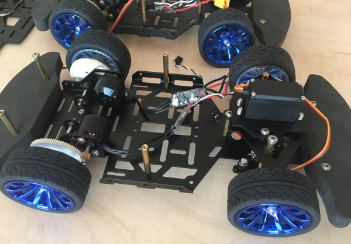

# C project

## Instructions

*The goal of this project is for small teams of 3-4 students to explore a chosen topic, use the [labs's components](https://github.com/tomas-fryza/avr-course/blob/master/README.md#components), develop solutions, simulate and implement them, create documentation, and present the results. Team members will organize and divide tasks among themselves.*

* The students will work on the project for five weeks, ending with a presentation and a practical demonstration (simulations alone are not enough), see the course schedule in e-learning.

* The AVR code must be written in C and/or Assembly and must be implementable on an Arduino Uno board using the toolchains provided by PlatformIO (exceptions by agreement).

* The use of Arduino frameworks/libraries is strictly prohibited!

* If needed, use the simulation tools, such as [SimulIDE](https://simulide.com/p/), [wokwi](https://wokwi.com/), [Falstad](https://www.falstad.com/circuit/circuitjs.html), etc.

* Draw illustrative flowcharts for all important functions/interrupt routines.

* Design a block diagram or circuit diagram of your application (EasyEDA, KiCAD, Eagle, ...).

* Optionally, design a PCB and/or 3D-printable enclosure for your solution.

* Use libraries from the labs. Create own libraries (and documentation) for the new components.

* Follow coding standards in your codes.

* Strictly follow licenses for third-party libraries !

* Create a public [GitHub](https://github.com/) (or any other online software development platform) repository for your project and publish all files here.

* Provide a list of all tools used during the project, including Machine Learning (some are listed [here](https://github.com/tomas-fryza/avr-course/wiki)).

* A PowerPoint-style presentation is not required; a good `README.md` on GitHub is sufficient.

* During the presentation, you can play a short video (max 1 minute) with subtitles or explanatory captions.

# Recommended README.md file structure

### Team members

* Member 1 (responsible for ...)
* Member 2 (responsible for ...)
* Member 3 (responsible for ...)

## Hardware description

Describe your implementation and include block or circuit diagram(s).

## Software description

Include flowcharts/state diagrams of your algorithm(s) and direct links to the source files in PlatformIO `src` or `lib` folders. Present the libraries you used in the project.

## Instructions and photos

Describe how to use the application. Add photos or videos of your application.

## References and tools

1. Put here the references and online tools you used.
2. ...

# Topics 2024/25

### Measurement/Control/Visualization of the environment for tropical plants

The goal of the project would be to create a system that measures key environmental parameters (such as temperature, humidity, light levels, soil moisture) for tropical plants. This system should also allow the user to control or adjust environmental conditions and visualize the data.

Inspiration:
* [Climate Chamber System](https://projecthub.arduino.cc/ms_peach/climate-chamber-system-c545de)

Possible components:
* Plant terrarium
* I2C temperature and humidity sensor
* Photoresistor
* Soil moisture sensor
* OLED display
* RGB LED strip Neopixel WS2812B
* Relays
* Brushless DC fan, NMOS transistor
* ESP8266 Wi-Fi module

### Concept of an autonomous vehicle

(*Max 2 teams per lab group.*)

The aim of the project would be to design and build an autonomous vehicle capable of performing line following, obstacle detection, and possibly other basic navigation tasks.

Inspiration:
* [NXP Cup](https://nxpcup.nxp.com/)

Possible components:
* [DFRobot chassis](https://nxp.gitbook.io/nxp-cup/2019-dfrobot-chassis-developer-guide/assembly/dfrobot-chassis), including ESCs (Electronic Speed Controllers) and servo motor for steering
* LiPol battery
* Proximity sensor HC-SR04
* Digital [line tracking sensor](https://www.dfrobot.com/product-85.html)
* I2C accelerometers and gyroscopes
* OLED display
* Platform can be changed to [FRDM-MCXN947](https://www.nxp.com/document/guide/getting-started-with-frdm-mcxn947:GS-FRDM-MCXNXX) board

   

### Solar panel monitoring and optimization

(*Max 2 teams per lab group.*)

The goal of this project is to design and implement an embedded system that monitors and optimizes the performance of solar panels. The system will use a range of sensors to collect real-time data on solar radiation, energy output, and panel efficiency. Data are displayed or logged. The project will involve hardware integration, data collection, and the development of algorithms to monitor panel health and efficiency.

Inspiration:
* [Simple Arduino Solar Radiation Meter for Solar Panels](https://projecthub.arduino.cc/mircemk/simple-arduino-solar-radiation-meter-for-solar-panels-ae1531)
* [Photovoltaic battery charger with sun tracking](https://www.vut.cz/en/students/final-thesis/detail/151699)

Possible components:
* Solar panel(s)
* Battery charger
* Photoresistor
* Current sensor
* OLED display
* EEPROM
* Rotary encoder or buttons or joystick
* Servo motors
* ESP8266 Wi-Fi module

### Electronically controlled xylophone

(*Max 1 team per lab group.*)

Build an electronic xylophone instrument that can be played using an AVR microcontroller. The project will combine hardware and software components to create an interactive and programmable musical instrument capable of producing different tones and melodies. Incorporating a graphical user interface (GUI) to visualize the notes being played.

Possible components:
* Xylophone
* OLED display
* Rotary encoder or buttons or joystick
* EEPROM memory

### Simulace a implementace FDIR algoritmu pro mikrokontroléry AVR v aerospace aplikacích

Cílem projektu je simulovat na mikrokontrolerech AVR funkcionalitu Fault Detection, Isolation, and Recovery (FDIR) algoritmu / subsystému
dle vlastního výběru využívaných v aerospace aplikacích.
Součástí hodnocení bude kvalita zpracování zvoleného simulovaného scénáře.

## Požadavky na projekt:
1. **Výběr FDIR algoritmu**:
- Prostudujte různé typy FDIR algoritmů používaných v aerospace průmyslu.
- Vyberte jeden algoritmus, který bude implementován a simulován.

2. **Návrh a implementace**:
- Navrhněte architekturu systému, který bude využívat mikrokontrolér AVR (např. ATmega328).
- Implementujte vybraný FDIR algoritmus v jazyce C nebo C++.
- Zajistěte, aby systém byl schopen detekovat, izolovat a obnovit se z chyb.
- Je zakázano využívat jakékoliv knihovny Arduino. Je možné využít vlastní implementace anebo řešení z laboratorních cvičení.

3. **Simulace a testování**:
- Vytvořte simulaci systému, která bude demonstrovat funkčnost FDIR algoritmu.
- Proveďte testování a validaci algoritmu pomocí simulace různých chybových scénářů.

4. **Závěrečná zpráva**:
- Vypracujte podrobnou zprávu, která bude obsahovat:
- Úvod do problematiky FDIR v aerospace aplikacích.
- Popis vybraného FDIR algoritmu a důvody jeho výběru.
- Návrh a implementaci systému.
- Výsledky simulace a testování.
- Diskuzi o výhodách a nevýhodách implementovaného řešení.
- Závěry a doporučení pro další vývoj.

## Hodnocení:
Projekt bude hodnocen na základě:
- Kvality a funkčnosti implementovaného FDIR algoritmu.
- Úrovně simulace a testování.
- Kvality a detailnosti závěrečné zprávy.
- Spolupráce a rozdělení úkolů v týmu.

## Doporučené zdroje:
1. **An Integrated Process for FDIR Design in Aerospace (FAME)**:

https://es-static.fbk.eu/people/bozzano/publications/imbsa2014b.pdf

2. **FDIR Development and Verification and Validation Process (FAME)**:

https://indico.esa.int/event/85/contributions/3387/attachments/2727/3152/1710-FDIR_7_An_Integrated_Process_for_FDIR_Design_in_Aerospace_FAME_-_ESA-ESTEC.pdf

3. **FDIR in Aerospace Applications**:
- Kapitola v knize, která se zabývá návrhem a implementací FDIR systémů v aerospace aplikacích. Obsahuje podrobné informace o různých typech FDIR algoritmů a jejich použití.
- FDIR in Aerospace Applications

https://link.springer.com/chapter/10.1007/978-3-319-12214-4_7

### Usage of CubeSat Space Protocol (CSP)

(*Topic provided by [YSpace](https://www.vut.cz/en/yspace) group.*)

Test of multiprocessor communication. The MCU platform will be changed to [FRDM-MCXN947](https://www.nxp.com/document/guide/getting-started-with-frdm-mcxn947:GS-FRDM-MCXNXX) board.

### Another topic related to, for example, your bachelor's thesis

(*Must be arranged in advance.*)
