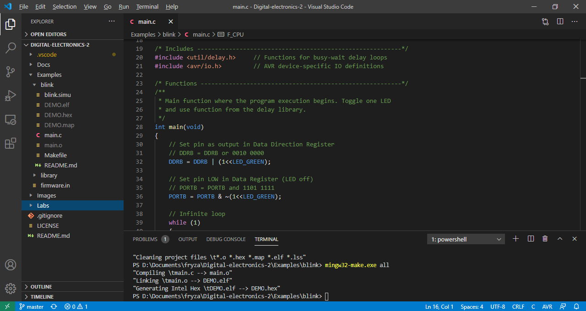

### Version: Windows and Atmel Studio 7

1. Follow any online tutorial, such as [1](../../docs/CProgrammingInAtmelStudio7.pdf) or [2](https://unboxing-tomorrow.com/programming-atmel-microcontrollers-with-atmel-studio-7/), create a new GCC C Executable Project `led` within `01-tools` working folder for ATmega328P device and copy/paste [blink example code](../../examples/blink/main.c) to your `main.c` source file. Examine all lines of source code. What is the meaning of individual commands?

2. Build (compile) the project: **Build >> Build Solution F7**

3. Simulate the project in Atmel Studio 7: **Debug > Start Debugging and Break (Alt+F5)**. Use Run To Cursor, and/or Step Over buttons and see changes at **I/O Port (PORTB)**. Exit the simulator by **Debug > Stop Debugging Ctrl+Shift+F5**.

4. Connect Arduino board to USB port (in lab's configuration it supposed to be COM3), run external programmer in menu **Tools > Send to Arduino UNO** and download the compiled code to Arduino Uno board. Note that, this external tool is configured according to [How to Flash AVR from Atmel Studio](https://www.elecrom.com/program-flash-arduino-uno-atmel-studio/).

   | Parameter | Value |
   | :-- | :-- |
   | Title: | `Send to Arduino Uno`
   | Command: | `C:\APPZ\avrdude\avrdude.exe`
   | Arguments: | `-p m328p -c arduino -D -V -u -q -U flash:w:$(TargetName).hex:i -P COM3`
   | Initial directory: | `$(TargetDir)`
   | Use Output window: | checked

   

### Version: Windows and command-line toolchain

1. Copy `main.c` and `Makefile` files from blink example to `labs\01-tools` folder.

2. Copy `example\Makefile.in` settings file to `Labs` folder. Note that, this file contains parameters and settings that are identical for all (future) projects located in this folder. Uncomment the Windows settings in this file. Make sure the values for `PREFIX` and `AVRDUDE` contain the correct paths and `USBPORT` contains port where Arduino board is connected.

   ```Makefile
   ## Linux
   #PREFIX  = /opt/avr8-gnu-toolchain-linux_x86_64
   #AVRDUDE = avrdude
   #RM      = rm -f
   ## See "dmesg" command output
   #USBPORT = /dev/ttyUSB0
   
   ## Windows
   PREFIX  = C:\APPZ\Atmel\Studio\7.0\toolchain\avr8\avr8-gnu-toolchain
   AVRDUDE = C:\APPZ\avrdude\avrdude.exe
   RM      = del
   # See USB-SERIAL CH340 port in Device Manager
   USBPORT = COM3
   ```

3. Run Visual Studio Code source code editor, open your `digital-electronics-2` working folder, run internal terminal in menu **Terminal > New Terminal**, and change path to `labs\01-tools`.

   ```bash
   cd labs\01-tools\
   ```

4. Open `main.c` source file. What is the meaning of each line of this source code?

5. Use the following commands step by step in the internal terminal to find out what they mean. Note: these commands are defined in `Makefile`.

   ```bash
   mingw32-make.exe all
   mingw32-make.exe clean
   mingw32-make.exe size
   mingw32-make.exe flash
   ```

   

### Version: Ubuntu-based Linux distributions

1. Copy `main.c` and `Makefile` files from blink example to `labs/01-tools` folder.

2. Copy `example/Makefile.in` settings file to `labs` folder. Note that, this file contains parameters and settings that are identical for all (future) projects located in this folder. Uncomment the Linux settings in this file. Make sure the values for `PREFIX` and `AVRDUDE` contain the correct paths and `USBPORT` contains port where Arduino board is connected.

   ```Makefile
   ## Linux
   PREFIX  = /opt/avr8-gnu-toolchain-linux_x86_64
   AVRDUDE = avrdude
   RM      = rm -f
   # See "dmesg" command output
   USBPORT = /dev/ttyUSB0
   
   ## Windows
   #PREFIX  = C:\APPZ\Atmel\Studio\7.0\toolchain\avr8\avr8-gnu-toolchain
   #AVRDUDE = C:\APPZ\avrdude\avrdude.exe
   #RM      = del
   ## See USB-SERIAL CH340 port in Device Manager
   #USBPORT = COM3
   ```

3. Run Visual Studio Code source code editor, open your `digital-electronics-2` working folder, run internal terminal in menu **Terminal > New Terminal**, and change path to `labs/01-tools`.

   ```bash
   cd labs/01-tools/
   ```

4. Open `main.c` source file. What is the meaning of each line of this source code?

5. Use the following commands step by step in the internal terminal to find out what they mean. Note: these commands are defined in `Makefile`.

   ```bash
   ## Type this commands
   $ make all
   $ make clean
   $ make size
   $ make flash
   ```
