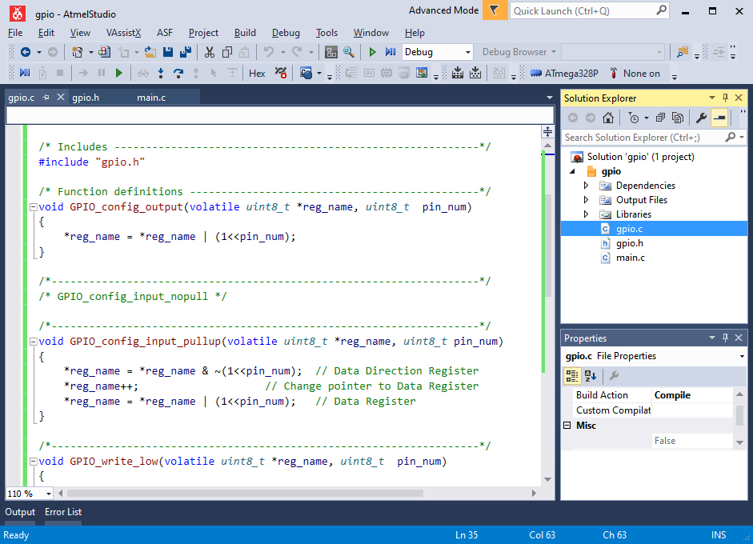
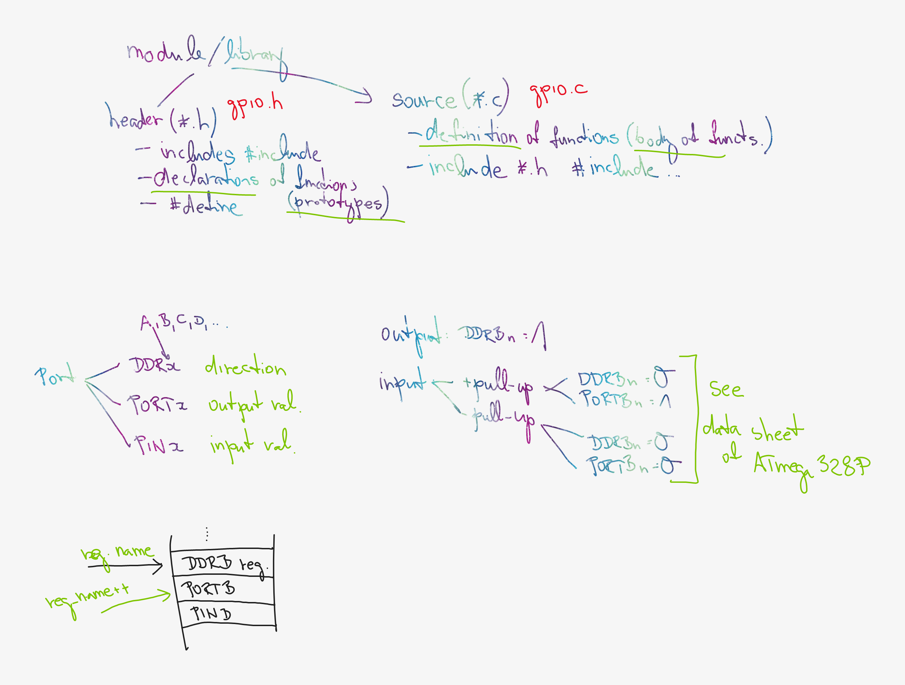

# Lab 2: User library for GPIO control

<!--

-->

### Learning objectives

After completing this lab you will be able to:

* Config input/output ports of AVR using control registers
* Use ATmega328P manual and find information
* Understand the difference between header and source files
* Create your own library
* Understand how to call a function with pointer parameters

The purpose of this laboratory exercise is to learn how to create your own library in C. Specifically, it will be a library for controlling GPIO (General Purpose Input/Output) pins with help of control registers.

### Table of contents

* [Pre-Lab preparation](#preparation)
* [Part 1: Synchronize repositories and create a new project](#part1)
* [Part 2: GPIO control registers](#part2)
* [Part 3: GPIO library files](#part3)
* [Experiments on your own](#experiments)
* [Post-Lab report](#report)
* [References](#references)

<a name="preparation"></a>

## Pre-Lab preparation

1. Fill in the following table and enter the number of bits and numeric range for the selected data types defined by C.

   | **Data type** | **Number of bits** | **Range** | **Description** |
   | :-: | :-: | :-: | :-- |
   | `uint8_t`  | 8 | 0, 1, ..., 255 | Unsigned 8-bit integer |
   | `int8_t`   |  |  |  |
   | `uint16_t` |  |  |  |
   | `int16_t`  |  |  |  |
   | `float`    |  | -3.4e+38, ..., 3.4e+38 | Single-precision floating-point |
   | `void`     |  |  |  |

<a name="part1"></a>

## Part 1: Synchronize repositories and create a new project

1. Run Git Bash (Windows) of Terminal (Linux), navigate to your working directory, and update local repository.

   > Useful bash and git commands are: `cd` - Change working directory. `mkdir` - Create directory. `ls` - List information about files in the current directory. `pwd` - Print the name of the current working directory. `git status` - Get state of working directory and staging area. `git pull` - Update local repository and working folder.
   >

2. Run Visual Studio Code and create a new PlatformIO project `lab2-gpio_library` for `Arduino Uno` board and change project location to your local repository folder `Documents/digital-electronics-2`.

3. IMPORTANT: Rename `LAB2-GPIO_LIBRARY > src > main.cpp` file to `main.c`, ie change the extension to `.c`.

4. Copy/paste [report template](https://raw.githubusercontent.com/tomas-fryza/digital-electronics-2/master/labs/02-gpio/report.md) to your `LAB2-GPIO_LIBRARY > test > README` file. Rename this file to `README.md`, ie add the extension `.md`.

<a name="part2"></a>

## Part 2: GPIO control registers

AVR microcontroller associates pins into so-called ports, which are marked with the letters A, B, C, etc. Each of the pins is controlled separately and can function as an input (entry) or output (exit) point of the microcontroller. Control is possible exclusively by software via control registers.

There are exactly three control registers for each port: DDR, PORT and PIN, supplemented by the letter designation of the port. For port A these are registers DDRA, PORTA and PINA, for port B registers DDRB, PORTB, PINB, etc.

DDR (Data Direction Register) is used to set the input/output direction of port communication, PORT is the output data port and PIN works for reading input values from the port.

A detailed description of working with input/output ports can be found in [ATmega328P datasheet](https://www.microchip.com/wwwproducts/en/ATmega328p) in section I/O-Ports.

1. Use the datasheet to find out the meaning of the DDRB and PORTB control register values and their combinations. (Let PUD (Pull-up Disable) bit in MCUCR (MCU Control Register) is 0 by default.)

   | **DDRB** | **PORTB** | **Direction** | **Internal pull-up resistor** | **Description** |
   | :-: | :-: | :-: | :-: | :-- |
   | 0 | 0 | input | no | Tri-state, high-impedance |
   | 0 | 1 | | | |
   | 1 | 0 | | | |
   | 1 | 1 | | | |

2. To control individual bits, the following binary and logic operations are used.

* `|`: OR
* `&`: AND
* `^`: XOR
* `~`: NOT
* `<<`: binary shift to left
* `>>`: binary shift to right

   | **b** | **a** |**b or a** | **b and a** | **b xor a** | **not b** |
   | :-: | :-: | :-: | :-: | :-: | :-: |
   | 0 | 0 | 0 | 0 | 0 | 1 |
   | 0 | 1 | 1 | 0 | 1 | 1 |
   | 1 | 0 | 1 | 0 | 1 | 0 |
   | 1 | 1 | 1 | 1 | 0 | 0 |

   

3. Copy/paste [your solution](https://raw.githubusercontent.com/tomas-fryza/digital-electronics-2/master/solutions/lab1-blink_arduino/src/main.c) with two LEDs from Lab1 to `LAB2-GPIO_LIBRARY > src > main.c` source file. Compile (build) the project and note its size in bytes.

   | **Version** | **Size [B]** |
   | :-- | :-: |
   | Arduino-style |  |
   | Registers |  |
   | Library functions |  |

   Comment Arduino-style defines and functions, use binary operations with control registers DDRB, PORTB and rewrite the application. Note its size after the compilation. Use breadborad, LED, resistor, and wires and connect second LED in actve-low way. Upload the code into the ATmega328P and verify its functionality.

<a name="part3"></a>

## Part 3: GPIO library files

For clarity and efficiency of the code, the individual parts of the application in C are divided into two types of files: header files and source files. Note that together they form one module.

**Header file** is a file with extension `.h` and generally contains definitions of data types, function prototypes and C preprocessor commands. **Source file** has the extension `.c` and is used to implementation the code. It is bad practice to mix usage of the two although it is possible.

C programs are highly dependent on functions. Functions are the basic building blocks of C programs and every C program is combination of one or more functions. There are two types of functions in C: **built-in functions** which are the part of C compiler and **user defined functions** which are written by programmers according to their requirement.

To use a user-defined function, there are three parts to consider:

* Function prototype or Function declaration (`*.h` file)
* Function definition (`*.c` file)
* Function call (`*.c` file)

   

*[A function prototype](https://www.programiz.com/c-programming/c-user-defined-functions) is simply the declaration of a function that specifies function's name, parameters and return type. It doesn't contain function body. A **function prototype** gives information to the compiler that the function may later be used in the program.*

***Function definition** contains the block of code to perform a specific task.*

*By **calling the function**, the control of the program is transferred to the function.*

A header file can be shared between several source files by including it with the C preprocessing directive `#include`. If a header file happens to be included twice, the compiler will process its contents twice and it will result in an error. The standard way to prevent this is to enclose the entire real contents of the file in a conditional, like this:

```c
#ifndef HEADER_FILE_NAME        // Preprocessor directive allows for conditional compilation. If not defined.
# define HEADER_FILE_NAME       // Definition of constant within your source code.

// The body of entire header file

#endif                          // The #ifndef directive must be closed by an #endif
```

This construct is commonly known as a wrapper `#ifndef`. When the header is included again, the conditional will be false, because `HEADER_FILE_NAME` is already defined. The preprocessor will skip over the entire contents of the file, and the compiler will not see it twice.

1. In PlatformIO project, create a new folder `LAB2-GPIO_LIBRARY > lib > gpio`. Within this folder, create two new files `gpio.c` and `gpio.h`. See the project structure:

   ```
   |--lib
   |  |
   |  |--gpio
   |     |- gpio.c
   |     |- gpio.h
   |--src
      |- main.c
   ```

   * Copy/paste [header file](https://raw.githubusercontent.com/tomas-fryza/digital-electronics-2/master/labs/library/include/gpio.h) to `gpio.h`.
   * Copy/paste [library source file](https://raw.githubusercontent.com/tomas-fryza/digital-electronics-2/master/labs/library/gpio.c) to `gpio.c`.
   * Include header file to `src > main.c`:

   ```c
   #include <gpio.h>

   int main(void)
   {
       ...
   }
   ```

2. Go through both files and make sure you understand each line. The GPIO library defines the following functions.

   | **Return** | **Function name** | **Function parameters** | **Description** |
   | :-: | :-- | :-- | :-- |
   | `void` | `GPIO_mode_output` | `volatile uint8_t *reg, uint8_t pin` | Configure one output pin |
   | `void` | `GPIO_mode_input_pullup` | `volatile uint8_t *reg, uint8_t pin` | Configure one input pin and enable pull-up resistor |
   | `void` | `GPIO_write_low` | `volatile uint8_t *reg, uint8_t pin` | Write one pin to low value |
   | `void` | `GPIO_write_high` | `volatile uint8_t *reg, uint8_t pin` | Write one pin to high value |
   | `uint8_t` | `GPIO_read` | `volatile uint8_t *reg, uint8_t pin` | Read a value from input pin |

   > Suggestions for other features you can add:
   > * `void GPIO_mode_input_nopull(volatile uint8_t *reg, uint8_t pin)` Configure one input pin without pull-up resistor
   > * `void GPIO_write_toggle(volatile uint8_t *reg, uint8_t pin)` Toggle one pin value
   >

   The register name parameter must be `volatile` to avoid a compiler warning. Note that the C notation `*variable` representing a pointer to memory location where the variable's **value** is stored. Notation `&variable` is address-of-operator and gives an **address** reference of variable.

   ```c
   #include <gpio.h>

   int main(void)
   {
       GPIO_mode_output(&DDRB, LED_GREEN);
       ...
   }
   ```

   > [Understanding C Pointers: A Beginner's Guide](https://www.codewithc.com/understanding-c-pointers-beginners-guide/)
   >
   > 
   >
   > Explanation of how to pass an IO port as a parameter to a function is given [here](https://www.eit.lth.se/fileadmin/eit/courses/eita15/avr-libc-user-manual-2.0.0/FAQ.html#faq_port_pass).

3. In `main.c` comment binary operations with control registers (DDRB, PORTB) and rewrite the application with library functions. Note its size after the compilation. Try to optimize code to the most effective way.

4. (Optional) Connect the push button as active-low to the application. When you press and release the button, the LEDs will start to blink.

## Synchronize repositories

When you finish, always synchronize the contents of your working folder with the local and remote versions of your repository. This way you are sure that you will not lose any of your changes. To do that, use Visual Studio Code **Source Control (Ctrl+Shift+G)** or git commands.

   > Useful git commands are: `git status` - Get state of working directory and staging area. `git add` - Add new and modified files to the staging area. `git commit` - Record changes to the local repository. `git push` - Push changes to remote repository. `git pull` - Update local repository and working folder. Note that, a brief description of useful git commands can be found [here](https://github.com/tomas-fryza/digital-electronics-1/wiki/Useful-Git-commands) and detailed description of all commands is [here](https://github.com/joshnh/Git-Commands).
   >

<a name="experiments"></a>

## Experiments on your own

1. Complete declarations (`*.h`) and definitions (`*.c`) of suggested functions in the GPIO library.

2. Connect at least five LEDs and one push button to the microcontroller and program an application in [Knight Rider style](https://www.youtube.com/watch?v=w-P-2LdS6zk). When you press and release a push button once, the LEDs starts to switched on and off; ensure that only one of LEDs is switched on at a time. Do not implement the blinking speed changing.

3. Simulate the Knight Rider application in SimulIDE.

<a name="report"></a>

## Post-Lab report

*Complete all parts of `LAB2-GPIO_LIBRARY > test > README.md` file (see Part 1.4) in Czech, Slovak, or English, push it to your GitHub repository, and submit a link to this file via [BUT e-learning](https://moodle.vutbr.cz/). The deadline for submitting the task is the day before the next computer exercise.*

*Vypracujte všechny části ze souboru `LAB2-GPIO_LIBRARY > test > README.md` (viz Část 1.4) v českém, slovenském, nebo anglickém jazyce, uložte je na váš GitHub repozitář a odevzdejte link na tento soubor prostřednictvím [e-learningu VUT](https://moodle.vutbr.cz/). Termín odevzdání úkolu je den před dalším počítačovým cvičením.*

<a name="references"></a>

## References

1. Parewa Labs Pvt. Ltd. [C User-defined functions](https://www.programiz.com/c-programming/c-user-defined-functions)

2. [Understanding C Pointers: A Beginner's Guide](https://www.codewithc.com/understanding-c-pointers-beginners-guide/)

3. avr-libc. [How do I pass an IO port as a parameter to a function?](https://www.eit.lth.se/fileadmin/eit/courses/eita15/avr-libc-user-manual-2.0.0/FAQ.html#faq_port_pass)

4. Tomas Fryza. [Useful Git commands](https://github.com/tomas-fryza/digital-electronics-2/wiki/Useful-Git-commands)

5. [Goxygen commands](http://www.doxygen.nl/manual/docblocks.html#specialblock)
