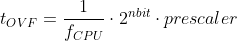

# Lab 3: Interrupts and polling

<!--

-->

### Learning objectives

After completing this lab you will be able to:

* Use `#define` compiler directives
* Use internal microcontroller timers
* Understand overflow
* Combine diferent interrupts

The purpose of the laboratory exercise is to understand the function of the interrupt, interrupt service routine, and the functionality of timer units. Another goal is to practice finding information in the MCU manual; specifically setting timer control registers.

### Table of contents

* [Pre-Lab preparation](#preparation)
* [Part 1: Synchronize repositories and create a new project](#part1)
* [Part 2: Timer overflow](#part2)
* [Part 3: Polling and interrupts](#part3)
* [Part 4: Extend the overflow](#part4)
* [Experiments on your own](#experiments)
* [Post-Lab report](#report)
* [References](#references)

<a name="preparation"></a>

## Pre-Lab preparation

Consider an n-bit number that we increment based on the clock signal. If we reach its maximum value and try to increase it, the value will be reset. We call this state an **overflow**. The overflow time depends on the frequency of the clock signal, the number of bits, and on the prescaler value:

&nbsp;

&nbsp;

1. Calculate the overflow times for three Timer/Counter modules that contain ATmega328P if CPU clock frequency is 16&nbsp;MHz. Complete the following table for given prescaler values. Note that, Timer/Counter2 is able to set 7 prescaler values, including 32 and 128 and other timers have only 5 prescaler values.

   | **Module** | **Number of bits** | **1** | **8** | **32** | **64** | **128** | **256** | **1024** |
   | :-: | :-: | :-: | :-: | :-: | :-: | :-: | :-: | :-: |
   | Timer/Counter0 | 8  | 16u | 128u | -- | | -- | | |
   | Timer/Counter1 | 16 |     |      | -- | | -- | | |
   | Timer/Counter2 | 8  |     |      |    | |    | | |

<a name="part1"></a>

## Part 1: Synchronize repositories and create a new project

1. Run Git Bash (Windows) of Terminal (Linux), navigate to your working directory, and update local repository.

   > Useful bash and git commands are: `cd` - Change working directory. `mkdir` - Create directory. `ls` - List information about files in the current directory. `pwd` - Print the name of the current working directory. `git status` - Get state of working directory and staging area. `git pull` - Update local repository and working folder.
   >

2. Run Visual Studio Code and create a new PlatformIO project `lab3-interrupts_timer` for `Arduino Uno` board and change project location to your local repository folder `Documents/digital-electronics-2`.

3. IMPORTANT: Rename `LAB3-INTERRUPTS_TIMER > src > main.cpp` file to `main.c`, ie change the extension to `.c`.

4. Copy/paste [report template](https://raw.githubusercontent.com/tomas-fryza/digital-electronics-2/master/labs/03-interrupts/report.md) to your `LAB3-INTERRUPTS_TIMER > test > README` file. Rename this file to `README.md`, ie add the extension `.md`.

<a name="part2"></a>

## Part 2: Timer overflow

A timer (or counter) is a hardware block within an MCU and can be used to measure time events. ATmega328P has three timers, called:

* Timer/Counter0,
* Timer/Counter1, and
* Timer/Counter2.

T/C0 and T/C2 are 8-bit timers, where T/C1 is a 16-bit timer. The counter counts in synchronization with microcontroller clock from 0 up to 255 (for 8-bit counter) or 65,535 (for 16-bit). If counting continues, the timer value overflows to the default value of zero. Different clock sources can be selected for each timer using a CPU frequency divider with fixed prescaler values, such as 8, 64, 256, 1024, and others.

1. The timer modules can be configured with several special purpose registers. According to the [ATmega328P datasheet](https://www.microchip.com/wwwproducts/en/ATmega328p) (eg in the **8-bit Timer/Counter0 with PWM > Register Description** section), which I/O registers and which bits configure the timer operations?

   | **Module** | **Operation** | **I/O register(s)** | **Bit(s)** |
   | :-: | :-- | :-: | :-- |
   | Timer/Counter0 | Prescaler<br><br>8-bit data value<br>Overflow interrupt enable | <br><br><br> | <br><br><br> |
   | Timer/Counter1 | Prescaler<br><br>16-bit data value<br>Overflow interrupt enable | TCCR1B<br><br>TCNT1H, TCNT1L<br>TIMSK1 | CS12, CS11, CS10<br>(000: stopped, 001: 1, 010: 8, 011: 64, 100: 256, 101: 1024)<br>TCNT1[15:0]<br>TOIE1 (1: enable, 0: disable) |
   | Timer/Counter2 | Prescaler<br><br>8-bit data value<br>Overflow interrupt enable | <br><br><br> | <br><br><br> |

2. Copy/paste [template code](https://raw.githubusercontent.com/tomas-fryza/digital-electronics-2/master/labs/03-interrupts/main.c) to `LAB3-INTERRUPTS_TIMER > src > main.c` source file.

3. In PlatformIO project, create a new folder `LAB3-INTERRUPTS_TIMER > lib > gpio`. Copy your GPIO library files [`gpio.c`](https://raw.githubusercontent.com/tomas-fryza/digital-electronics-2/master/labs/library/gpio.c) and [`gpio.h`](https://raw.githubusercontent.com/tomas-fryza/digital-electronics-2/master/labs/library/include/gpio.h) from the previous lab to this folder.

4. In PlatformIO project, create a new file `LAB3-INTERRUPTS_TIMER > include > timer.h`.  Copy/paste [header file](https://raw.githubusercontent.com/tomas-fryza/digital-electronics-2/master/labs/library/include/timer.h) to `timer.h`. See the final project structure:

   ```c
   |--include
   |  |--timer.h
   |
   |--lib
   |  |--gpio
   |     |- gpio.c
   |     |- gpio.h
   |
   |--src
      |- main.c
   ```

   For easier setting of control registers, the Timer/Counter1 macros with suitable names were defined in `timer.h`. Because we only define macros and not function bodies, the `timer.c` source file is **not needed** this time!

5. Go through the files and make sure you understand each line. Build and upload the code to Arduino Uno board. Note that `src > main.c` file contains the following:

   ```c
   #include <avr/interrupt.h>  // Interrupts standard C library for AVR-GCC
   #include <gpio.h>           // GPIO library for AVR-GCC
   #include "timer.h"          // Timer library for AVR-GCC

   int main(void)
   {
       ...
       // Enable overflow interrupt
       TIM1_overflow_interrupt_enable();
       ...
       // Enables interrupts by setting the global interrupt mask
       sei();
       ...
   }

   // Interrupt service routines
   ISR(TIMER1_OVF_vect)
   {
       ...
   }
   ```

6. In `timer.h` header file, define similar macros also for Timer/Counter0, modify `main.c` file, and use two interrupts for controling both LEDs. Let `LED_GREEN` be controlled by overflow from Timer1 and `LED_RED` by overflow from Timer0.

<a name="part3"></a>

## Part 3: Polling and interrupts

The state of continuous monitoring of any parameter is called **polling**. The microcontroller keeps checking the status of other devices; and while doing so, it does no other operation and consumes all its processing time for monitoring [[3]](https://www.renesas.com/us/en/support/technical-resources/engineer-school/mcu-programming-peripherals-04-interrupts.html).

While polling is a simple way to check for state changes, there's a cost. If the checking interval is too long, there can be a long lag between occurrence and detection and you may miss the change completely, if the state changes back before you check. A shorter interval will get faster and more reliable detection, but also consumes much more processing time and power, since many more checks will come back negative.

An alternative approach is to utilize **interrupts**. With this method, the state change generates an interrupt signal that causes the CPU to suspend its current operation (and save its current state), then execute the processing associated with the interrupt, and then restore its previous state and resume where it left off.


An interrupt is one of the fundamental features in a microcontroller. It is a signal to the processor emitted by hardware or software indicating an event that needs immediate attention. Whenever an interrupt occurs, the controller completes the execution of the current instruction and starts the execution of an **Interrupt Service Routine (ISR)** or Interrupt Handler. ISR tells the processor or controller what to do when the interrupt occurs [[4]](https://www.tutorialspoint.com/embedded_systems/es_interrupts.htm). After the interrupt code is executed, the program continues exactly where it left off.

Interrupts can be established for events such as a counter's value, a pin changing state, serial communication receiving of information, or the Analog to Digital Converted has finished the conversion process.

See the [ATmega328P datasheet](https://www.microchip.com/wwwproducts/en/ATmega328p) (section **Interrupts > Interrupt Vectors in ATmega328 and ATmega328P**) for sources of interruptions that can occur on ATmega328P. Complete the selected interrupt sources in the following table. The names of the interrupt vectors in C can be found in [C library manual](https://www.nongnu.org/avr-libc/user-manual/group__avr__interrupts.html).

| **Program address** | **Source** | **Vector name** | **Description** |
| :-: | :-- | :-- | :-- |
| 0x0000 | RESET | -- | Reset of the system |
| 0x0002 | INT0  | `INT0_vect`&nbsp;&nbsp;&nbsp;&nbsp;&nbsp;&nbsp;&nbsp;&nbsp;&nbsp;&nbsp;&nbsp;&nbsp;&nbsp;&nbsp;&nbsp;&nbsp; | External interrupt request number 0&nbsp;&nbsp;&nbsp;&nbsp;&nbsp;&nbsp;&nbsp;&nbsp;&nbsp;&nbsp;&nbsp;&nbsp;&nbsp;&nbsp;&nbsp;&nbsp; |
|  | INT1 |  |  |
|  | PCINT0 |  |  |
|  | PCINT1 |  |  |
|  | PCINT2 |  |  |
|  | WDT |  |  |
|  | TIMER2_OVF |  |  |
| 0x0018 | TIMER1_COMPB | `TIMER1_COMPB_vect` | Compare match between Timer/Counter1 value and channel B compare value |
| 0x001A | TIMER1_OVF | `TIMER1_OVF_vect` | Overflow of Timer/Counter1 value |
|  | TIMER0_OVF |  |  |
|  | USART_RX |  |  |
|  | ADC |  |  |
|  | TWI |  |  |

All interrupts are disabled by default. If you want to use them, you must first enable them individually in specific control registers and then enable them centrally with the `sei()` command (Set interrupt). You can also centrally disable all interrupts with the `cli()` command (Clear interrupt).

1. Consider an active-low push button with internal pull-up resistor on the PD2 pin.  Use Timer0 4-ms overflow to read button status. If the push button is pressed, turn on `LED_RED`; turn the LED off after releasing the button. Note: Within the Timer0 interrupt service routine, use a read function from your GPIO library to get the button status.

<a name="part4"></a>

## Part 4: Extend the overflow

1. Use Timer/Counter1 16-ms overflow and toggle `LED_GREEN` value approximately every 100&nbsp;ms (6 oveflows x 16 ms = 100 ms).

   FYI: Use static variables declared in functions that use them for even better isolation or use volatile for all variables used in both Interrupt routines and main code loop. According to [[7]](https://stackoverflow.com/questions/52996693/static-variables-inside-interrupts) the declaration line `static uint8_t no_of_overflows = 0;` is only executed the first time, but the variable value is updated/stored each time the ISR is called.

   ```c
   ISR(TIMER1_OVF_vect)
   {
       static uint8_t no_of_overflows = 0;

       no_of_overflows++;
       if (no_of_overflows >= 6)
       {
           // Do this every 6 x 16 ms = 100 ms
           no_of_overflows = 0;
           ...
       }
       // Else do nothing and exit the ISR
   }
   ```

3. When you finish, always synchronize the contents of your working folder with the local and remote versions of your repository. This way you are sure that you will not lose any of your changes. To do that, use **Source Control (Ctrl+Shift+G)** in Visual Studio Code or git commands.

   > Useful git commands are: `git status` - Get state of working directory and staging area. `git add` - Add new and modified files to the staging area. `git commit` - Record changes to the local repository. `git push` - Push changes to remote repository. `git pull` - Update local repository and working folder. Note that, a brief description of useful git commands can be found [here](https://github.com/tomas-fryza/digital-electronics-1/wiki/Useful-Git-commands) and detailed description of all commands is [here](https://github.com/joshnh/Git-Commands).
   >

<a name="experiments"></a>

## Experiments on your own

1. In `timer.h` header file, define macros also for Timer/Counter2.

2. Use the [ATmega328P datasheet](https://www.microchip.com/wwwproducts/en/ATmega328p) (section **8-bit Timer/Counter0 with PWM > Modes of Operation**) to find the main differences between:
   * Normal mode,
   * Clear Timer on Compare mode,
   * Fast PWM mode, and
   * Phase Correct PWM Mode.

3. Use basic [Goxygen commands](http://www.doxygen.nl/manual/docblocks.html#specialblock) inside the C-code comments and prepare your `timer.h` library for later easy generation of PDF documentation.

<a name="report"></a>

## Post-Lab report

*Complete all parts of `LAB3-INTERRUPTS_TIMER > test > README.md` file (see Part 1.4) in Czech, Slovak, or English, push it to your GitHub repository, and submit a link to this file via [BUT e-learning](https://moodle.vutbr.cz/). The deadline for submitting the task is the day before the next computer exercise.*

*Vypracujte všechny části ze souboru `LAB3-INTERRUPTS_TIMER > test > README.md` (viz Část 1.4) v českém, slovenském, nebo anglickém jazyce, uložte je na váš GitHub repozitář a odevzdejte link na tento soubor prostřednictvím [e-learningu VUT](https://moodle.vutbr.cz/). Termín odevzdání úkolu je den před dalším počítačovým cvičením.*

<a name="references"></a>

## References

1. Tomas Fryza. [Schematic of Arduino Uno board](https://oshwlab.com/tomas.fryza/arduino-shields)

2. Microchip Technology Inc. [ATmega328P datasheet](https://www.microchip.com/wwwproducts/en/ATmega328p)

3. Renesas Electronics Corporation. [Essentials of Microcontroller Use Learning about Peripherals: Interrupts](https://www.renesas.com/us/en/support/technical-resources/engineer-school/mcu-programming-peripherals-04-interrupts.html)

4. Tutorials Point. [Embedded Systems - Interrupts](https://www.tutorialspoint.com/embedded_systems/es_interrupts.htm)

5. [C library manual](https://www.nongnu.org/avr-libc/user-manual/group__avr__interrupts.html)

6. norwega. [Knight Rider style chaser](https://www.youtube.com/watch?v=w-P-2LdS6zk)

7. StackOverflow. [Static variables inside interrupts](https://stackoverflow.com/questions/52996693/static-variables-inside-interrupts)

8. Tutorials Point. [Arduino - Pulse Width Modulation](https://www.tutorialspoint.com/arduino/arduino_pulse_width_modulation.htm)

9. Tomas Fryza. [Useful Git commands](https://github.com/tomas-fryza/digital-electronics-2/wiki/Useful-Git-commands)

10. [Goxygen commands](http://www.doxygen.nl/manual/docblocks.html#specialblock)
