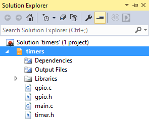
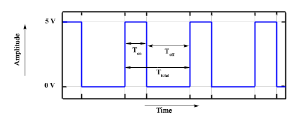

2. Shields are boards that can be attached to an Arduino board, significantly expand its capabilities, and makes prototyping much faster. See schematic of [Multi-function shield](https://oshwlab.com/tomas.fryza/arduino-shields) and find out the connection of four LEDs (D1, D2, D3, D4) and three push buttons (S1-A1, S2-A2, S3-A3).

&nbsp;

&nbsp;

&nbsp;

&nbsp;

&nbsp;

&nbsp;

### Version: Atmel Studio 7

1. Create a new GCC C Executable Project for ATmega328P within `04-interrupts` working folder and copy/paste [template code](main.c) to your `main.c` source file.

2. In **Solution Explorer** click on the project name, then in menu **Project**, select **Add New Item... Ctrl+Shift+A** and add a new C/C++ Include File `timer.h`. Copy/paste the [template code](../library/include/timer.h) into it.

3. In **Solution Explorer** click on the project name, then in menu **Project**, select **Add Existing Item... Shift+Alt+A** twice and add both GPIO library files (`gpio.h`, `gpio.c`) from the previous lab.

   

### Version: Command-line toolchain

1. Check if `library` folder and `Makefile.in` settings file exist within `Labs` folder. If not, copy them from the `Examples` folder.

2. Copy `main.c` and `Makefile` files from previous lab to `labs/04-interrupts` folder.

3. Copy/paste [template code](main.c) to your `04-interrupts/main.c` source file.

4. Create a new library header file in `labs/library/include/timer.h` and copy/paste the [template code](../library/include/timer.h) into it.

## Part 5: PWM (Pulse Width Modulation)

Pulse Width Modulation or PWM is a common technique used to vary the width of the pulses in a pulse-train. PWM has many applications such as controlling servos and speed controllers, limiting the effective power of motors and LEDs [[8]](https://www.tutorialspoint.com/arduino/arduino_pulse_width_modulation.htm). There are various terms associated with PWM:

* On-Time: duration of time signal is high,
* Off-Time: duration of time signal is low,
* Period: the sum of on-time and off-time of PWM signal,
* Duty Cycle: the percentage of time signal that remains on during the period of the PWM signal.

Use schematic of [Arduino Uno](https://oshwlab.com/tomas.fryza/arduino-shields) board or [ATmega328P datasheet](https://www.microchip.com/wwwproducts/en/ATmega328p) and in the following table write which Arduino Uno pins can be used to generate the PWM signal by internal timer modules.

| **Module** | **Description** | **MCU pin** | **Arduino pin** |
| :-: | :-: | :-: | :-: |
| Timer/Counter0 | OC0A |     |    |
|                | OC0B |     |    |
| Timer/Counter1 | OC1A |     |    |
|                | OC1B | PB2 | 10 |
| Timer/Counter2 | OC2A |     |    |
|                | OC2B |     |    |

