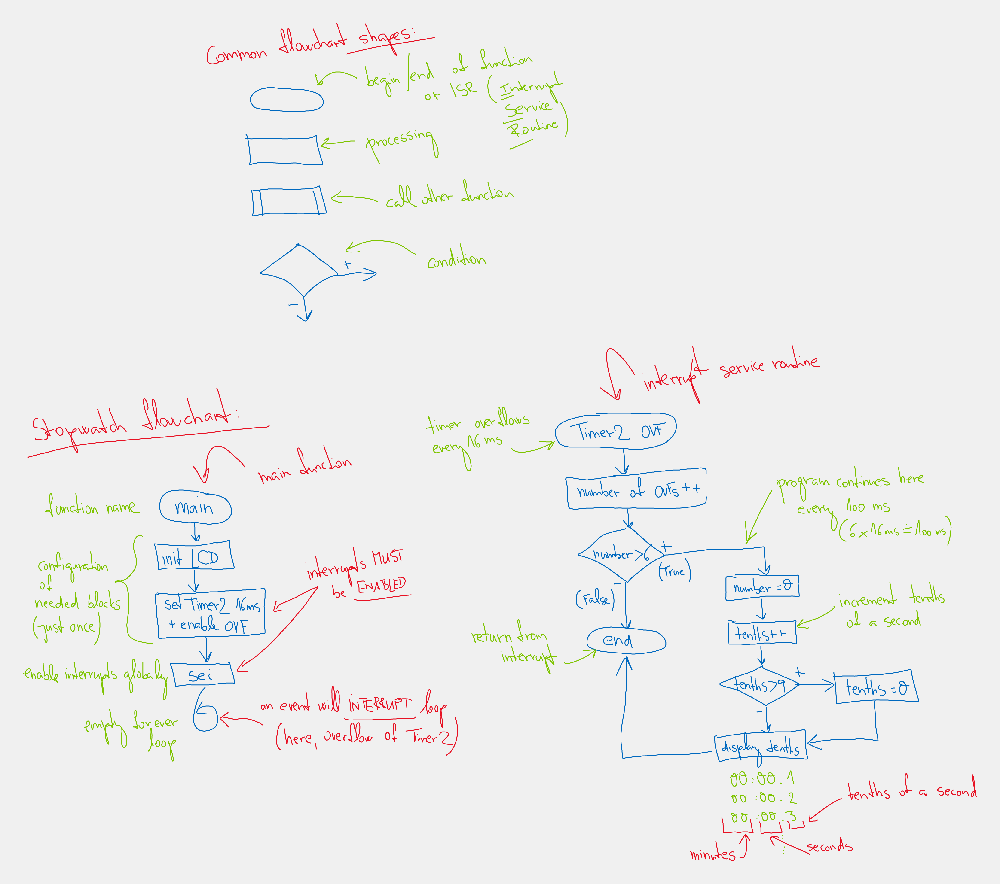

# Lab 4: Liquid crystal display (LCD)

<!--

-->

### Learning objectives

After completing this lab you will be able to:

* Use alphanumeric LCD
* Understand the digital communication between MCU and HD44780
* Use library functions for LCD
* Generate custom characters on LCD

The purpose of the laboratory exercise is to understand the serial control of Hitachi HD44780-based LCD character display and how to define custom characters. Another goal is to learn how to read documentation for library functions and use them in your own project.

### Table of contents

* [Pre-Lab preparation](#preparation)
* [Part 1: Synchronize repositories and create a new project](#part1)
* [Part 2: LCD display module](#part2)
* [Part 3: Library for HD44780 based LCDs](#part3)
* [Part 4: Stopwatch](#part4)
* [Part 5: Defined and custom characters](#part5)
* [Experiments on your own](#experiments)
* [Post-Lab report](#report)
* [References](#references)

<a name="preparation"></a>

## Pre-Lab preparation

1. Use schematic of the [LCD keypad shield](https://oshwlab.com/tomas.fryza/arduino-shields) and find out the connection of LCD display. What data and control signals are used? What is the meaning of these signals?

   | **LCD signal(s)** | **AVR pin(s)** | **Description** |
   | :-: | :-: | :-- |
   | RS | PB0 | Register selection signal. Selection between Instruction register (RS=0) and Data register (RS=1) |
   | R/W |  |  |
   | E |  |  |
   | D[3:0] |  |  |
   | D[7:4] |  |  |
   | K |  |  |

2. What is the ASCII table? What are the codes/values for uppercase letters `A` to `Z`, lowercase letters `a` to `z`, and numbers `0` to `9` in this table?

   | **Char** | **Decimal** | **Hexadecimal** |
   | :-: | :-: | :-: |
   | `A` | 65 | 0x41 |
   | `B` |  |  |
   | ... |  |  |
   | `a` | 97 | 0x61 |
   | `b` |  |  |
   | ... |  |  |
   | `0` | 48 | 0x30 |
   | `1` |  |  |
   | ... |  |  |

<a name="part1"></a>

## Part 1: Synchronize repositories and create a new project

1. Run Git Bash (Windows) of Terminal (Linux), navigate to your working directory, and update local repository.

   > Useful bash and git commands are: `cd` - Change working directory. `mkdir` - Create directory. `ls` - List information about files in the current directory. `pwd` - Print the name of the current working directory. `git status` - Get state of working directory and staging area. `git pull` - Update local repository and working folder.
   >

2. Run Visual Studio Code and create a new PlatformIO project `lab4-lcd` for `Arduino Uno` board and change project location to your local repository folder `Documents/digital-electronics-2`.

3. IMPORTANT: Rename `LAB4-LCD > src > main.cpp` file to `main.c`, ie change the extension to `.c`.

4. Copy/paste [report template](https://raw.githubusercontent.com/tomas-fryza/digital-electronics-2/master/labs/04-lcd/report.md) to your `LAB4-LCD > test > README` file. Rename this file to `README.md`, ie add the extension `.md`.

<a name="part2"></a>

## Part 2: LCD display module

**LCD (Liquid Crystal Display)** is an electronic device which is used for display any ASCII text. There are many different screen sizes e.g. 16x1, 16x2, 16x4, 20x4, 40x4 characters and each character is made of 5x8 matrix pixel dots. LCD displays have different LED backlight in yellow-green, white and blue color. LCD modules are mostly available in COB (Chip-On-Board) type. With this method, the controller IC chip or driver (here: HD44780) is directly mounted on the backside of the LCD module itself.

The control is based on the Hitachi HD44780 chipset (or a compatible), which is found on most text-based LCDs, and hence the driving software remains the same even for different screen sizes. The driver contains instruction set, character set, and in addition you can also generate your own characters.

The HD44780 is capable of operating in 8-bit mode i.e. faster, but 11 microcontroller pins (8 data + 3 control) are needed. Because the speed is not really that important as the amount of data needed to drive the display is low, the 4-bit mode is more appropriate for microcontrollers since only 4+2=6 (or 4+3=7) pins are needed.

In 8-bit mode we send the command/data to the LCD using eight data lines (D0-D7), while in 4-bit mode we use four data lines (D4-D7) to send commands and data. Inside the HD44780 there is still an 8-bit operation so for 4-bit mode, two writes to get 8-bit quantity inside the chip are made (first high four bits and then low four bits with an E clock pulse).

In the lab, the LCD1602 display module is used. The display consists of 2 rows of 16 characters each. It has an LED backlight and it communicates through a parallel interface with only 6 wires (+ 1 signal for backglight control):

* RS - register select. Selects the data or instruction register inside the HD44780
* E - enable. This loads the data into the HD44780 on the falling edge
* (at LCD keypad schield, R/W pin is permanently connected to GND)
* D7:4 - Upper nibble used in 4-bit mode
* K - Backlight cathode


When a command is given to LCD, the command register (RS = 0) is selected and when data is sent to LCD, the data register (RS = 1) is selected. A **command** is an instruction entered on the LCD in order to perform the required function. In order to display textual information, **data** is send to LCD.

> ### Example of HD44780 communication
>
> **Question:** Let the following image shows the communication between ATmega328P and LCD display in 4-bit mode. How does HD44780 chipset understand the sequence of these signals?
>
> &nbsp;
> 
>
> **Answer:** The following signals are read on the first falling edge of the enable, therefore: `RS = 1` (data register) and higher four data bits `D7:4 = 0100`. On the second falling edge of enable, the lower four data bits are `D7:4 = 0011`. The whole byte transmitted to the LCD is therefore `0100_0011` (0x43) and according to the ASCII (American Standard Code for Information Interchange) table, it represents lettre `C`.
>
>
> The Hitachi HD44780 has many commands, the most useful for initialization, xy location settings, and print [[1]](https://www.sparkfun.com/datasheets/LCD/HD44780.pdf).
>
> 
>
> 
>
> If you are an advanced programmer and would like to create your own library for interfacing your microcontroller with an LCD module then you have to understand those instructions and commands which can be found its datasheet.

<a name="part3"></a>

## Part 3: Library for HD44780 based LCDs

In the lab, we are using [LCD library for HD44780 based LCDs](http://www.peterfleury.epizy.com/avr-software.html) developed by Peter Fleury.

1. Use the online manual of LCD library (generated by [Doxygen tool](https://www.doxygen.nl/manual/docblocks.html#specialblock)) and add the input parameters and description of the following functions.

   | **Function name** | **Function parameters** | **Description** | **Example** |
   | :-- | :-- | :-- | :-- |
   | `lcd_init` | `LCD_DISP_OFF`<br>`LCD_DISP_ON`<br>`LCD_DISP_ON_CURSOR`<br>`LCD_DISP_ON_CURSOR_BLINK` | Display off&nbsp;&nbsp;&nbsp;&nbsp;&nbsp;&nbsp;&nbsp;&nbsp;&nbsp;&nbsp;&nbsp;&nbsp;&nbsp;&nbsp;&nbsp;&nbsp;&nbsp;&nbsp;&nbsp;&nbsp;&nbsp;&nbsp;&nbsp;&nbsp;&nbsp;&nbsp;&nbsp;&nbsp;&nbsp;&nbsp;&nbsp;&nbsp;&nbsp;&nbsp;&nbsp;&nbsp;&nbsp;&nbsp;&nbsp;&nbsp;&nbsp;&nbsp;&nbsp;&nbsp;&nbsp;<br>...&nbsp;<br>...&nbsp;<br>...&nbsp; | `lcd_init(LCD_DISP_OFF);`<br>...&nbsp;<br>...&nbsp;<br>...&nbsp; |
   | `lcd_clrscr` | | | `lcd_clrscr();` |
   | `lcd_gotoxy` | | | |
   | `lcd_putc` | | | |
   | `lcd_puts` | | | |
   | `lcd_command` | | | |
   | `lcd_data` | | | |

2. Copy/paste [template code](https://raw.githubusercontent.com/tomas-fryza/digital-electronics-2/master/labs/04-lcd/main.c) to `LAB4-LCD > src > main.c` source file.

3. In PlatformIO project, create a new folder `LAB4-LCD > lib > gpio`. Copy your GPIO library files [`gpio.c`](https://raw.githubusercontent.com/tomas-fryza/digital-electronics-2/master/labs/library/gpio.c) and [`gpio.h`](https://raw.githubusercontent.com/tomas-fryza/digital-electronics-2/master/labs/library/include/gpio.h) from the previous lab to this folder.

4. In PlatformIO project, create a new file `LAB4-LCD > include > timer.h`.  Copy/paste [header file](https://raw.githubusercontent.com/tomas-fryza/digital-electronics-2/master/labs/library/include/timer.h) from the previous lab to this file.

5. In PlatformIO project, create a new folder `LAB4-LCD > lib > lcd`. Within this folder, create three new files `lcd.c`, `lcd.h`, and `lcd_definitions.h`. See the project structure:

   ```c
   |--include
   |  |--timer.h
   |
   |--lib
   |  |--gpio
   |  |  |- gpio.c
   |  |  |- gpio.h
   |  |
   |  |--lcd
   |     |- lcd.c
   |     |- lcd.h
   |     |- lcd_definitions.h
   |
   |--src
      |- main.c
   ```

   1. Copy/paste [header file](https://raw.githubusercontent.com/tomas-fryza/digital-electronics-2/master/labs/library/include/lcd.h) to `lcd.h`
   2. Copy/paste [header file](https://raw.githubusercontent.com/tomas-fryza/digital-electronics-2/master/labs/library/include/lcd_definitions.h) to `lcd_definitions.h`
   3. Copy/paste [library source file](https://raw.githubusercontent.com/tomas-fryza/digital-electronics-2/master/labs/library/lcd.c) to `lcd.c`

6. Go through the `lcd_definitions.h` and `main.c` files and make sure you understand each line. Build and upload the code to Arduino Uno board.

7. Use library functions `lcd_gotoxy()`, `lcd_puts()`, `lcd_putc()` and display strings/characters on the LCD as shown in the figure bellow. Explanation: You will later display the square of seconds at position "a", the process bar at "b", and the rotating text at position "c". Note, there is a cursor after letter "c".

   

> The figure above was created by online [LCD Display Screenshot Generator](http://avtanski.net/projects/lcd/).
>

8. Use the PB2 pin to control the backlight of the LCD screen. (Optionaly: Create a new library function for this purpose.)

<a name="part4"></a>

## Part 4: Stopwatch

1. Use Timer/Counter2 16-ms overflow and update the stopwatch LCD value approximately every 100&nbsp;ms (6 x 16 ms = 100 ms) as explained in the previous lab. Display tenths of a second and seconds `00:seconds.tenths`. Let the stopwatch counts from `00:00.0` to `00:59.9` and then starts again.

   

   ```c
   #include <stdlib.h>         // C library. Needed for number conversions
   ...

   ISR(TIMER2_OVF_vect)
   {
       static uint8_t no_of_overflows = 0;
       static uint8_t tenths = 0;  // Tenths of a second
       char string[2];             // String for converted numbers by itoa()

       no_of_overflows++;
       if (no_of_overflows >= 6)
       {
           // Do this every 6 x 16 ms = 100 ms
           no_of_overflows = 0;

           // Count tenth of seconds 0, 1, ..., 9, 0, 1, ...
           ...

           itoa(tenths, string, 10);  // Convert decimal value to string
           lcd_gotoxy(7, 0);
           lcd_puts(string);
       }
       // Else do nothing and exit the ISR
   }
   ```

   IMPORTANT: Because library functions only allow to display a string (`lcd_puts`) or individual characters (`lcd_putc`), the variables' number values need to be converted to such strings. To do this, use the `itoa(number, string, num_base)` function from the standard `stdlib.h` library. The `num_base` parameter allows you to display the `number` in decimal, hexadecimal, or binary.

2. A flowchart is a visual representation of a certain process or flow of instructions of an algorithm that helps to understand it. A flowchart basically uses rectangles, diamonds, ovals and various other shapes to make the problem easier to understand.

   

   Draw a flowchart of the Timer/Counter2 interrupt service routine that updates the tenths of a second on the stopwatch.

<a name="part5"></a>

## Part 5: Defined and custom characters

All LCD displays based on the Hitachi HD44780 controller have two types of memory that store defined characters: CGROM and CGRAM (Character Generator ROM & RAM). The CGROM memory is non-volatile and cannot be modified, while the CGRAM memory is volatile and can be modified at any time [[4]](https://lastminuteengineers.com/arduino-1602-character-lcd-tutorial/).

CGROM memory is used to store all permanent fonts that can be displayed using their ASCII code. For example, if we write 0x43, then we get the character "C" on the display. In total, it can generate 208 5x8 character patterns.


CGRAM is another memory that can be used for storing user defined characters. This RAM is limited to 64 bytes. Meaning, for 5x8 pixel based LCD, up to 8 user-defined characters can be stored in the CGRAM. It is useful if you want to use a character that is not part of the standard 127-character ASCII table.


A custom character is an array of 8 bytes. Each byte (only 5 bits are considered) in the array defines one row of the character in the 5x8 matrix. Whereas, the zeros and ones in the byte indicate which pixels in the row should be on and which ones should be off.

1. To design a new custom character, store it in CGRAM according to the following code.

   ```c
   /* Global variables --------------------------------------------------*/
   // Custom character definition using https://omerk.github.io/lcdchargen/
   uint8_t customChar[8] = {
       0b00111,
       0b01110,
       0b11100,
       0b11000,
       0b11100,
       0b01110,
       0b00111,
       0b00011
   };
   ...

   int main(void)
   {
       // Initialize LCD display
       lcd_init(LCD_DISP_ON);

       // Set pointer to beginning of CGRAM memory
       lcd_command(1 << LCD_CGRAM);
       for (uint8_t i = 0; i < 8; i++)
       {
           // Store all new chars to memory line by line
           lcd_data(customChar[i]);
       }
       // Set DDRAM address to display characters
       lcd_command(1 << LCD_DDRAM);
    
       // Display first custom character at address 0
       lcd_putc(0);
       ...
   ```

2. Design at least one more custom character, store it in CGRAM memory according to the previous code, and display all new characters on the LCD screen.

3. When you finish, always synchronize the contents of your working folder with the local and remote versions of your repository. This way you are sure that you will not lose any of your changes. To do that, use **Source Control (Ctrl+Shift+G)** in Visual Studio Code or git commands.

   > Useful git commands are: `git status` - Get state of working directory and staging area. `git add` - Add new and modified files to the staging area. `git commit` - Record changes to the local repository. `git push` - Push changes to remote repository. `git pull` - Update local repository and working folder. Note that, a brief description of useful git commands can be found [here](https://github.com/tomas-fryza/digital-electronics-1/wiki/Useful-Git-commands) and detailed description of all commands is [here](https://github.com/joshnh/Git-Commands).
   >

<a name="experiments"></a>

## Experiments on your own

1. Complete the `TIMER2_OVF_vect` interrupt routine with stopwatch code and display `minutes:seconds.tenths`.

   

2. Display the square value of the `seconds` at LCD position "a".

   

3. Use new characters and create a progress bar at LCD position "b". Let the full bar state corresponds to one second.

   

   

   Hint: Use Timer/Counter0 with 16ms overflow and change custom characters at specific display position.

   ```c
   /* Variables ---------------------------------------------------------*/
   // Custom character definition using https://omerk.github.io/lcdchargen/
   uint8_t customChar[] = {
       // addr 0: .....
       0b00000, 0b00000, 0b00000, 0b00000, 0b00000, 0b00000, 0b00000, 0b00000,
       // addr 1: |....
       0b10000, 0b10000, 0b10000, 0b10000, 0b10000, 0b10000, 0b10000, 0b10000,
       ...
   };
   ...
   /*--------------------------------------------------------------------*/
   /**
    * ISR starts when Timer/Counter0 overflows. Update the progress bar on
    * LCD display every 16 ms.
    */
   ISR(TIMER0_OVF_vect)
   {
       static uint8_t symbol = 0;
       static uint8_t position = 0;

       lcd_gotoxy(1 + position, 1);
       lcd_putc(symbol);

       // WRITE YOUR CODE HERE
   }
   ```

4. From LCD position "c", displays running text, ie text that moves characters to the left twice per second. Hint: Use Timer/Counter1 with an 262ms prescaler and every 2nd overflow move the auxiliary variable along the defined string, such as `uint8_t running_text[] = "   I like Digital electronics!\n";`.

   

<a name="report"></a>

## Post-Lab report

*Complete all parts of `LAB4-LCD > test > README.md` file (see Part 1.4) in Czech, Slovak, or English, push it to your GitHub repository, and submit a link to this file via [BUT e-learning](https://moodle.vutbr.cz/). The deadline for submitting the task is the day before the next computer exercise.*

*Vypracujte všechny části ze souboru `LAB4-LCD > test > README.md` (viz Část 1.4) v českém, slovenském, nebo anglickém jazyce, uložte je na váš GitHub repozitář a odevzdejte link na tento soubor prostřednictvím [e-learningu VUT](https://moodle.vutbr.cz/). Termín odevzdání úkolu je den před dalším počítačovým cvičením.*

<a name="references"></a>

## References

1. HITACHI. [HD44780U, Dot Matrix Liquid Crystal Display Controller/Driver](https://www.sparkfun.com/datasheets/LCD/HD44780.pdf)

2. Peter Fleury. [LCD library for HD44780 based LCDs](http://www.peterfleury.epizy.com/avr-software.html)

3. avtanski.net. [LCD Display Screenshot Generator](http://avtanski.net/projects/lcd/)

4. LastMinuteEngineers.com. [Interfacing 16×2 Character LCD Module with Arduino](https://lastminuteengineers.com/arduino-1602-character-lcd-tutorial/)

5. omerk.github.io. [Custom Character Generator for HD44780 LCD Modules](https://omerk.github.io/lcdchargen/)

6. Protostack Pty Ltd. [HD44780 Character LCD Displays – Part 1](https://protostack.com.au/2010/03/character-lcd-displays-part-1/)

7. [Circuit Basics](https://www.circuitbasics.com/)

8. [CGRAM display memory](https://www.mikroe.com/ebooks/pic-microcontrollers-programming-in-c/additional-components)

9. Tomas Fryza. [Useful Git commands](https://github.com/tomas-fryza/digital-electronics-2/wiki/Useful-Git-commands)

10. Tomas Fryza. [Schematic of LCD Keypad shield](https://oshwlab.com/tomas.fryza/arduino-shields)

11. [Goxygen commands](https://www.doxygen.nl/manual/docblocks.html#specialblock)
