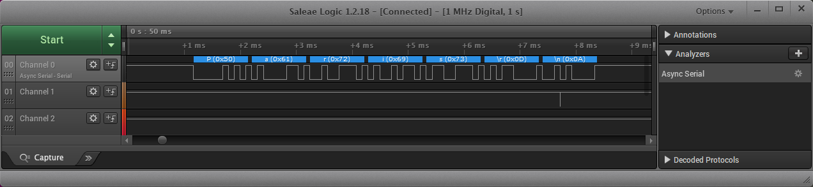
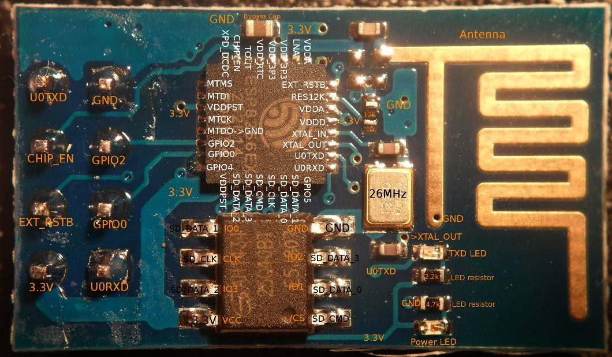

# Lab 6: Universal Asynchronous Receiver-Transmitter (UART)

### Learning objectives

After completing this lab you will be able to:

* Understand the UART communication
* Decode UART frames
* Use functions from UART library
* Use logic analyzer

The purpose of the laboratory exercise is to understand serial asynchronous communication, data frame structure and communication options using an internal USART unit.

### Table of contents

* [Preparation tasks](#preparation)
* [Part 1: Synchronize repositories and create a new folder](#part1)
* [Part 2: Basics of UART communication](#part2)
* [Part 3: Communication between Arduino board and computer](#part3)
* [Experiments on your own](#experiments)
* [Post-Lab report](#report)
* [References](#references)

<a name="preparation"></a>

## Pre-Lab preparation

1. Use schematic of [Arduino Uno](https://oshwlab.com/tomas.fryza/arduino-shields) and find out on which Arduino Uno pins the UART transmitter (Tx) and receiver (Rx) are located.

2. Remind yourself, what an [ASCII table](http://www.asciitable.com/) is. What codes are defined for control characters `Esc`, `Space`, `Tab`, and `Enter`?

<a name="part1"></a>

## Part 1: Synchronize repositories and create a new project

1. Run Git Bash (Windows) of Terminal (Linux), navigate to your working directory, and update local repository.

   > Useful bash and git commands are: `cd` - Change working directory. `mkdir` - Create directory. `ls` - List information about files in the current directory. `pwd` - Print the name of the current working directory. `git status` - Get state of working directory and staging area. `git pull` - Update local repository and working folder.
   >

2. Run Visual Studio Code and create a new PlatformIO project `lab6-uart` for `Arduino Uno` board and change project location to your local repository folder `Documents/digital-electronics-2`.

3. IMPORTANT: Rename `LAB6-UART > src > main.cpp` file to `main.c`, ie change the extension to `.c`.

4. Copy/paste [report template](https://raw.githubusercontent.com/tomas-fryza/digital-electronics-2/master/labs/06-uart/report.md) to your `LAB6-UART > test > README` file. Rename this file to `README.md`, ie add the extension `.md`.

<a name="part2"></a>

## Part 2: Basics of UART communication

The UART (Universal Asynchronous Receiver-Transmitter) is not a communication protocol like SPI and I2C, but a physical circuit in a microcontroller, or a stand-alone integrated circuit, that translates communicated data between serial and parallel forms. It is one of the simplest and easiest method for implement and understanding.

In UART communication, two UARTs communicate directly with each other. The transmitting UART converts parallel data from a CPU into serial form, transmits it in serial to the receiving UART, which then converts the serial data back into parallel data for the receiving device. Only two wires are needed to transmit data between two UARTs. Data flows from the Tx pin of the transmitting UART to the Rx pin of the receiving UART [[3]](https://www.circuitbasics.com/basics-uart-communication/), [[4]](https://www.analog.com/en/analog-dialogue/articles/uart-a-hardware-communication-protocol.html).

UARTs transmit data asynchronously, which means there is no external clock signal to synchronize the output of bits from the transmitting UART. Instead, timing is agreed upon in advance between both units, and special **Start** (log. 0) and 1 or 2 **Stop** (log. 1) bits are added to each data package. These bits define the beginning and end of the data packet so the receiving UART knows when to start reading the bits. In addition to the start and stop bits, the packet/frame also contains data bits and optional parity.

The amount of **data** in each packet can be set from 5 to 9 bits. If it is not otherwise stated, data is transferred least-significant bit (LSB) first.

**Parity** is a form of very simple, low-level error checking and can be Even or Odd. To produce the parity bit, add all 5-9 data bits and extend them to an even or odd number. For example, assuming parity is set to even and was added to a data byte `0110_1010`, which has an even number of 1's (4), the parity bit would be set to 0. Conversely, if the parity mode was set to odd, the parity bit would be 1.

One of the most common UART formats is called **9600 8N1**, which means 8 data bits, no parity, 1 stop bit and a symbol rate of 9600&nbsp;Bd.


> ### Example of UART communication
>
> **Question:** Let the following image shows one frame of UART communication transmitting from the ATmega328P in 8N1 mode. What ASCII code/character does it represent? According to bit period, estimate the symbol rate.
>
> &nbsp;
> 
>
> **Answer:** 8N1 means that 8 data bits are transmitted, no parity is used, and the number of stop bits is one. Because the frame always starts with a low level start bit and the order of the data bits is from LSB to MSB, the data transmitted bu UART is therefore `0100_0101` (0x45) and according to the [ASCII](http://www.asciitable.com/) (American Standard Code for Information Interchange) table, it represents the letter `E`.
>
> The figure further shows that the bit period, i.e. the duration of one bit, is 104&nbsp;us. The symbol rate of the communication is thus 1/104e-6 = 9615, i.e. approximately 9600&nbsp;Bd.
>

<a name="part3"></a>

## Part 3: Communication between Arduino board and computer

In the lab, we are using [UART library](http://www.peterfleury.epizy.com/avr-software.html) developed by Peter Fleury.

1. Use online manual of UART library and add the input parameters and description of the following functions.

   | **Function name** | **Function parameter(s)** | **Description** | **Example** |
   | :-- | :-- | :-- | :-- |
   | `uart_init` | `UART_BAUD_SELECT(9600, F_CPU)` | Initialize UART to 8N1 and set baudrate to 9600&nbsp;Bd | `uart_init(UART_BAUD_SELECT(9600, F_CPU));` |
   | `uart_getc` |  |  |
   | `uart_putc` |  |  |
   | `uart_puts` |  |  |

2. Copy/paste [template code](https://raw.githubusercontent.com/tomas-fryza/digital-electronics-2/master/labs/06-uart/main.c) to `LAB6-UART > src > main.c` source file.

3. Use your favorite file manager and copy `timer.h` file from the previous lab to `LAB6-UART > include` folder.

4. In PlatformIO project, create a new folder `LAB6-UART > lib > uart`. Within this folder, create two new files `uart.c` and `uart.h`.

   1. Copy/paste [library source file](https://raw.githubusercontent.com/tomas-fryza/digital-electronics-2/master/labs/library/uart.c) to `uart.c`
   2. Copy/paste [header file](https://raw.githubusercontent.com/tomas-fryza/digital-electronics-2/master/labs/library/include/uart.h) to `uart.h`

   The final project structure should look like this:

   ```c
   ├── include
   │   └── timer.h
   ├── lib
   │   └── uart
   |       ├── uart.c
   |       └── uart.h
   └── src
       └── main.c
   ```

5. Go through the `main.c` file and make sure you understand each line. Build and upload the code to Arduino Uno board. What is the meaning of ASCII control characters `\r`, `\n`, and `\t`?

   Use **PlatformIO: Serial Monitor** or **PuTTY application** to receive values from Arduino board. In PuTTY, set connection type to `Serial` and check that configuration is the same as in the ATmega328P application, ie. 9600 8N1 mode. Note that, **serial line** (here COM3 on Windows) could be different. In Linux, use `dmesg` command to verify your port (such as `/dev/ttyUSB0`).

   
   

   > WARNING: Before Arduino board re-programming process, PuTTY app must be closed!
   >
   > In SimulIDE, right click to ATmega328 package and select **Open Serial Monitor**. In this window you can receive data from the microcontroller, but also send them back.
   >

6. Configure Timer1 to overflow four times per second and transmit UART string `Paris`. Use Logic Analyzer to visualize and decode transmitting strings.

   

   > Note that, you have to have a [Saleae logic analyzer](https://www.saleae.com/) or [similar](https://www.amazon.com/KeeYees-Analyzer-Device-Channel-Arduino/dp/B07K6HXDH1/ref=sr_1_6?keywords=saleae+logic+analyzer&qid=1667214875&qu=eyJxc2MiOiI0LjIyIiwicXNhIjoiMy45NSIsInFzcCI6IjMuMDMifQ%3D%3D&sprefix=saleae+%2Caps%2C169&sr=8-6), and to download and install [Saleae Logic 1](https://support.saleae.com/logic-software/legacy-software/older-software-releases#logic-1-x-download-links) software on your computer.
   >

7. Use `uart_getc` function and display the ASCII code of received character in decimal, hexadecimal, and binary. You can use Timer1 overflow handler to perform such receiver. Fill the table with selected keys.

   ```c
   ISR(TIMER1_OVF_vect)
   {
       uint8_t value;
       char string[8];  // String for converted numbers by itoa()

       value = uart_getc();
       if (value != '\0') {  // Data available from UART
           // Display ASCII code of received character
           // WRITE YOUR CODE HERE
       }
   }
   ```

   | **Char** | **Decimal** | **Hexadecimal** | **Binary** |
   | :-: | :-: | :-: | :-: |
   | `a` | 97 | 0x61 | `0b0110_0001` |
   | `b` |  |  |  |
   | `c` |  |  |  |
   | `0` | 48 | 0x30 | `0b0011_0000` |
   | `1` |  |  |  |
   | `2` |  |  |  |
   | `Esc` |  |  |  |
   | `Space` |  |  |  |
   | `Tab` |  |  |  |
   | `Backspace` |  |  |  |
   | `Enter` |  |  |  |

8. (Optional) Verify basic AT commands of Wi-Fi module ESP8266 ESP-01. Connect Wi-Fi module to Arduino Uno board according to the following instructions.

   | **ESP-01 pin** | **Arduino Uno pin** | **ESP-01 pin** | **Arduino Uno pin** |
   | :-: | :-: | :-: | :-: |
   | U0TXD | Rx (pin 0) | GND | GND |
   | CHIP_EN | 3.3V | GPIO2 | Not connected |
   | EXT_RSTB | Not connected | GPIO0 | Not connected |
   | 3.3V | 3.3V | U0RXD | Tx (pin 1) |

   

   In your code, initialize UART to 8N1 mode, 115200 Bd and in Timer1 overflow transmit one of the following AT commands; make sure command string ends by `\r\n`. Use Logic analyzer to read the response of Wi-Fi module.

   * `AT` - Check the communication with module
   * `AT+CWMODE=1` - Set the module mode
   * `AT+GMR` - Get the module version
   * `AT+CWLAPOPT=1,6` - Limit the list to `rssi` and `ssid` parameters only
   * `AT+CWLAP` - List `ssid` and `rssi` parameters of available Wi-Fi APs

   The complete list and description of all AT commands are available [here](https://github.com/tomas-fryza/digital-electronics-2/blob/master/docs/esp8266_at_instruction_set.pdf). To avoid a conflict with Wi-Fi module, remove the Tx and Rx wires when uploading the firmware and put them back after the upload is complete.

9. When you finish, always synchronize the contents of your working folder with the local and remote versions of your repository. This way you are sure that you will not lose any of your changes. To do that, use **Source Control (Ctrl+Shift+G)** in Visual Studio Code or git commands.

   > Useful git commands are: `git status` - Get state of working directory and staging area. `git add` - Add new and modified files to the staging area. `git commit` - Record changes to the local repository. `git push` - Push changes to remote repository. `git pull` - Update local repository and working folder. Note that, a brief description of useful git commands can be found [here](https://github.com/tomas-fryza/digital-electronics-1/wiki/Useful-Git-commands) and detailed description of all commands is [here](https://github.com/joshnh/Git-Commands).
   >

<a name="experiments"></a>

## Experiments on your own

1. Use [ANSI Escape Sequences](https://gist.github.com/fnky/458719343aabd01cfb17a3a4f7296797) and modify color and format of transmitted strings according to the following code. Try other formatting styles. Because the PlatformIO Serial Monitor does not support the ANSI Excape Sequences, you have to use PuTTY application.

   ```c
   /* Color/formatting sequence always starts by "\033[" and ends by "m" strings.
   * One or more formatting codes "#", separated by ";" can be used within
   * one line, such as:
   *    \033[#m      or
   *    \033[#;#m    or
   *    \033[#;#;#m  etc. */
   uart_puts("\033[4;32m");        // 4: underline style; 32: green foreground
   uart_puts("This is all Green and Underlined.");
   uart_puts("\033[0m");           // 0: reset all attributes
   uart_puts("This is Normal text again.");
   ```

2. Program a piece of code to calculate the parity bit from the specified value.

   > Note: Keep UART strings as shot as possible. But if you need to transmit a larger amount of data, it is necessary to increase the size of the transmit/receive buffer in the `uart.h` file, eg to 128.
   >
   >```c
   >/** @brief  Size of the circular receive buffer, must be power of 2
   > *
   > *  You may need to adapt this constant to your target and your application by adding
   > *  CDEFS += -DUART_RX_BUFFER_SIZE=nn to your Makefile.
   > */
   >#ifndef UART_RX_BUFFER_SIZE
   ># define UART_RX_BUFFER_SIZE 128
   >#endif
   >
   >/** @brief  Size of the circular transmit buffer, must be power of 2
   > *
   > *  You may need to adapt this constant to your target and your application by adding
   > *  CDEFS += -DUART_TX_BUFFER_SIZE=nn to your Makefile.
   > */
   >#ifndef UART_TX_BUFFER_SIZE
   ># define UART_TX_BUFFER_SIZE 128
   >#endif
   >```
   >

3. Program a software UART transmitter (emulated UART) that will be able to generate UART data on any output pin of the ATmega328P microcontroller. Let the bit rate be approximately 9600&nbsp;Bd and do not use the delay library. Also consider the possibility of calculating the parity bit. Verify the UART communication with logic analyzer or oscilloscope.

4. Program an interactive console that communicates between ATmega328P and the computer (PuTTY application) via UART. Let the main screen of the console is as follows:

   ```bash
   --- Interactive UART console ---
   1: read current Timer/counter1 value
   2: reset Timer/counter1
   > 
   ```

   After pressing the '1' key on computer keyboard, ATmega328P receives ASCII code of the key and sends the current Timer1 value back to PuTTY. After pressing the '2' key, ATmega328P resets Timer1 value, etc. Use ANSI escape sequences to highlight information within PuTTY console.

   ```c
   uint8_t value;
   ...
   value = uart_getc();
   if (value != '\0') {     // Data available from UART
       if (value == `1`) {  // Key `1` received
           ...
       }
   }
   ...

<a name="report"></a>

## Post-Lab report

*Complete all parts of `LAB4-LCD > test > README.md` file (see Part 1.4) in Czech, Slovak, or English, push it to your GitHub repository, and submit a link to this file via [BUT e-learning](https://moodle.vutbr.cz/). The deadline for submitting the task is the day before the next computer exercise.*

*Vypracujte všechny části ze souboru `LAB4-LCD > test > README.md` (viz Část 1.4) v českém, slovenském, nebo anglickém jazyce, uložte je na váš GitHub repozitář a odevzdejte link na tento soubor prostřednictvím [e-learningu VUT](https://moodle.vutbr.cz/). Termín odevzdání úkolu je den před dalším počítačovým cvičením.*

<a name="references"></a>

## References

1. Tomas Fryza. [Schematic of Arduino Uno](https://oshwlab.com/tomas.fryza/arduino-shields)

2. [ASCII Table](http://www.asciitable.com/)

3. Circuit Basics. [Basics of UART Communication](https://www.circuitbasics.com/basics-uart-communication/)

4. Eric Peňa, Mary Grace Legaspi. [UART: A Hardware Communication Protocol Understanding Universal Asynchronous Receiver/Transmitter](https://www.analog.com/en/analog-dialogue/articles/uart-a-hardware-communication-protocol.html)

5. Peter Fleury. [UART library](http://www.peterfleury.epizy.com/avr-software.html)

6. Tomas Fryza. [Useful Git commands](https://github.com/tomas-fryza/digital-electronics-2/wiki/Useful-Git-commands)

7. Christian Petersen. [ANSI Escape Sequences](https://gist.github.com/fnky/458719343aabd01cfb17a3a4f7296797)
