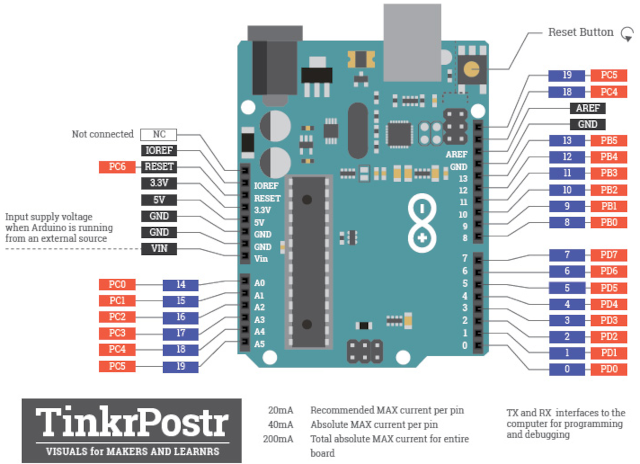

# Lab 8: YOUR_FIRSTNAME LASTNAME

Link to this file in your GitHub repository:

[https://github.com/your-github-account/repository-name/lab_name](https://github.com/...)

### Arduino Uno pinout

1. In the picture of the Arduino Uno board, mark the pins that can be used for the following functions:
   * PWM generators from Timer0, Timer1, Timer2
   * analog channels for ADC
   * UART pins
   * I2C pins
   * SPI pins
   * external interrupt pins INT0, INT1

   

### I2C

1. Code listing of Timer1 overflow interrupt service routine for reading temperature and checksum values from DHT12 sensor. Always use syntax highlighting and meaningful comments:

```c
/**********************************************************************
 * Function: Timer/Counter1 overflow interrupt
 * Purpose:  Update Finite State Machine and get humidity, temperature,
 *           and checksum from DHT12 sensor.
 **********************************************************************/
ISR(TIMER1_OVF_vect)
{
    static state_t state = STATE_IDLE;  // Current state of the FSM
    static uint8_t addr = 0x5c;  // I2C slave address of DHT12
    uint8_t value;               // Data obtained from the I2C bus
    char uart_string[] = "000";  // String for converting numbers by itoa()

    // FSM
    switch (state)
    {
    // Do nothing
    case STATE_IDLE:
        // Move to the next state
        state = STATE_HUMID;
        break;
    
    // Get humidity
    case STATE_HUMID:
        // WRITE YOUR CODE HERE
        
        // Move to the next state
        state = STATE_TEMP;
        break;

    // Get temperature
    case STATE_TEMP:
        // WRITE YOUR CODE HERE

        // Move to the next state
        state = STATE_CHECK;
        break;

    // Get checksum
    case STATE_CHECK:
        // WRITE YOUR CODE HERE
        
        // Move to the next state
        state = STATE_IDLE;
        break;

    default:
        state = STATE_IDLE;
        break;
    }
}
```

2. (Hand-drawn) picture of I2C signals when asking and reading checksum value (only 1 byte) from DHT12 sensor. Indicate which specific moments control the data line master and which slave. Draw the whole request/receive process, from start to stop condition.

   

### Meteo station

Consider an application for temperature and humidity measurement and display. Use combine sensor DHT12, real time clock DS3231, LCD, and one LED. Application display time in hours:minutes:seconds at LCD, measures both temperature and humidity values once per minut, display both values on LCD, and when the temperature is too high, the LED starts blinking.

1. FSM state diagram picture of meteo station. The image can be drawn on a computer or by hand. Concise name of individual states and describe the transitions between them.

   
