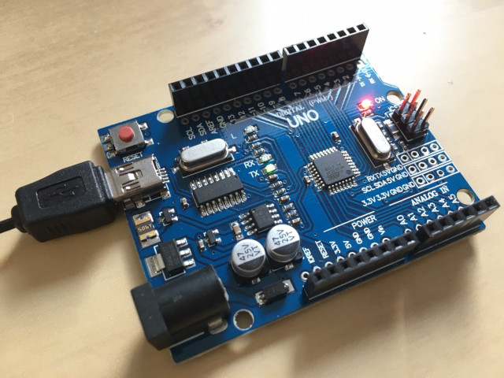

# Lab 9: Combining C and assembly language



### Learning objectives

After completing this lab you will be able to:

* Use basic AVR instructions
* Convert AVR instruction to hexadecimal machine code
* Pass parameters from C code to assembly and vice versa

The purpose of the laboratory exercise is to understand the AVR instruction set and how the individual instructions are translated into machine code. The main goal is to learn to combine higher and lower programming language in one project.

### Table of contents

* [Preparation tasks](#preparation)
* [Part 1: Synchronize repositories and create a new folder](#part1)
* [Part 2: Assembly language](#part2)
* [Part 3: LFSR-based pseudo random generator](#part3)
* [Part 4: Sum of the products (SoP)](#part4)
* [Experiments on your own](#experiments)
* [Lab assignment](#assignment)
* [References](#references)

<a name="preparation"></a>

## Preparation tasks (done before the lab at home)

A linear-feedback shift register (LFSR) is a shift register whose input bit is a linear function of its previous state. The bit positions that affect the next state are called the taps. We can use this type of functions in many application such as counters, crypto, CRC generation, scrambling/descrambling algorithm, etc.

There are two different (but equivalent) types of LFSR implementation the Fibonacci and the Galois. The LFSR can be implemented using XOR or XNOR primitive functions [[1]](https://surf-vhdl.com/how-to-implement-an-lfsr-in-vhdl/).

A maximum-length LFSR produces an m-sequence i.e. it cycles through all possible 2^N−1 states which look like pseudo-random values. If XOR gates are used, the illegal state is all zeros because this case will never change. A state with all ones is illegal when using an XNOR feedback, because the counter would remain locked-up in this state.

1. Consider a 4-bit shift register whose input (LSB bit) is formed by an XNOR gate with taps [3, 1]. In the following table, complete the individual states in the registry if the initial value was 0000 [[2]](https://www.edn.com/tutorial-linear-feedback-shift-registers-lfsrs-part-1/). How many states are generated in this way?

   | **Index** | **3** | **2** | **1** | **0** | **3 xnor 1** |
   | :-: | :-: | :-: | :-: | :-: | :-: |
   | 0 | 0 | 0 | 0 | 0 | 1 |
   | 1 | 0 | 0 | 0 | 1 | 1 |
   | 2 | 0 | 0 | 1 | 1 | 0 |
   | 3 |  |  |  |  |  |
   | 4 |  |  |  |  |  |
   | 5 |  |  |  |  |  |
   | 6 |  |  |  |  |  |
   | 7 |  |  |  |  |  |

2. Use **AVR® Instruction Set Manual** from Microchip [Online Technical Documentation](https://onlinedocs.microchip.com/), find the description of selected instructions, and complete the table.

   | **Instruction** | **Operation** | **Description** | **Cycles** |
   | :-- | :-: | :-- | :-: |
   | `add Rd, Rr` | Rd = Rd + Rr | Adds two registers without Carry flag | 1 |
   | `andi Rd, K` | Rd = Rd and K | Logical AND between register Rd and 8-bit constant K | 1 |
   | `bld Rd, b` |  |  |  |
   | `brne k` |  |  |  |
   | `bst Rd, b` |  |  |  |
   | `eor Rd, Re` |  |  |  |
   | `ldi Rd, K` |  |  |  |
   | `mov Rd, Rr` |  |  |  |
   | `out A, Rr` |  |  |  |
   | `push Rr` |  |  |  |
   | `rcall k` |  |  |  |
   | `rjmp k` |  |  |  |
   | `rol Rd` |  |  |  |
   | `ror Rd` |  |  |  |
   | `sbi A, b` |  |  |  |
   | `nop` |  |  |  |

<a name="part1"></a>

## Part 1: Synchronize repositories and create a new folder

Run Git Bash (Windows) of Terminal (Linux), navigate to your working directory, and update local repository. Create a new working folder `labs/09-asm` for this exercise.

<a name="part2"></a>

## Part 2: Assembly language

Any program is just a series of instructions, that fetch and manipulate data. In most applications, this means reading the inputs, checking their status, switching on the outputs accordingly, or transferring data to another device, such as a display or serial line.

A number of simple binary instructions are used to perform these basic tasks, and each has an equivalent assembly language instruction that people can understand. Using assembly language allows you to understand much more about how the AVR works and how it is put together. It also produces very small and therefore fast code. The disadvantage is that you as a programmer have to do everything, including memory management and program structure, which can be very time consuming.

To avoid this, higher-level languages are more often used to write programs for microcontrollers, expecially C but also Basic and Java. A high level means that each line of C (or other language) can be translated into many lines of assembly language.

The compiler also deals with program structure and memory management, making writinh code much easier. Commonly used routines, such as delays, can also be stored in libraries and easily reused. In addition, the C compiler makes it easier to work with numbers larger than one byte.

For time- or space-critical applications, it can often be desirable to combine C code (for easy maintenance) and assembly code (for maximal speed or minimal code size) together. To allow a program written in C to call a subroutine written in assembly language, you must be familiar with the register usage convention of the C compiler [[4]](https://people.ece.cornell.edu/land/courses/ece4760/FinalProjects/s2012/xg46_jy363/xg46_jy363/Reference/Mixing%20C%20and%20assembly;%20language%20programs.pdf).

Parameters between C and assembly may be passed via registers and/or the stack. Using the register way, parameters are passed via R25:R8 (first parameter in R25:24). If the parameters passed require more memory than is available in the registers R25:R8, then the stack is used to pass additional parameters. Return values are placed in registers beginning at R25, ie. an 8-bit value gets returned in R24, an 16-bit value gets returned in R25:24, an 32-bit value gets returned in R25:22, and an 64-bit value gets returned in R25:18 [[5]](https://msoe.us/taylor/tutorial/ce2810/candasm).

<a name="part3"></a>

## Part 3: LFSR-based pseudo random generator

### Version: Atmel Studio 7

1. Create a new GCC C Executable Project for ATmega328P within `09-asm` working folder and copy/paste [template code](main.c) to your `main.c` source file.

2. In **Solution Explorer** click on the project name, then in menu **Project**, select **Add New Item... Ctrl+Shift+A** and add a new Preprocessing Assembler File (.S) `lfsr.S`. Copy/paste [template code](lfsr.S) into it.

3. In **Solution Explorer** click on the project name, then in menu **Project**, select **Add Existing Item... Shift+Alt+A** and add:
   * UART library files `uart.h`, `uart.c` from the previous lab,
   * Timer library `timer.h` from the previous labs.

### Version: Command-line toolchain

1. Copy `main.c` and `Makefile` files from previous lab to `Labs/09-asm` folder.

2. Copy/paste [template code](main.c) to your `09-asm/main.c` source file.

3. Create a new source file `lfsr.S` and copy/paste [template code](lfsr.S) into it.

4. Add the source file of UART library between the compiled files in `09-asm/Makefile`.

```Makefile
# Add or comment libraries you are using in the project
#SRCS += $(LIBRARY_DIR)/lcd.c
SRCS += $(LIBRARY_DIR)/uart.c
#SRCS += $(LIBRARY_DIR)/twi.c
#SRCS += $(LIBRARY_DIR)/gpio.c
#SRCS += $(LIBRARY_DIR)/segment.c
```

### All versions

1. Set Timer/Counter1 overflow, generate pseudo-random sequences, and transmit results via UART to PuTTY SSH Client or Serial monitor. (In SimulIDE, also display sequences using LEDs.)

   

2. Explore the LFSR algorithm within `rand4_asm` function. Verify which feedback taps generate a maximum length LFSR sequence for 4-structure.

   | **Taps** | **4-bit LFSR sequence**&nbsp;&nbsp;&nbsp;&nbsp;&nbsp;&nbsp;&nbsp;&nbsp;&nbsp;&nbsp;&nbsp;&nbsp;&nbsp;&nbsp;&nbsp;&nbsp;&nbsp;&nbsp;&nbsp;&nbsp;&nbsp;&nbsp;&nbsp; | **Length** |
   | :-: | :-- | :-: |
   | 1, 0 |  |  |
   | 2, 0 |  |  |
   | 3, 0 |  |  |
   | 2, 1 |  |  |
   | 3, 1 | 0, 1, 3, 6, c, 8 | 6 |
   | 3, 2 |  |  |

3. See **Output Files** in Solution Explorer in Atmel Studio or use `make list` command to generate listing file `.lss` by the compiler. In this file, check: (a) interrupt vectors (How many interrupt routines are used?), (b) body of `rand4_asm` function. Is there any pseudo-instruction?

4. Use AVR® Instruction Set Manual, convert one instruction from assembly to machine code, and verify your result with listing file.

5. For each instruction from `rand4_asm` function, determine the number of iterations and use the CPU cycles values to calculate the total duration of this function.

6. In the `main.c` file, program the function `uint8_t rand4_c(uint8_t value)` in C, which generates a 4-bit LFSR sequence with a maximum length. In the `.lss` file compare both functions, in assembly and your in C. What is the duration of both functions in CPU cycles?

   | **Function** | **Number of instructions** | **Total number of CPU cycles** |
   | :-- | :-: | :-: |
   | `rand4_asm` | | |
   | `rand4_c` | | |

<a name="part4"></a>

## Part 4: Sum of the products (SoP)

1. Create a new project `09-asm_sop` and copy needed files from previous project(s).

2. In assembly, program the `uint8_t sop_asm(*uint8_t a, *uint8_t b, uint8_t length)` function to calculate the sum of the products of two integer vectors `a` and `b`, which have the same number of elements `length`. Transmit the SoP result via UART. For simplicity, consider only 8-bit sum and multiplication operations.

3. Write the same function `uint8_t sop_c(*uint8_t a, *uint8_t b, uint8_t length)` in C language and compare the duration of both functions using the file `.lss`.

## Synchronize repositories

Use [git commands](https://github.com/tomas-fryza/digital-electronics-2/wiki/Useful-Git-commands) to add, commit, and push all local changes to your remote repository. Check the repository at GitHub web page for changes.

<a name="experiments"></a>

## Experiments on your own

### Version: Real hardware

1. In assembly, program a function `void burst_asm(uint8_t length)` to generate a variable number of short pulses at output pin. Let the pulse width be the shortest one. Write the same function `void burst_c(uint8_t length)` in C and compare duration of both functions. Use a logic analyzer, verify the pulse width and calculate the CPU frequency accordingly.

2. In assembly, program your own delay function with one parameter that specifies the delay time in microseconds. Use a logic analyzer or oscilloscope to verify the correct function when generating pulses on the ATmega328P output pin. Use this function to generate the following acoustic tones: [C2, D2, E2, F2, G2, and A2](https://pages.mtu.edu/~suits/notefreqs.html).

### Version: Both SimulIDE and real hardware

3. Verify that assembly function `rand8_asm` is able to generate an 8-bit sequence of maximum length for taps 7, 5, 4, 3.

4. Program a 16-bit LFSR-based pseudo-random generator in assembly language and display values at UART. What LFSR taps provide the maximum length of generated sequence?

5. In assembly, program a function to find a maximum value of input array. Transmit the result via UART.

6. In assembly, program a function for sorting three input values in descending order.

7. In assembly, program interrupt service routine for Timer/Counter1 overflow.

<a name="assignment"></a>

## Lab assignment

*Prepare all parts of the assignment in Czech, Slovak or English, insert them in this [template](assignment.md), export formatted output (not Markdown) [from HTML to PDF](https://github.com/tomas-fryza/digital-electronics-2/wiki/Export-README-to-PDF), and submit a single PDF file via [BUT e-learning](https://moodle.vutbr.cz/). The deadline for submitting the task is the day before the next laboratory exercise.*

> *Vypracujte všechny části úkolu v českém, slovenském, nebo anglickém jazyce, vložte je do této [šablony](assignment.md), exportujte formátovaný výstup (nikoli výpis v jazyce Markdown) [z HTML do PDF](https://github.com/tomas-fryza/digital-electronics-2/wiki/Export-README-to-PDF) a odevzdejte jeden PDF soubor prostřednictvím [e-learningu VUT](https://moodle.vutbr.cz/). Termín odevzdání úkolu je den před dalším počítačovým cvičením.*
>

<a name="references"></a>

## References

1. Surf-VHDL. [How to implement an LFSR in VHDL](https://surf-vhdl.com/how-to-implement-an-lfsr-in-vhdl/)

2. Clive Maxfield. [Tutorial: Linear Feedback Shift Registers (LFSRs) – Part 1](https://www.edn.com/tutorial-linear-feedback-shift-registers-lfsrs-part-1/)

3. Microchip Atmel. [AVR® Instruction Set Manual](https://onlinedocs.microchip.com/)

4. William Barnekow. [Mixing C and assembly language programs](https://people.ece.cornell.edu/land/courses/ece4760/FinalProjects/s2012/xg46_jy363/xg46_jy363/Reference/Mixing%20C%20and%20assembly%20language%20programs.pdf)

5. Chris Taylor. [Mixing C and Assembly](https://msoe.us/taylor/tutorial/ce2810/candasm)

6. Tomas Fryza. [Useful Git commands](https://github.com/tomas-fryza/digital-electronics-2/wiki/Useful-Git-commands)

7. B. H. Suits. [Physics of Music - Notes](https://pages.mtu.edu/~suits/notefreqs.html)
