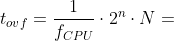
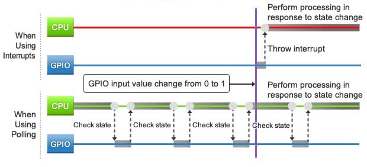
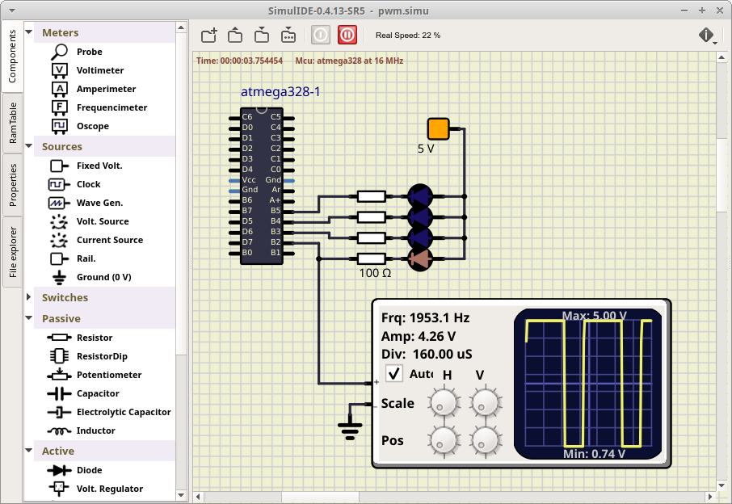

# Lab 4: Interrupts, timers


### Learning objectives

After completing this lab you will be able to:

* Use `#define` compiler directives
* Use internal microcontroller timers
* Understand overflow
* Use additional shields with other peripherals

The purpose of the laboratory exercise is to understand the function of the interrupt, interrupt service routine, and the functionality of timer units. Another goal is to practice finding information in the MCU manual; specifically setting timer control registers.

### Table of contents

* [Preparation tasks](#preparation)
* [Part 1: Synchronize repositories and create a new folder](#part1)
* [Part 2: Timers](#part2)
* [Part 3: Polling and Interrupts](#part3)
* [Part 4: Final application](#part4)
* [Part 5: PWM (Pulse Width Modulation)](#part5)
* [Experiments on your own](#experiments)
* [Lab assignment](#assignment)
* [References](#references)

<a name="preparation"></a>

## Preparation tasks (done before the lab at home)

Consider an n-bit number that we increment based on the clock signal. If we reach its maximum value and try to increase it, the value will be reset. We call this state an **overflow**. The overflow time depends on the frequency of the clock signal, the number of bits, and on the prescaler value:

&nbsp;

&nbsp;

1. Calculate the overflow times for three Timer/Counter modules that contain ATmega328P if CPU clock frequency is 16&nbsp;MHz. Complete the following table for given prescaler values. Note that, Timer/Counter2 is able to set 7 prescaler values, including 32 and 128 and other timers have only 5 prescaler values.

   | **Module** | **Number of bits** | **1** | **8** | **32** | **64** | **128** | **256** | **1024** |
   | :-: | :-: | :-: | :-: | :-: | :-: | :-: | :-: | :-: |
   | Timer/Counter0 | 8  | 16u | 128u | -- | | -- | | |
   | Timer/Counter1 | 16 |     |      | -- | | -- | | |
   | Timer/Counter2 | 8  |     |      |    | |    | | |

2. Shields are boards that can be attached to an Arduino board, significantly expand its capabilities, and makes prototyping much faster. See schematic of [Multi-function shield](https://oshwlab.com/tomas.fryza/arduino-shields) and find out the connection of four LEDs (D1, D2, D3, D4) and three push buttons (S1-A1, S2-A2, S3-A3).

&nbsp;

&nbsp;

&nbsp;

&nbsp;

&nbsp;

&nbsp;

<a name="part1"></a>

## Part 1: Synchronize repositories and create a new folder

Run Git Bash (Windows) of Terminal (Linux), navigate to your working directory, and update local repository. Create a new working folder `labs/04-interrupts` for this exercise.

<a name="part2"></a>

## Part 2: Timers

A timer (or counter) is a hardware block within an MCU and can be used to measure time events. ATmega328P has three timers, called:

* Timer/Counter0,
* Timer/Counter1, and
* Timer/Counter2.

T/C0 and T/C2 are 8-bit timers, where T/C1 is a 16-bit timer. The counter counts in synchronization with microcontroller clock from 0 up to 255 (for 8-bit counter) or 65,535 (for 16-bit). Different clock sources can be selected for each timer using a CPU frequency divider with fixed prescaler values, such as 8, 64, 256, 1024, and others.

The timer modules can be configured with several special purpose registers. According to the [ATmega328P datasheet](https://www.microchip.com/wwwproducts/en/ATmega328p) (eg in the **8-bit Timer/Counter0 with PWM > Register Description** section), which I/O registers and which bits configure the timer operations?

| **Module** | **Operation** | **I/O register(s)** | **Bit(s)** |
| :-: | :-- | :-: | :-- |
| Timer/Counter0 | Prescaler<br><br>8-bit data value<br>Overflow interrupt enable | <br><br><br> | <br><br><br> |
| Timer/Counter1 | Prescaler<br><br>16-bit data value<br>Overflow interrupt enable | TCCR1B<br><br>TCNT1H, TCNT1L<br>TIMSK1 | CS12, CS11, CS10<br>(000: stopped, 001: 1, 010: 8, 011: 64, 100: 256, 101: 1024)<br>TCNT1[15:0]<br>TOIE1 (1: enable, 0: disable) |
| Timer/Counter2 | Prescaler<br><br>8-bit data value<br>Overflow interrupt enable | <br><br><br> | <br><br><br> |

### Version: Atmel Studio 7

1. Create a new GCC C Executable Project for ATmega328P within `04-interrupts` working folder and copy/paste [template code](main.c) to your `main.c` source file.

2. In **Solution Explorer** click on the project name, then in menu **Project**, select **Add New Item... Ctrl+Shift+A** and add a new C/C++ Include File `timer.h`. Copy/paste the [template code](../library/include/timer.h) into it.

3. In **Solution Explorer** click on the project name, then in menu **Project**, select **Add Existing Item... Shift+Alt+A** twice and add both GPIO library files (`gpio.h`, `gpio.c`) from the previous lab.

   

### Version: Command-line toolchain

1. Check if `library` folder and `Makefile.in` settings file exist within `Labs` folder. If not, copy them from the `Examples` folder.

2. Copy `main.c` and `Makefile` files from previous lab to `labs/04-interrupts` folder.

3. Copy/paste [template code](main.c) to your `04-interrupts/main.c` source file.

4. Create a new library header file in `labs/library/include/timer.h` and copy/paste the [template code](../library/include/timer.h) into it.

### Both versions

For easier setting of control registers, for Timer/Counter0 and Timer/Counter1 define macros in `timer.h` with suitable names, which will replace the setting at low level. Because we only define macros and not function bodies, the `timer.c` source file is **not needed** this time!

```c
#ifndef TIMER_H
# define TIMER_H

/* Includes ----------------------------------------------------------*/
#include <avr/io.h>

/* Defines -----------------------------------------------------------*/
/**
 * @brief Defines prescaler CPU frequency values for Timer/Counter1.
 * @note  F_CPU = 16 MHz
 */
#define TIM1_stop()             TCCR1B &= ~((1<<CS12) | (1<<CS11) | (1<<CS10));         // 000 --> STOP
#define TIM1_overflow_4ms()     TCCR1B &= ~((1<<CS12) | (1<<CS11)); TCCR1B |= (1<<CS10);// 001 --> 1
#define TIM1_overflow_33ms()    TCCR1B &= ~((1<<CS12) | (1<<CS10)); TCCR1B |= (1<<CS11);// 010 --> 8
#define TIM1_overflow_262ms()   TCCR1B &= ~(1<<CS12); TCCR1B |= (1<<CS11) | (1<<CS10);  // 011 --> 64
#define TIM1_overflow_1s()      TCCR1B &= ~((1<<CS11) | (1<<CS10)); TCCR1B |= (1<<CS12);// 100 --> 256
#define TIM1_overflow_4s()      TCCR1B &= ~(1<<CS11); TCCR1B |= (1<<CS12) | (1<<CS10);  // 101 --> 1024

/**
 * @brief Defines interrupt enable/disable modes for Timer/Counter1.
 */
#define TIM1_overflow_interrupt_enable()    TIMSK1 |= (1<<TOIE1);   // 1 --> enable
#define TIM1_overflow_interrupt_disable()   TIMSK1 &= ~(1<<TOIE1);  // 0 --> disable

#endif
```

<a name="part3"></a>

## Part 3: Polling and Interrupts

The state of continuous monitoring of any parameter is called **polling**. The microcontroller keeps checking the status of other devices; and while doing so, it does no other operation and consumes all its processing time for monitoring [[3]](https://www.renesas.com/us/en/support/technical-resources/engineer-school/mcu-programming-peripherals-04-interrupts.html).

While polling is a simple way to check for state changes, there's a cost. If the checking interval is too long, there can be a long lag between occurrence and detection and you may miss the change completely, if the state changes back before you check. A shorter interval will get faster and more reliable detection, but also consumes much more processing time and power, since many more checks will come back negative.

An alternative approach is to utilize **interrupts**. With this method, the state change generates an interrupt signal that causes the CPU to suspend its current operation (and save its current state), then execute the processing associated with the interrupt, and then restore its previous state and resume where it left off.



An interrupt is one of the fundamental features in a microcontroller. It is a signal to the processor emitted by hardware or software indicating an event that needs immediate attention. Whenever an interrupt occurs, the controller completes the execution of the current instruction and starts the execution of an **Interrupt Service Routine (ISR)** or Interrupt Handler. ISR tells the processor or controller what to do when the interrupt occurs [[4]](https://www.tutorialspoint.com/embedded_systems/es_interrupts.htm). After the interrupt code is executed, the program continues exactly where it left off.

Interrupts can be established for events such as a counter's value, a pin changing state, serial communication receiving of information, or the Analog to Digital Converted has finished the conversion process.

See the [ATmega328P datasheet](https://www.microchip.com/wwwproducts/en/ATmega328p) (section **Interrupts > Interrupt Vectors in ATmega328 and ATmega328P**) for sources of interruptions that can occur on ATmega328P. Complete the selected interrupt sources in the following table. The names of the interrupt vectors in C can be found in [C library manual](https://www.nongnu.org/avr-libc/user-manual/group__avr__interrupts.html).

| **Program address** | **Source** | **Vector name** | **Description** |
| :-: | :-- | :-- | :-- |
| 0x0000 | RESET | -- | Reset of the system |
| 0x0002 | INT0  | `INT0_vect`&nbsp;&nbsp;&nbsp;&nbsp;&nbsp;&nbsp;&nbsp;&nbsp;&nbsp;&nbsp;&nbsp;&nbsp;&nbsp;&nbsp;&nbsp;&nbsp; | External interrupt request number 0&nbsp;&nbsp;&nbsp;&nbsp;&nbsp;&nbsp;&nbsp;&nbsp;&nbsp;&nbsp;&nbsp;&nbsp;&nbsp;&nbsp;&nbsp;&nbsp; |
|  | INT1 |  |  |
|  | PCINT0 |  |  |
|  | PCINT1 |  |  |
|  | PCINT2 |  |  |
|  | WDT |  |  |
|  | TIMER2_OVF |  |  |
| 0x0018 | TIMER1_COMPB | `TIMER1_COMPB_vect` | Compare match between Timer/Counter1 value and channel B compare value |
| 0x001A | TIMER1_OVF | `TIMER1_OVF_vect` | Overflow of Timer/Counter1 value |
|  | TIMER0_OVF |  |  |
|  | USART_RX |  |  |
|  | ADC |  |  |
|  | TWI |  |  |

All interrupts are disabled by default. If you want to use them, you must first enable them individually in specific control registers and then enable them centrally with the `sei()` command (Set interrupt). You can also centrally disable all interrupts with the `cli()` command (Clear interrupt).

<a name="part4"></a>

## Part 4: Final application

In `04-interrupts/main.c` file, rewrite the application for flashing a LED but this time without using the `delay.h` library. Use Multi-function shield and toggle D1 LED with one of the internal timers. Select its prescaler value and enable overflow interrupt. Do not forget to include both gpio and timer header files to your main application `#include "gpio.h"` and `#include "timer.h"`.

In addition, if you want to use interrupts in your application, you must:

* insert the header file `#include <avr/interrupt.h>`,
* make peripheral function settings (such as prescaler),
* enable specific interrupts (such as overflow),
* define interrupt handlers (such as `ISR(TIMER1_OVF_vect)`), and
* allow such handlers to run by `sei()` macro.

```c
#include <avr/interrupt.h>  // Interrupts standard C library for AVR-GCC
...

int main(void)
{
    ...

    // Enables interrupts by setting the global interrupt mask
    sei();

    // Infinite loop
    while (1)
    {
        /* Empty loop. All subsequent operations are performed exclusively 
         * inside interrupt service routines ISRs */
    }

    // Will never reach this
    return 0;
}

ISR(TIMER1_OVF_vect)
{
    // WRITE YOUR CODE HERE
}
```

1. Compile the code and download to Arduino Uno board or load `*.hex` firmware to SimulIDE circuit (create an identical LED connection according to the Multi-function shield).

2. Observe the correct function of the application on the flashing LED or measure its signal using a logic analyzer or oscilloscope. Try different overflow times.

3. Consider a push button in the application. If the push button is pressed, let the LEDs blink faster; when the push button is released, the blinking is slower. Note: Do not use an interrupt to check the status of a push button, but a read function from your GPIO library.

4. Extend the existing application and control four LEDs in [Knight Rider style](https://www.youtube.com/watch?v=w-P-2LdS6zk). Do not use delay library, but a single Timer/Counter.

   FYI: Use static variables declared in functions that use them for even better isolation or use volatile for all variables used in both Interrupt routines and main code loop. For example in code [[7]](https://stackoverflow.com/questions/52996693/static-variables-inside-interrupts) the line `static uint16_t i=0;` will only run the first time.

```c
void IRQHandler()
{
    static uint16_t i=0;  // This line only run the first time

    if (i>=500)
    {
        i=0;  // Variable is reset when function IRQHandler is executed 500 times
    }
    else
    {
        i++;  // Static variable is incremented any time function IRQHandler is executed
    }
}
```

<a name="part5"></a>

## Part 5: PWM (Pulse Width Modulation)

Pulse Width Modulation or PWM is a common technique used to vary the width of the pulses in a pulse-train. PWM has many applications such as controlling servos and speed controllers, limiting the effective power of motors and LEDs [[8]](https://www.tutorialspoint.com/arduino/arduino_pulse_width_modulation.htm). There are various terms associated with PWM:

* On-Time: duration of time signal is high,
* Off-Time: duration of time signal is low,
* Period: the sum of on-time and off-time of PWM signal,
* Duty Cycle: the percentage of time signal that remains on during the period of the PWM signal.


Use schematic of [Arduino Uno](https://oshwlab.com/tomas.fryza/arduino-shields) board or [ATmega328P datasheet](https://www.microchip.com/wwwproducts/en/ATmega328p) and in the following table write which Arduino Uno pins can be used to generate the PWM signal by internal timer modules.

| **Module** | **Description** | **MCU pin** | **Arduino pin** |
| :-: | :-: | :-: | :-: |
| Timer/Counter0 | OC0A |     |    |
|                | OC0B |     |    |
| Timer/Counter1 | OC1A |     |    |
|                | OC1B | PB2 | 10 |
| Timer/Counter2 | OC2A |     |    |
|                | OC2B |     |    |

## Synchronize repositories

Use [git commands](https://github.com/tomas-fryza/digital-electronics-2/wiki/Useful-Git-commands) to add, commit, and push all local changes to your remote repository. Check the repository at GitHub web page for changes.

<a name="experiments"></a>

## Experiments on your own

1. Use the [ATmega328P datasheet](https://www.microchip.com/wwwproducts/en/ATmega328p) (section **16-bit Timer/Counter1 with PWM > Register Description**) and configure Timer/Counter1 to generate a PWM (Pulse Width Modulation) signal on channel B (pin PB2, OC1B). Configure Timer/Counter1 as follows:
   * Select Compare output mode, Fast PWM in register TCCR1A: **non-inverting mode** (Clear OC1A/OC1B on Compare Match, set OC1A/OC1B at BOTTOM),
   * Select Waveform generation in registers TCCR1A and TCCR1B: **Fast PWM, 10-bit**,
   * Select clock prescaler in TCCR1B: **8**,
   * Set default duty cycle in OCR1B to 50%: **0x01FF**,
   * Enable Output Compare B Match Interrupt in TIMSK1: **OCIE1B**.

   Do not forget to enable interrupts by setting the global interrupt mask `sei()` and increment the duty cycle in OCR1B when the timer value is equal to compare value, ie. within interrupt handler `ISR(TIMER1_COMPB_vect)`. Clear the OCR1B value when it reaches its maximum, ie 0x03FF.

   Note that, the 16-bit value of the output compare register pair OCR1BH:L is directly accessible using the OCR1B variable defined in the AVR Libc library.

   Connect an oscilloscope to PB2 pin (in SimulIDE **Meters > Oscope**) and observe the changes in the generated signal.

   

2. Use the [ATmega328P datasheet](https://www.microchip.com/wwwproducts/en/ATmega328p) (section **8-bit Timer/Counter0 with PWM > Modes of Operation**) to find the main differences between:
   * Normal mode,
   * Clear Timer on Compare mode,
   * Fast PWM mode, and
   * Phase Correct PWM Mode.

Extra. Use basic [Goxygen commands](http://www.doxygen.nl/manual/docblocks.html#specialblock) inside the C-code comments and prepare your `timer.h` library for later easy generation of PDF documentation.

<a name="assignment"></a>

## Lab assignment

*Prepare all parts of the assignment in Czech, Slovak or English according to this [template](assignment.md), export formatted output (not Markdown) [from HTML to PDF](https://github.com/tomas-fryza/digital-electronics-2/wiki/Export-README-to-PDF), and submit a single PDF file via [BUT e-learning](https://moodle.vutbr.cz/). The deadline for submitting the task is the day before the next laboratory exercise.*

> *Vypracujte všechny části úkolu v českém, slovenském, nebo anglickém jazyce podle této [šablony](assignment.md), exportujte formátovaný výstup (nikoli výpis v jazyce Markdown) [z HTML do PDF](https://github.com/tomas-fryza/digital-electronics-2/wiki/Export-README-to-PDF) a odevzdejte jeden PDF soubor prostřednictvím [e-learningu VUT](https://moodle.vutbr.cz/). Termín odevzdání úkolu je den před dalším počítačovým cvičením.*
>

<a name="references"></a>

## References

1. Tomas Fryza. [Schematic of Arduino Uno board](https://oshwlab.com/tomas.fryza/arduino-shields)

2. Microchip Technology Inc. [ATmega328P datasheet](https://www.microchip.com/wwwproducts/en/ATmega328p)

3. Renesas Electronics Corporation. [Essentials of Microcontroller Use Learning about Peripherals: Interrupts](https://www.renesas.com/us/en/support/technical-resources/engineer-school/mcu-programming-peripherals-04-interrupts.html)

4. Tutorials Point. [Embedded Systems - Interrupts](https://www.tutorialspoint.com/embedded_systems/es_interrupts.htm)

5. [C library manual](https://www.nongnu.org/avr-libc/user-manual/group__avr__interrupts.html)

6. norwega. [Knight Rider style chaser](https://www.youtube.com/watch?v=w-P-2LdS6zk)

7. StackOverflow. [Static variables inside interrupts](https://stackoverflow.com/questions/52996693/static-variables-inside-interrupts)

8. Tutorials Point. [Arduino - Pulse Width Modulation](https://www.tutorialspoint.com/arduino/arduino_pulse_width_modulation.htm)

9. Tomas Fryza. [Useful Git commands](https://github.com/tomas-fryza/digital-electronics-2/wiki/Useful-Git-commands)

10. [Goxygen commands](http://www.doxygen.nl/manual/docblocks.html#specialblock)
