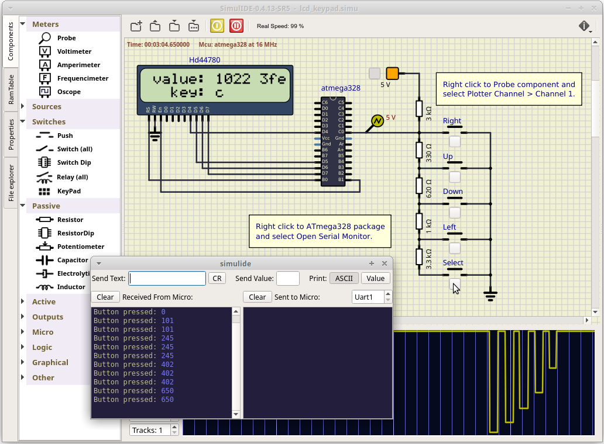

# Lab 7: UART serial communication

### Learning objectives

After completing this lab you will be able to:

* Understand the analog-to-digital conversion process
* How to use internal ADC unit
* Understand the UART communication
* Use functions from UART library

The purpose of the laboratory exercise is to understand analog-to-digital number conversion and the use of an internal 8-channel 10-bit AD converter. Another goal is to understand serial asynchronous communication, data frame structure and communication options using an internal USART unit.

### Table of contents

* [Preparation tasks](#preparation)
* [Part 1: Synchronize repositories and create a new folder](#part1)
* [Part 2: UART communication](#part2)
* [Experiments on your own](#experiments)
* [Lab assignment](#assignment)
* [References](#references)

<a name="preparation"></a>

## Preparation tasks (done before the lab at home)

xxx

<a name="part1"></a>

## Part 1: Synchronize repositories and create a new folder

xxx

<a name="part2"></a>

## Part 2: UART communication

The UART (Universal Asynchronous Receiver-Transmitter) is not a communication protocol like SPI and I2C, but a physical circuit in a microcontroller, or a stand-alone integrated circuit, that translates communicated data between serial and parallel forms. It is one of the simplest and easiest method for implement and understanding.

In UART communication, two UARTs communicate directly with each other. The transmitting UART converts parallel data from a CPU into serial form, transmits it in serial to the receiving UART, which then converts the serial data back into parallel data for the receiving device. Only two wires are needed to transmit data between two UARTs. Data flows from the Tx pin of the transmitting UART to the Rx pin of the receiving UART [[6]](https://www.circuitbasics.com/basics-uart-communication/).

UARTs transmit data asynchronously, which means there is no external clock signal to synchronize the output of bits from the transmitting UART. Instead, timing is agreed upon in advance between both units, and special **Start** (log. 0) and 1 or 2 **Stop** (log. 1) bits are added to each data package. These bits define the beginning and end of the data packet so the receiving UART knows when to start reading the bits. In addition to the start and stop bits, the packet/frame also contains data bits and optional parity.

The amount of **data** in each packet can be set from 5 to 9 bits. If it is not otherwise stated, data is transferred least-significant bit (LSB) first.

**Parity** is a form of very simple, low-level error checking and can be Even or Odd. To produce the parity bit, add all 5-9 data bits and extend them to an even or odd number. For example, assuming parity is set to even and was added to a data byte `0110_1010`, which has an even number of 1's (4), the parity bit would be set to 0. Conversely, if the parity mode was set to odd, the parity bit would be 1.

One of the most common UART formats is called **9600 8N1**, which means 8 data bits, no parity, 1 stop bit and a symbol rate of 9600&nbsp;Bd.


### Example of UART communication

> **Question:** Let the following image shows one frame of UART communication transmitting from the ATmega328P in 8N1 mode. What ASCII code/character does it represent? According to bit period, estimate the symbol rate.
>
   &nbsp;
   

> **Answer:** 8N1 means that 8 data bits are transmitted, no parity is used, and the number of stop bits is one. Because the frame always starts with a low level start bit and the order of the data bits is from LSB to MSB, the data transmitted bu UART is therefore `0100_0101` (0x45) and according to the [ASCII](http://www.asciitable.com/) (American Standard Code for Information Interchange) table, it represents the letter `E`.
>
> The figure further shows that the bit period, i.e. the duration of one bit, is 104&nbsp;us. The symbol rate of the communication is thus 1/104e-6 = 9615, i.e. approximately 9600&nbsp;Bd.
>

1. In the lab, we are using [UART library](http://www.peterfleury.epizy.com/avr-software.html) developed by Peter Fleury. Use online manual of UART library and add the input parameters and description of the functions to the following table.

   | **Function name** | **Function parameter(s)** | **Description** | **Example** |
   | :-- | :-- | :-- | :-- |
   | `uart_init` | `UART_BAUD_SELECT(9600, F_CPU)` | Initialize UART to 8N1 and set baudrate to 9600&nbsp;Bd | `uart_init(UART_BAUD_SELECT(9600, F_CPU));` |
   | `uart_getc` |  |  |
   | `uart_putc` |  |  |
   | `uart_puts` |  |  |

2. Extend the application from the previous point and send information about the results of the analog to digital conversion to the UART transmitter. Use internal UART module in 9600 8N1 mode. If needed, define the CPU clock frequency in `main.c`:

```c
#ifndef F_CPU
# define F_CPU 16000000  // CPU frequency in Hz required for UART_BAUD_SELECT
#endif
```

### Version: SimulIDE

1. In SimulIDE, right click to ATmega328 package and select **Open Serial Monitor**. In this window you can receive data from the microcontroller, but also send them back.

   

### Version: Real hardware

1. Use PuTTY SSH Client to receive values from Arduino board. Set connection type to **Serial** and check that the configuration is the same as in the ATmega328 application. Note that, serial line to connect to (here COM3 on Windows) could be different. In Linux, use `dmesg` command to verify your port (such as `/dev/ttyUSB0`).

   
   

> WARNING: Before Arduino board re-programming process, PuTTY SSH Client must be closed!
>

## Synchronize repositories

Use [git commands](https://github.com/tomas-fryza/digital-electronics-2/wiki/Useful-Git-commands) to add, commit, and push all local changes to your remote repository. Check the repository at GitHub web page for changes.

<a name="experiments"></a>

## Experiments on your own

1. Based on the converted values, write the part of the code that distinguishes which push button was pressed and display the information at LCD position `c` and send it to UART. Try to recalculate the input voltage values in mV. Hint: Use integer data types only; the absolute accuracy of the calculation is not important here.

   > Note: If you need to transmit a larger amount of data, it is necessary to increase the size of the transmit/receive buffer in the `uart.h` file, eg to 64.
   >
```c
/** @brief  Size of the circular receive buffer, must be power of 2
 *
 *  You may need to adapt this constant to your target and your application by adding
 *  CDEFS += -DUART_RX_BUFFER_SIZE=nn to your Makefile.
 */
#ifndef UART_RX_BUFFER_SIZE
# define UART_RX_BUFFER_SIZE 64
#endif

/** @brief  Size of the circular transmit buffer, must be power of 2
 *
 *  You may need to adapt this constant to your target and your application by adding
 *  CDEFS += -DUART_TX_BUFFER_SIZE=nn to your Makefile.
 */
#ifndef UART_TX_BUFFER_SIZE
# define UART_TX_BUFFER_SIZE 64
#endif
```

   

2. Design a piece of code to calculate the parity bit from the specified value. Display the parity of ADC converted value on the LCD and UART.

Extra. Design your own library for working with analog to digital convertor.

### Version: Real hardware

3. What is the meaning of ASCII control characters `\r`, `\n`, and `\b`? What codes are defined for these characters in ASCII table?

4. Use [ANSI Escape Sequences](https://gist.github.com/fnky/458719343aabd01cfb17a3a4f7296797) and modify color and format of transmitted strings according to the following code. Try other formatting styles.

   ```c
   /* Color/formatting sequence always starts by "\033[" and ends by "m" strings.
   * One or more formatting codes "#", separated by ";" can be used within
   * one line, such as:
   *    \033[#m      or
   *    \033[#;#m    or
   *    \033[#;#;#m  etc. */
   uart_puts("\033[4;32m");        // 4: underline style; 32: green foreground
   uart_puts("This is all Green and Underlined.");
   uart_puts("\033[0m");           // 0: reset all attributes
   uart_puts("This is Normal text again.");
   ```

5. Program an interactive console that communicates between ATmega328P and the computer (PuTTY application) via UART. Let the main screen of the console is as follows:

   ```bash
   --- Interactive UART console ---
   1: read current Timer/counter1 value
   2: reset Timer/counter1
   > 
   ```

   After pressing the '1' key on computer keyboard, ATmega328P receives ASCII code of the key and sends the current Timer1 value back to PuTTY. After pressing the '2' key, ATmega328P resets Timer1 value, etc. Use ANSI escape sequences to highlight information within PuTTY console.

   ```c
   uint8_t c;
   ...

   c = uart_getc();
   if (c != '\0') {        // Data available from UART
       if (c == '1') {     // Key '1' received
           ...
       }
   }
   ```

6. Program a software UART transmitter (emulated UART) that will be able to generate UART data on any output pin of the ATmega328P microcontroller. Let the bit rate be approximately 9600&nbsp;Bd and do not use the delay library. Also consider the possibility of calculating the parity bit. Verify the UART communication with logic analyzer or oscilloscope.

<a name="assignment"></a>

## Lab assignment

*Prepare all parts of the assignment in Czech, Slovak or English according to this [template](assignment.md), export formatted output (not Markdown) [from HTML to PDF](https://github.com/tomas-fryza/digital-electronics-2/wiki/Export-README-to-PDF), and submit a single PDF file via [BUT e-learning](https://moodle.vutbr.cz/). The deadline for submitting the task is the day before the next laboratory exercise.*

> *Vypracujte všechny části úkolu v českém, slovenském, nebo anglickém jazyce podle této [šablony](assignment.md), exportujte formátovaný výstup (nikoli výpis v jazyce Markdown) [z HTML do PDF](https://github.com/tomas-fryza/digital-electronics-2/wiki/Export-README-to-PDF) a odevzdejte jeden PDF soubor prostřednictvím [e-learningu VUT](https://moodle.vutbr.cz/). Termín odevzdání úkolu je den před dalším počítačovým cvičením.*
>

<a name="references"></a>

## References

1. Tomas Fryza. [Schematic of LCD Keypad shield](https://oshwlab.com/tomas.fryza/arduino-shields)

2. EETech Media, LLC. [Voltage Divider Calculator](https://www.allaboutcircuits.com/tools/voltage-divider-calculator/)

3. Components101. [Introduction to Analog to Digital Converters (ADC Converters)](https://components101.com/articles/analog-to-digital-adc-converters)

4. Embedds. [ADC on Atmega328. Part 1](https://embedds.com/adc-on-atmega328-part-1/)

5. Microchip Technology Inc. [ATmega328P datasheet](https://www.microchip.com/wwwproducts/en/ATmega328p)

6. Circuit Basics. [Basics of UART Communication](https://www.circuitbasics.com/basics-uart-communication/)

7. [ASCII Table](http://www.asciitable.com/)

8. Peter Fleury. [UART library](http://www.peterfleury.epizy.com/avr-software.html)

9. Tomas Fryza. [Useful Git commands](https://github.com/tomas-fryza/digital-electronics-2/wiki/Useful-Git-commands)

10. Christian Petersen. [ANSI Escape Sequences](https://gist.github.com/fnky/458719343aabd01cfb17a3a4f7296797)
